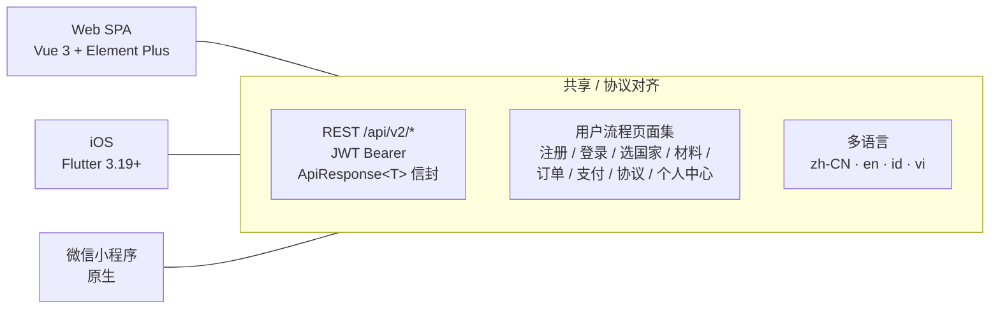
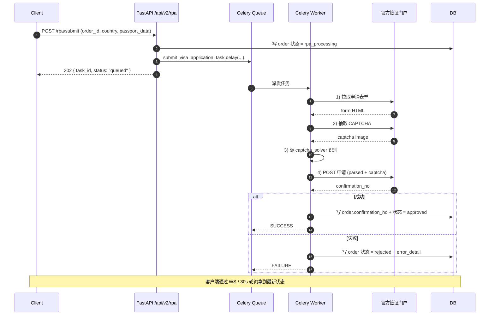
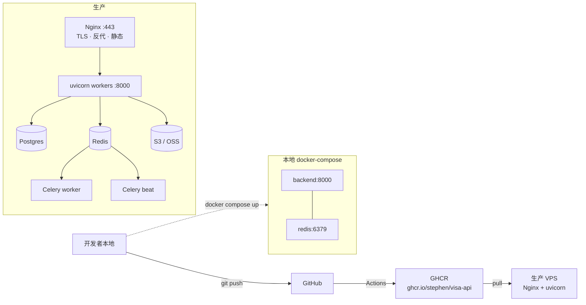

# Htex — 架构文档 (ARCHITECTURE)

> 适用版本: Visa MVP V2 (W1–W15) · 文档维护: 架构组 · 最近更新: 2026-06-15

本文件描述 Htex 的整体架构, 包括:

1. 顶层组件 (客户端 / 网关 / 后端 / 基础设施)
2. 三大客户端的形态差异与共享点
3. 后端的分层结构与模块边界
4. 端到端数据流 (注册 → 申请 → OCR → RPA → 支付 → 通知)
5. 关键横切关注点 (安全 / 限流 / 观测性 / 部署)

---

## 1. 顶层架构 (System Overview)

```mermaid
flowchart TB
    %% ─────────── Clients ───────────
    subgraph Clients[客户端层 / Clients]
        direction TB
        Web[Web SPA<br/>Vue 3 + Element Plus<br/>Vite · Pinia · Vue Router · vue-i18n]
        iOS[iOS App<br/>Flutter 3.19+<br/>http · shared_preferences · provider · intl]
        MP[微信小程序<br/>原生 WXML/WXSS/JS<br/>utils/i18n.js · wx.request]
    end

    %% ─────────── Edge ───────────
    subgraph Edge[边缘层 / Edge]
        LB[Reverse Proxy / Load Balancer<br/>Nginx · TLS 终结]
        CDN[CDN<br/>静态资源 (Web 产物 / 微信小程序包)]
    end

    %% ─────────── Gateway / API ───────────
    subgraph Gateway[API 网关 / API Layer]
        FAPI[FastAPI 应用<br/>uvicorn :8000<br/>CORS · 安全头 · 限流 · 请求日志]
    end

    %% ─────────── Backend Services ───────────
    subgraph Backend[后端服务 / Backend Services]
        direction TB
        Routers[API Routers<br/>/api/v2/{auth,orders,materials,ocr,rpa,payment,<br/>sms,voice,insurance,destinations,affiliate,admin}]
        WS[WebSocket Hub<br/>/ws/orders/{order_no}]
        Sch[Internal Scheduler Endpoints<br/>/scheduler/*  X-System-Key]
        Services[Service Layer<br/>order · payment · rpa · ocr · auth · mfa · voice · sms · insurance · affiliate]
        Tasks[Celery Tasks<br/>rpa.submit_visa_application<br/>rpa.check_rpa_status]
    end

    %% ─────────── Infra ───────────
    subgraph Infra[基础设施 / Infrastructure]
        DB[(Database<br/>SQLite aiosqlite — dev<br/>PostgreSQL — prod)]
        Cache[(Cache / Broker<br/>Redis 7<br/>Celery broker + result backend)]
        Q{{Task Queue<br/>Celery + Redis}}
        Store[(Object Storage<br/>材料上传 / RPA 截图)]
    end

    %% ─────────── External ───────────
    subgraph External[外部服务 / External]
        Stripe[Stripe<br/>支付 + 退款 + 分账]
        Twilio[Twilio / 短信通道<br/>验证码下发]
        RPAProv[官方签证门户<br/>Indonesia e-Visa<br/>Vietnam e-Visa]
        OCR[OCR 服务<br/>护照字段识别]
    end

    %% ─────────── Arrows ───────────
    Web  -- HTTPS /api/v2/* --> LB
    iOS  -- HTTPS /api/v2/* --> LB
    MP   -- HTTPS /api/v2/* --> LB
    LB   --> FAPI
    LB   -- /static --> CDN

    FAPI --> Routers
    FAPI --> WS
    FAPI --> Sch
    Routers --> Services
    Services --> DB
    Services --> Cache
    Services -->|enqueue| Q
    Services --> Store
    Services --> Stripe
    Services --> Twilio
    Services --> OCR

    Q --> Tasks
    Tasks --> RPAProv
    Tasks --> Store
    Tasks -->|status| DB
```

### 1.1 组件职责

| 组件 | 职责 | 关键事实 |
| --- | --- | --- |
| **Web / iOS / 小程序** | 终端用户入口, 渲染页面 / 收集表单 / 轮询状态 | 全部走同一套 `/api/v2/*` REST 协议, 共享 `ApiResponse<T>` 错误信封 |
| **Nginx + TLS** | 流量入口, 静态资源分发 | 部署在边缘节点, 终止 HTTPS |
| **FastAPI 应用** | 业务路由 + 校验 + 中间件链 | `uvicorn` 启动, lifespan 启动时校验 DB 连接 |
| **Celery Worker** | 长耗时任务 (RPA 提交 / 状态轮询) | 单独进程, Redis 做 broker |
| **SQLite (dev) / Postgres (prod)** | 持久化 | dev 用 `aiosqlite`, prod 切换 `DATABASE_URL` |
| **Redis** | Celery broker + result backend + 限流 | 端口 6379, 命名空间分 DB |
| **Stripe** | 国际卡支付 + 退款 + Transfer 分账 | `STRIPE_SECRET_KEY` 缺失时降级为 mock |
| **Twilio / 短信通道** | 手机验证码下发 | dev 默认 mock, prod 切换 `SMS_CHANNEL=twilio` |
| **RPA 官方门户** | 目的地使领馆/电子签门户递交（美/英/澳/申根；当前功能关闭） | `FEATURE_RPA_ENABLED`；历史 ID/VN provider 已下线注册 |

---

## 2. 三大客户端对比



### 2.1 Web (`frontend/web/`)

| 项 | 选型 / 事实 |
| --- | --- |
| 框架 | Vue 3.4 (`<script setup>`, Composition API) |
| UI 库 | Element Plus 2.7 + `@element-plus/icons-vue` |
| 状态管理 | Pinia 2.1 (auth / 用户 / 订单 store) |
| 路由 | Vue Router 4 (`createWebHistory`) |
| 国际化 | vue-i18n 9 (zh-CN / en / id / vi) |
| 构建 | Vite 5 (port 5173 dev, 4173 preview) |
| 端到端测试 | Playwright (`@playwright/test`) |
| 单元测试 | Vitest + `@vue/test-utils` + jsdom |
| HTTP | Axios 1.7 (统一拦截器注入 `Authorization` / `X-System-Key`) |
| 关键页面 | Home / Login / Register / Profile / Destinations / Materials(扫描 + 上传 + 校验) / Orders(列表 + 新建 + 详情) / RpaSubmit / RpaStatus / PaymentResult / Agreement / ForgotPassword / admin 子模块 (Login / Dashboard / RateLimit) |

### 2.2 iOS (`frontend/ios/`)

| 项 | 选型 / 事实 |
| --- | --- |
| 框架 | Flutter ≥ 3.19 (Dart SDK ≥ 3.3) |
| 路由 | Navigator 1.0 (`MaterialApp.onGenerateRoute`), 无第三方路由依赖 |
| 状态管理 | `provider` 6.1 (轻量) |
| 国际化 | `flutter_localizations` + `intl` + ARB (en / zh / id / vi) |
| 持久化 | `shared_preferences` (token / locale) |
| HTTP | `http` 1.2 (走 `lib/api/` 自封装) |
| 二维码 | `qr_flutter` (支付二维码) |
| 页面集 | Home / Login / Register / Materials / MaterialsUpload / Destinations / Profile / Orders / OrderDetail / OrderForm / Payment / Forgot / Agreement (13 屏) |
| 多端复用 | `web/` 子目录可在 Chrome 跑 Web build, 支持 `?page=&lang=` 调试跳转 |

### 2.3 微信小程序 (`frontend/miniprogram/`)

| 项 | 选型 / 事实 |
| --- | --- |
| 形态 | 原生小程序 (WXML / WXSS / JS) |
| 全局入口 | `app.js` (i18n / token / locale 启动加载) |
| 国际化 | `utils/i18n.js` (内存 hash, 4 语种) |
| API 工具 | `utils/api.js` (封装 `wx.request` + token 注入) |
| 鉴权工具 | `utils/auth.js` (`TOKEN_KEY` / `USER_KEY` 存储) |
| 页面 (Tab) | home (Tab) / destinations (Tab) / profile (Tab) / login / register / order / payment / forgot / agreement |
| 打包 | `miniprogram-ci` (`npm run build:weapp`) |

---

## 3. 后端架构 (Backend)

### 3.1 分层

```mermaid
flowchart TB
    Req[HTTP Request] --> MW1[SecurityHeaders<br/>X-Content-Type-Options · CSP · X-Frame-Options]
    MW1 --> MW2[RequestSizeLimit<br/>默认 10 MB]
    MW2 --> MW3[CORS<br/>显式 allowlist]
    MW3 --> MW4[RequestLogging<br/>结构化 JSON 日志]
    MW4 --> MW5[RateLimit<br/>global_per_min · slow_per_min]
    MW5 --> Router[API Routers<br/>/api/v2/{resource}]
    Router -->|Depends| Svc[Service Layer<br/>order · payment · rpa · ocr · auth · ...]
    Router -->|Depends| Model[ORM Models<br/>SQLAlchemy 2 async]
    Svc --> Model
    Svc --> Cache[Redis 客户端]
    Svc -->|enqueue| Q[Celery Broker]
    Svc -->|call| Ext[External SDK<br/>Stripe · Twilio · RPA]
    Model --> DB[(SQLite / Postgres)]
    Cache --> Redis[(Redis)]
    Q --> Worker[Celery Worker 进程]
    Worker -->|update| DB
    Worker -->|call| Ext
```

### 3.2 模块清单 (`backend/app/api/v2/`)

| Router | 前缀 | 主要能力 |
| --- | --- | --- |
| `auth.py` | `/auth` | 注册 / 登录 / 登出 / 密码重置 / MFA |
| `orders.py` | `/orders` | 订单 CRUD / 状态查询 / 提交 / 取消 |
| `materials.py` | `/materials` | 材料上传 / 列表 / 删除 / 校验触发 |
| `ocr.py` | `/ocr` | 护照 OCR 触发 / 结果回查 |
| `rpa.py` | `/rpa` | 提交签证申请 (Celery) / 状态 / 重试 |
| `payment.py` | `/payment` | 创建订单 / 查询 / 取消 / Webhook |
| `sms.py` | `/sms` | 发送验证码 / 校验 (mock / twilio) |
| `voice.py` | `/voice` | 语音转写 (W14-5) |
| `insurance.py` | `/insurance` | 拒签险报价 / 投保 / 理赔 (mock) |
| `destinations.py` | `/destinations` | 可办签证国家列表 |
| `affiliate.py` | `/affiliate` | 分销链接 / 佣金 / 提现 |
| `admin.py` | `/admin` | 后台管理 (订单 / 用户 / 配置 / 限流) |

### 3.3 内部端点 (与 `/api/v2` 解耦)

| 端点 | 鉴权 | 用途 |
| --- | --- | --- |
| `/health` | 无 | 健康检查 (含 DB ping) |
| `/metrics` | 无 | Prometheus 抓取点 |
| `/ws/orders/{order_no}` | JWT | 订单状态实时推送 (5 态时间线) |
| `/scheduler/*` | `X-System-Key` | 内部调度 (Celery beat / cron) |

### 3.4 横切关注点

| 关注点 | 实现位置 | 关键事实 |
| --- | --- | --- |
| 鉴权 | `app/core/security.py` + `Depends(get_current_user)` | JWT, 登录后下发 access/refresh |
| 限流 | `app/middleware/rate_limit.py` | 内存桶 + Redis 双实现可切换, 按 IP + 路由类 |
| 错误信封 | `app/core/errors.py` + 4 个 exception handler | 统一 `code + message + data` 结构 |
| 请求日志 | `app/middleware/logging.py` | 透传 `request_id` / `user_id` / `latency` |
| 安全头 | `app/middleware/security_headers.py` | 默认开启 CSP / X-Frame-Options / nosniff |
| 请求体大小 | `app/middleware/request_size_limit.py` | 默认 10 MB (`MAX_REQUEST_SIZE_MB` 可调) |
| 审计 | `app/middleware/audit_decorator.py` + `models/audit_log.py` | 后台管理操作落 audit_log |
| 观测性 | `app/core/metrics.py` (`/metrics`) | 进程级 + 业务级计数器 |

### 3.5 数据模型 (节选)

| Model | 表 / 集合 | 说明 |
| --- | --- | --- |
| `User` / `UserSession` | 用户 + 会话 | 邮箱 / 手机 / 密码 hash / MFA 密钥 |
| `Destination` | 可办签证国家 | 静态配置, 含材料清单 / 模板 |
| `Material` | 材料附件 | OSS key + 校验状态 + OCR 抽取字段 |
| `Order` | 订单 | 5 态机: `draft → submitted → rpa_processing → approved/rejected/cancelled` |
| `OrderPollLog` | 订单轮询日志 | 兜底 30s 轮询 + WS 推送 |
| `SmsCode` | 验证码 | 5 分钟 TTL, hash 存储 |
| `AuditLog` | 审计 | 后台 / 关键业务操作留痕 |
| `WebhookEvent` | 支付 Webhook 幂等 | Stripe event_id 唯一 |
| `ValidationRule` | 字段级校验 | JSON / YAML 规则, 热更新 |

### 3.6 Celery 任务 (异步管道)



---

## 4. 数据流 (User Journey)

> 用户从注册到拿签的完整链路。

```mermaid
flowchart TD
    A[1. 注册 / 登录<br/>POST /auth/register<br/>POST /auth/sms/send + /auth/login] --> B[2. 选目的地<br/>GET /destinations<br/>选择国家 + 签证类型]
    B --> C[3. 上传材料<br/>POST /materials<br/>护照 / 照片 / 在职证明]
    C --> D[4. OCR 抽取<br/>POST /ocr<br/>护照字段 → 预填]
    D --> E[5. AI 校验<br/>POST /materials/validate<br/>字段级规则 + 整改指引]
    E -->|不通过| C
    E -->|通过| F[6. 创建订单<br/>POST /orders<br/>draft + 价格 + 保险选项]
    F --> G[7. 触发 RPA<br/>POST /rpa/submit<br/>Celery 异步执行]
    G --> H[8. RPA 执行中<br/>WS /ws/orders/{no}<br/>+ 30s 轮询兜底]
    H -->|成功| I[9a. 创建支付单<br/>POST /payment/create<br/>Stripe PaymentIntent]
    H -->|失败| I2[9b. 失败回退<br/>支持重试 / 退款]
    I --> J[10. 跳转支付<br/>Stripe.js / 收银台]
    J --> K[11. Stripe Webhook<br/>POST /payment/webhook<br/>幂等: webhook_event]
    K --> L[12. 订单完成<br/>order.status = paid<br/>发短信 / 邮件通知]
    L --> M[13. 通知用户<br/>SMS (Twilio) +<br/>站内消息 + Email]
```

### 4.1 关键步骤细节

| Step | 入口 | 关键 API | 失败处理 |
| --- | --- | --- | --- |
| 1. 注册 | `Register.vue` | `POST /auth/sms/send` → `POST /auth/register` | 验证码 5min TTL, 重试冷却 60s |
| 1'. 登录 | `Login.vue` | `POST /auth/login` (密码) 或 `POST /auth/sms/login` (短信) | MFA 可选 (`mfa_service`) |
| 2. 选国家 | `Destinations.vue` | `GET /destinations` | 静态缓存, 24h revalidate |
| 3. 上传材料 | `Materials.vue` / `MaterialsScan.vue` | `POST /materials` (multipart, ≤ 10MB) | 病毒扫描 (mock) + mime 检查 |
| 4. OCR | 自动触发 (上传完成后) | `POST /ocr` 异步返回 task_id | 失败可手动重试 |
| 5. AI 校验 | `MaterialsValidate.vue` | `POST /materials/validate` | 字段级提示, 不阻断流程 |
| 6. 创建订单 | `OrderNew.vue` | `POST /orders` | 价目由后端计算, 前端只展示 |
| 7. RPA 提交 | `RpaSubmit.vue` | `POST /rpa/submit` (Celery) | 任务入队即返回 202, 不阻塞 UI |
| 8. 状态查询 | `RpaStatus.vue` / `OrderDetail.vue` | `WS /ws/orders/{no}` + 30s polling | WS 断开自动降级轮询 |
| 9. 支付 | `PaymentResult.vue` | `POST /payment/create` → Stripe.js | 用户取消 / 失败可重试 |
| 10. 收银台 | Stripe 托管 | 跳转 Stripe Checkout | — |
| 11. Webhook | Stripe → 后端 | `POST /payment/webhook` | 幂等表去重, 签名校验 |
| 12. 完成 | 后台 | `order.status = paid` | 触发短信 / 站内信 |
| 13. 通知 | `sms_provider` | `Twilio` / mock | 失败入死信, 后续补偿 |

---

## 5. 部署 / 基础设施



| 环境 | 组件 | 说明 |
| --- | --- | --- |
| **dev (本地)** | Docker Compose: `backend` (uvicorn --reload) + `redis:7-alpine` | SQLite `visa_mvp.db` 挂载到 `./.data` |
| **prod** | Nginx + 多 uvicorn worker + Celery worker + beat + Postgres + Redis + S3/OSS | 由 `scripts/build-multiarch.sh` 构建多架构镜像推 GHCR |
| **CI** | GitHub Actions (`.github/workflows/`) | lint + pytest + multi-arch build |

---

## 6. 关键设计决策 (ADRs 摘要)

| 主题 | 决策 | 备选 |
| --- | --- | --- |
| API 风格 | REST + JSON, 统一 `ApiResponse<T>` 信封 | GraphQL / gRPC |
| 鉴权 | JWT (access + refresh) + 可选 MFA (TOTP) | Session cookie / OAuth2 |
| 异步任务 | Celery + Redis | RQ / Dramatiq / 云函数 |
| DB 抽象 | SQLAlchemy 2.x async (declarative) | Tortoise / Piccolo |
| 限流 | 中间件 + 内存 / Redis 双实现 | API 网关层 |
| 部署 | Docker + 单一镜像, 多架构 (amd64 + arm64) | K8s / Lambda |
| 多端对齐 | 三端共享同一套 `/api/v2/*` 协议, 各自原生 UI | BFF 拆分 |
| 国际化 | Web: vue-i18n JSON; iOS: ARB; 小程序: 自写 i18n | 全量用同一份字典 |
| 支付 | Stripe 单一通道 (V2.1 计划接支付宝/微信) | 多通道适配器 |
| RPA | 进程内 `asyncio.run` (Celery sync wrapper) | 独立 worker 子进程 |

---

## 7. 安全 / 合规要点

| 维度 | 控制 |
| --- | --- |
| 传输 | 全站 HTTPS, HSTS, 现代 cipher |
| 凭据 | JWT 短时效 (15min) + refresh, secret 由 env 注入 |
| 密码 | bcrypt / argon2, 禁止明文落库 |
| 验证码 | 5min TTL, hash 存储, 60s 重试冷却 |
| 输入校验 | Pydantic schema + `validation_rules.json` 字段规则 |
| 注入 | 全部走 ORM, 无字符串拼 SQL |
| 文件上传 | mime 嗅探 + 大小限制 + 病毒扫描 hook |
| 审计 | 后台管理操作落 `audit_log` |
| 数据 | 个人敏感信息 (护照号 / 手机) 加密存储 (字段级) |
| 合规 | `docs/LEGAL_REVIEW_NOTES.md` 跟踪法务 review 状态 |
| 部署安全 | prod 环境 `ADMIN_PASSWORD` 必须 override, 否则拒启动 |

---

## 8. 目录速查

```
visa-mvp/
├── backend/                # FastAPI 后端
│   ├── app/
│   │   ├── main.py         # FastAPI 入口 (lifespan + middleware + routers)
│   │   ├── celery_app.py   # Celery 实例
│   │   ├── api/v2/         # 12 个业务 router
│   │   ├── core/           # config / db / errors / logging / metrics / security
│   │   ├── middleware/     # rate_limit / request_size / security_headers / audit
│   │   ├── models/         # SQLAlchemy ORM
│   │   ├── schemas/        # Pydantic 校验
│   │   ├── services/       # 业务服务 (含 payment / rpa / sms 子包)
│   │   └── tasks/          # Celery 任务
│   ├── alembic/            # DB 迁移
│   ├── docker-compose.yml  # backend + redis
│   └── Dockerfile
├── frontend/
│   ├── web/                # Vue 3 + Element Plus SPA
│   ├── ios/                # Flutter (iOS / Android / Web 三端)
│   └── miniprogram/        # 微信小程序 (原生)
├── docs/                   # 项目文档 (API / 法务 / 架构)
├── outputs/                # sprint deliverables
└── scripts/                # 维护脚本 (decontaminate / write_guard)
```

---

## 9. 变更记录

| 日期 | 版本 | 变更 |
| --- | --- | --- |
| 2026-06-15 | v0.1 | 初稿 (W15 收尾, V2 范围) |
