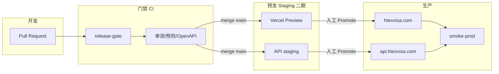

# Htex DevOps 方案（稳定发版）

> 背景：当前发版靠本机 `rsync` + `vercel deploy`，缺统一门禁，已多次出现  
> Google 按钮消失、管理端 500、只发一端导致上传 403、加密密钥未设等事故。  
> 目标：用**最小成本**把「能发」变成「可控、可回滚、可验收」。

---

## 1. 现状诊断

| 问题 | 根因 |
|------|------|
| 发版路径不唯一 | 有时本地 `npm run build`，有时 `vercel build --prod`（读云端 env） |
| 无强制预检 | 缺 `VITE_*` / `MATERIAL_ENCRYPTION_KEY` / Pydantic schema 要上线后才爆 |
| 前后端解耦部署 | 契约变更（consent / age）只发一端就断链路 |
| 无冒烟验收 | 发完靠人工点页面，漏测常见 |
| CI 与发版脱节 | `.github/workflows/ci.yml` 存在，但不过关也能手工上生产 |
| 回滚弱 | 前端靠 Vercel 旧部署，后端镜像无固定 tag / 无快速切回 |

---

## 2. 目标架构（分三期）

### 一期（立刻落地，本仓库已加）

- **Release Gate**：PR / main 必须过预检（OpenAPI、typing、前端 env 规则、bundle 校验逻辑）
- **单一发版命令**：前端 `npm run build:prod`；后端 `preflight_prod.py` + deploy 脚本
- **生产冒烟** `scripts/smoke-prod.sh`：health、login 页 Google 资源、admin login 非 500、关键静态 SEO
- **契约变更发版顺序**：先后端（迁移+health）→ 再前端 → smoke
- **Vercel Production env 固化**（已做）：`VITE_GOOGLE_CLIENT_ID` 等

### 二期（1–2 周，建议做）

- **Staging**
  - 前端：Vercel Preview（每个 PR 自动）或 `staging.htexvisa.com`
  - 后端：同机 `docker compose` 第二套（如 `:8001` + `api-staging`）或独立轻量机
  - Preview 的 `VITE_API_BASE` 指向 staging API
- **只有 staging smoke 绿才允许 prod**
- 后端镜像打 git SHA tag，支持一键回滚到上一 SHA

### 三期（有余力再做）

- 生产蓝绿 / 双容器切换
- 迁移「expand → migrate → contract」规范
- 监控：5xx、上传失败率、consent 403 突增告警（Sentry / 简单 Uptime）
- 发版日历 + 变更窗口（避免高峰）

---

## 3. 环境与职责

| 环境 | 前端 | 后端 | 谁能发 |
|------|------|------|--------|
| local | Vite :5173 | Docker/本地 uvicorn | 开发者 |
| preview/staging | Vercel Preview | staging API | CI 自动 + 人工验收 |
| production | htexvisa.com | api.htexvisa.com | **仅 workflow_dispatch / 指定人**，过 gate + smoke |

密钥：生产 `.env` 只在 VPS；`VITE_*` 只在 Vercel；GitHub Secrets 存 deploy token / SSH key（二期自动化用）。

---

## 4. 发版 SOP（一期强制）

### 4.1 无 API 契约变更（纯 UI / 文案）

1. PR → Release Gate 绿  
2. `cd frontend/web && npm run build:prod`  
3. `vercel deploy --prebuilt --prod`  
4. `bash scripts/smoke-prod.sh`  

### 4.2 有契约变更（新字段 / consent / 迁移）

1. PR 标明 `contract-change`  
2. Release Gate 绿  
3. **先发后端**：`preflight_prod.py --strict` → rebuild → `alembic current` 含 `(head)` → health  
4. **再发前端**（同上）  
5. smoke + 人工：注册年龄勾选 → 上传同意 → 管理端登录  

### 4.3 禁止事项

- 禁止生产机上直接改代码不记 git  
- 禁止裸 `vercel build --prod` 且不跑 `preflight:prod` / `verify:prod-bundle`  
- 禁止 rsync 全仓 `--delete`（易误删 / 误传 `.opencode`）  
- 禁止只发后端 consent 门槛而不发前端弹窗  

---

## 5. 质量门禁清单（Release Gate）

| 检查 | 工具 |
|------|------|
| OpenAPI 可生成 | `backend/scripts/preflight_prod.py` |
| typing.Optional 等缺口 | 同上 |
| Alembic 单 head | 同上 |
| 前端关键 `VITE_*` 规则 | `frontend/web/scripts/preflight-prod.mjs` |
| 构建产物含 Google Client ID | `verify-prod-bundle.mjs`（本地/CI 构建后） |
| 前端 vitest（稳定子集） | `vitest run`（允许已知债分步清） |
| 后端核心用例 | consent / encryption / auth 相关优先 |

完整手工清单见 `pm/infra/RELEASE_CHECKLIST.md`。

---

## 6. 回滚策略

| 层 | 回滚方式 | RTO |
|----|----------|-----|
| 前端 | Vercel → Deployments → Promote 上一成功生产部署 | ~1 min |
| 后端 | `docker compose` 切回上一镜像 tag / 上一 git SHA 目录 rebuild | ~5 min |
| DB 迁移 | **默认只 expand**；危险 migration 必须先有 downgrade 演练；禁止依赖不可逆 data wipe 当日常回滚 |

原则：**应用回滚优先于数据库回滚**。

---

## 7. 成功标准（4 周内）

- 连续 4 次生产发版：smoke 全绿，无「发完才发现按钮没了 / 500」  
- 所有生产发版可指出对应 git SHA  
- 契约变更发版有书面顺序（backend → frontend）  
- 回滚演练至少 1 次（前端 Promote 旧版）  

---

## 8. 下一步（需要你拍板）

1. **是否上 staging 子域**（`staging.htexvisa.com` / `api-staging`）——二期核心  
2. **是否把生产部署收口到 GitHub Actions**（SSH + Vercel token），取消本机手工 rsync  
3. **历史测试债治理**：CI 全绿前，Release Gate 用「核心绿」而非全量 800+  

推荐顺序：先用好一期门禁 + smoke → 再上 staging → 最后全自动部署。
