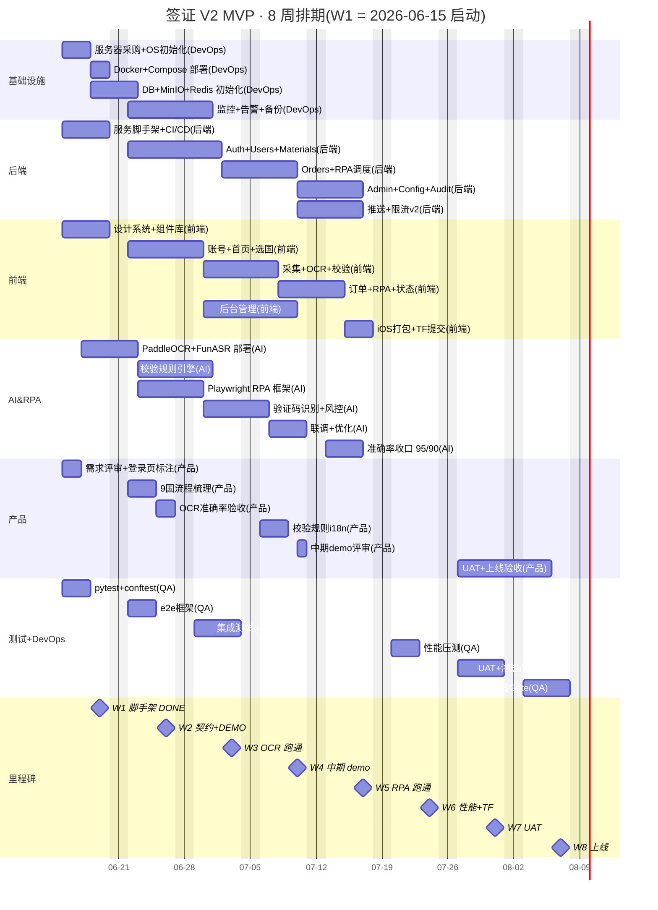

# WBS · 签证 V2 MVP · 8 周任务拆解

> **D = PM 维护**. 修订请改本文件,更新 `pm/WORKLOG.json` 的 `last_update`.
> 5 角色:产品 / 前端 / 后端 / AI&RPA / 测试+DevOps(V2 §10.2 标配 + W1 测试与 DevOps 合并,人少时一人兼)
> 任务数:**129 条**(W1-W8 五角色 P/F/B/A/QD 全周拆解;Section 10 给出按角色 × 周的逐项统计)
> 任务 ID 规则:`P1.1` = Product W1 task 1;`F1.3` = Frontend W1 task 3,以此类推
> 甘特图:见下方 [§0.5 内嵌 Mermaid](#05-内嵌甘特图mermaid) 或独立文件 `pm/wbs/wbs.gantt.mmd`(内容同步)

---

## 0. 全局里程碑

| ID  | 里程碑                        | 目标日         | 验收物                                 |
| --- | ----------------------------- | -------------- | -------------------------------------- |
| M0  | 立项 / V2 文档定稿            | 2026-06-11     | V2 需求文档(docx)                      |
| M1  | W1 脚手架 / 登录页可跑        | 2026-06-19     | 4 端登录页 + 后端 Auth 5 端点 + 测试   |
| M2  | W2 OpenAPI 契约 / 设计走查    | 2026-06-26     | OpenAPI 3.0 YAML + Figma              |
| M3  | W3 OCR 跑通 / 选国页         | 2026-07-03     | OCR 准确率 ≥ 80% / 9 国适配             |
| M4  | W4 中期 demo / 前端联调        | 2026-07-10     | 端到端 demo / API 收口                 |
| M5  | W5 RPA 跑通 / 校验规则        | 2026-07-17     | 提交成功率 ≥ 80% / 15+ 规则              |
| M6  | W6 性能 + iOS 审核提交        | 2026-07-24     | P95 < 300ms / TestFlight              |
| M7  | W7 UAT + 修复                 | 2026-07-31     | 验收清单 90% PASS                      |
| M8  | W8 上线验收 / Gate            | 2026-08-07     | 上线报告 + 8 节点全部 gate            |

---

## 0.5 内嵌甘特图(Mermaid)

> 与独立文件 `pm/wbs/wbs.gantt.mmd` 内容同步;两处任选一处查看即可。

### 关键路径

> 关键路径 = 端到端 demo 必须在 M4 跑通的最长依赖链,延期会让 M5/M6/M7/M8 全部顺延。

**M0 → M1 → M2 → M3 → M4**:产品需求定稿 → 脚手架 + 登录页 → 契约 + 选国 → OCR + 采集 → 中期 demo 联调

具体链路(按 section 顺序串行/并行约束):

| 阶段 | 关键节点 | 依赖 | 风险 |
| --- | --- | --- | --- |
| W1 → M1 | P1.1 / F1.1-F1.12 / B1.1-B1.13 / A1.1-A1.5 / QD1.1-QD1.6 | 4 端脚手架 + auth 端点 | 4 端联调阻塞(见 R10) |
| W2 → M2 | B2.1 OpenAPI 契约 / F2.x 选国页 / P2.x 9 国流程 | 契约先于 UI,UI 先于联调 | 契约反复改 → UI 重做(无降级) |
| W3 → M3 | A3.x OCR 跑通 / F3.x 采集页 | OCR 引擎先于采集 UI | R1 PaddleOCR 准确率不足 |
| W4 → M4 | 端到端 demo(采集 → OCR → 校验 → 提交) | 上面所有 | 任何上游延期都吃掉 M4 slack |

**Slack 为 0** 的节点(无 buffer):M1(脚手架必须 D5 收口)、M3(OCR 跑通必须 D5 收口)、M4(端到端 demo 必须 D5 收口)。其余 M2/M5/M6/M7 各有 1-2 天 slack。

---

## 1. W1 (2026-06-15 ~ 2026-06-19) · 脚手架周

> 目标:4 端脚手架都跑起来,登录页可调通后端 mock,测试框架 + 覆盖率 ≥ 80% for auth.

### 1.1 产品 (P)

| ID    | 任务                                          | Owner | 依赖 | 交付物                  | 状态 |
| ----- | --------------------------------------------- | ----- | ---- | ----------------------- | ---- |
| P1.1  | 评审 V2 文档,锁定 W1 范围(仅登录页)         | PM    | —    | W1 范围确认邮件         | To Do |
| P1.2  | 4 端登录页交互注释(从 V2 原型 P3 截图标注)   | PM    | P1.1 | 标注图 4 张              | To Do |
| P1.3  | 起 WBS + 风险登记 + standup 框架              | PM    | —    | pm/ 全套                | Doing |
| P1.4  | ngrok 临时域名方案 + launchd plist            | PM    | —    | pm/infra/               | Doing |
| P1.5  | W1 看板 daily 维护                            | PM    | P1.3 | pm/board/ 每日更新       | To Do |

### 1.2 前端 (F) · 4 端

| ID     | 任务                                          | Owner | 依赖   | 交付物                    | 状态 |
| ------ | --------------------------------------------- | ----- | ------ | ------------------------- | ---- |
| F1.1   | Web 端 Vite + Vue3 + Element Plus 初始化      | FE-A  | —      | frontend/web/             | Doing |
| F1.2   | Web 端 vue-router 4 + Pinia 接入              | FE-A  | F1.1   | 路由表                    | Doing |
| F1.3   | Web 端 vue-i18n@9 + zh-CN/en.json (30+ key)   | FE-A  | F1.1   | locales/                  | Doing |
| F1.4   | Web 端 P3 登录页移植 + 共用组件(Button/Card) | FE-A  | F1.2,F1.3 | login.vue + 截图        | To Do |
| F1.5   | iOS 端 Flutter 初始化(--platforms=ios)       | FE-B  | —      | frontend/ios/(无 android/) | Doing |
| F1.6   | iOS 端 flutter_localizations + intl           | FE-B  | F1.5   | intl_*.arb                | To Do |
| F1.7   | iOS 端 P3 登录页移植(Flutter 版)             | FE-B  | F1.6   | login_page.dart + 截图    | To Do |
| F1.8   | 小程序端 uni-app x 初始化                    | FE-C  | —      | frontend/miniprogram/     | To Do |
| F1.9   | 小程序端 P3 登录页移植(uni-app 版)            | FE-C  | F1.8   | login.vue + 截图          | To Do |
| F1.10  | 后台 Web 端初始化 + 登录页 + Dashboard 占位  | FE-A  | F1.1   | frontend/admin/           | To Do |
| F1.11  | shared/i18n/{zh-CN,en}.json 4 端共用          | FE-A  | F1.3   | shared/i18n/              | To Do |
| F1.12  | shared/design-tokens.json(色/字/间距)         | FE-A  | —      | shared/design-tokens.json | To Do |

### 1.3 后端 (B)

| ID    | 任务                                            | Owner | 依赖 | 交付物                       | 状态 |
| ----- | ----------------------------------------------- | ----- | ---- | ---------------------------- | ---- |
| B1.1  | FastAPI 0.110+ 项目脚手架(app/main.py)         | BE-A  | —    | backend/app/                 | Doing |
| B1.2  | SQLAlchemy 2.0 async + SQLite 引擎              | BE-A  | B1.1 | app/core/db.py              | Doing |
| B1.3  | Pydantic v2 Settings + .env.example             | BE-A  | B1.1 | app/core/config.py          | Doing |
| B1.4  | Alembic init + 4 表 migration (0001_init.py)    | BE-A  | B1.2 | alembic/versions/0001_init.py | To Do |
| B1.5  | JWT + bcrypt(python-jose + passlib)             | BE-A  | B1.1 | app/core/security.py        | To Do |
| B1.6  | POST /api/v2/auth/register                     | BE-A  | B1.4,B1.5 | app/api/v2/auth/register.py | To Do |
| B1.7  | POST /api/v2/auth/login                        | BE-A  | B1.4,B1.5 | app/api/v2/auth/login.py    | To Do |
| B1.8  | POST /api/v2/auth/sms-login                    | BE-A  | B1.4,B1.5 | .../sms_login.py           | To Do |
| B1.9  | POST /api/v2/auth/refresh                      | BE-A  | B1.5 | .../refresh.py              | To Do |
| B1.10 | POST /api/v2/auth/send-code(Mock 直接返回 code) | BE-A  | B1.4 | .../send_code.py            | To Do |
| B1.11 | 限流中间件(慢 API 60 req/min/IP)              | BE-B  | B1.1 | app/middleware/ratelimit.py | To Do |
| B1.12 | 请求日志中间件(loguru)                         | BE-B  | B1.1 | app/middleware/log.py       | To Do |
| B1.13 | Docker compose(后端 + Redis)+ Dockerfile       | BE-B  | B1.1 | docker-compose.yml          | To Do |
| B1.14 | 本地起服务 + curl 5 端点全 PASS                 | BE-A  | B1.6-B1.10 | WORKLOG.md 贴 200 响应 | To Do |

### 1.4 AI&RPA (A)

| ID    | 任务                                          | Owner | 依赖   | 交付物                  | 状态 |
| ----- | --------------------------------------------- | ----- | ------ | ----------------------- | ---- |
| A1.1  | 本周不交付功能,只跑准备动作                  | AI-A  | —      | —                       | —    |
| A1.2  | 准备 PaddleOCR + Tesseract 双引擎容器镜像     | AI-A  | —      | docker/Dockerfile.ocr   | To Do |
| A1.3  | 准备 100 张样本护照图片(W3 OCR 准确率测试)   | AI-A  | —      | samples/passport/100    | To Do |
| A1.4  | 校验规则 15 条 JSON schema 草案               | AI-A  | —      | rules/v1_draft.json     | To Do |
| A1.5  | ddddocr 验证码识别 demo 跑通                  | AI-B  | —      | ddddocr_demo.py + 输出  | To Do |

### 1.5 测试+DevOps (Q+D)

| ID      | 任务                                          | Owner | 依赖       | 交付物                            | 状态 |
| ------- | --------------------------------------------- | ----- | ---------- | --------------------------------- | ---- |
| QD1.1   | pytest.ini + conftest.py (db 准备/清理)       | QA-A  | —          | qa/pytest.ini + conftest.py       | Doing |
| QD1.2   | requirements-test.txt 锁定版本                | QA-A  | —          | qa/requirements-test.txt          | Doing |
| QD1.3   | test_auth.py 框架 + 1 个示例测试              | QA-A  | QD1.1      | qa/integration/test_auth.py       | To Do |
| QD1.4   | OpenAPI 3.0 spec 占位(等 B 端完成)            | QA-A  | B1.6-B1.10 | qa/contract/openapi.yaml         | To Do |
| QD1.5   | CI 脚本 run_tests.sh + 写 last_run.json       | Dev   | QD1.1      | qa/scripts/run_tests.sh           | To Do |
| QD1.6   | 覆盖率报告 pytest --cov 生成                  | QA-A  | QD1.1      | qa/reports/coverage/index.html    | To Do |

---

## 2. W2 (2026-06-22 ~ 2026-06-26) · 契约 + 选国 + 设计系统

| ID    | 角色 | 任务                                           | Owner | 依赖 | 交付物                            |
| ----- | ---- | ---------------------------------------------- | ----- | ---- | --------------------------------- |
| P2.1  | 产品 | OpenAPI 契约评审会(后端主讲,前端反向确认)     | PM    | B1.x | 会议纪要 + 改 API 列表            |
| P2.2  | 产品 | 9 国签证流程梳理(美/日/英/澳/加/申根/新/韩/新)| PM    | —    | country_flows/9 份               |
| F2.1  | 前端 | Web 端首页 P1 + 选国页 P2 移植                | FE-A  | F1.4 | index.vue + countries.vue + 截图 |
| F2.2  | 前端 | iOS 端首页 + 选国移植                         | FE-B  | F1.7 | 截图                              |
| F2.3  | 前端 | 小程序端首页 + 选国移植                       | FE-C  | F1.9 | 截图                              |
| F2.4  | 前端 | 共用 design-token 接入 4 端                   | FE-A  | F1.12 | 4 端 token 应用截图              |
| F2.5  | 前端 | i18n 4 语种资源扩展(加 id/vi)                  | FE-A  | F1.11 | locales/{id,vi}.json             |
| B2.1  | 后端 | 国家服务 GET /api/v2/countries                 | BE-A  | B1.x | countries.py + 9 国 seed data     |
| B2.2  | 后端 | 选国配置(规则/材料清单/语种)                 | BE-A  | B2.1 | config/countries.yaml            |
| B2.3  | 后端 | OpenAPI YAML 自动生成 + Swagger UI             | BE-A  | B1.x | openapi/v2.yaml + /docs         |
| B2.4  | 后端 | Celery worker 骨架(等 W5 RPA 用)              | BE-B  | B1.13 | app/worker/celery_app.py         |
| A2.1  | AI&RPA | 校验规则 15 条 V1 锁版                   | AI-A  | A1.4 | rules/v1.json 锁版               |
| A2.2  | AI&RPA | Playwright RPA 框架骨架 + 1 个 demo 任务       | AI-B  | A1.5 | rpa/framework/ + demo.py         |
| QD2.1 | QA    | 端到端框架(playwright)+ 1 个登录 e2e         | QA-A  | QD1.x | qa/e2e/test_login.py              |
| QD2.2 | DevOps | Docker 镜像构建 + docker-compose up 跑通     | Dev   | B1.13 | 本地一键起 backend+redis          |
| QD2.3 | DevOps | 日志收集方案(Loki / 本地文件二选一)        | Dev   | B1.12 | 选型 + 部署 README                |

---

## 3. W3 (2026-06-29 ~ 2026-07-03) · OCR + 采集 + 选国完成

| ID    | 角色 | 任务                                          | Owner | 依赖     | 交付物                      |
| ----- | ---- | --------------------------------------------- | ----- | -------- | --------------------------- |
| P3.1  | 产品 | OCR 准确率验收标准定档(≥ 80% W3,≥ 95% W8)   | PM    | A1.3     | 验收 checklist               |
| F3.1  | 前端 | Web 端 N1 扫描引导页(边框/闪光/倒计时)      | FE-A  | F2.1     | n1_scan.dart 移植到 web      |
| F3.2  | 前端 | iOS 端 N1 扫描页 + 相机权限                  | FE-B  | F2.2     | 截图 + Info.plist 配置      |
| F3.3  | 前端 | 小程序端 N1 扫描页(降级为拍照)              | FE-C  | F2.3     | 截图                        |
| F3.4  | 前端 | 材料上传组件(限 10MB,格式:JPG/PNG/PDF/WebP) | FE-A  | F3.1     | uploader.vue                |
| B3.1  | 后端 | 材料服务 POST /api/v2/materials/upload       | BE-A  | B1.x     | materials.py                |
| B3.2  | 后端 | 文件存储(MinIO / 本地文件系统二选一)        | BE-B  | B1.13    | 选型 + storage adapter      |
| B3.3  | 后端 | SHA256 去重(同用户同文件不重复 OCR)        | BE-A  | B3.1     | 去重中间件                  |
| B3.4  | 后端 | 临时文件 24h 清理脚本(Celery beat)          | BE-B  | B2.4     | cleanup_task.py             |
| A3.1  | AI&RPA | PaddleOCR 部署 + 100 张样本准确率测试     | AI-A  | A1.2,A1.3 | accuracy_report.md          |
| A3.2  | AI&RPA | Tesseract 兜底对比(若 Paddle < 80%)        | AI-A  | A3.1     | 对比报告                    |
| A3.3  | AI&RPA | 字段映射 schema(护照/身份证/邀请函 3 类) | AI-A  | A3.1     | field_mapping.yaml          |
| A3.4  | AI&RPA | RPA Playwright demo 跑通 1 个真实国家        | AI-B  | A2.2     | rpa demo video              |
| QD3.1 | QA    | 材料服务集成测试(上传/去重/清理)          | QA-A  | B3.x     | test_materials.py            |
| QD3.2 | QA    | OCR 准确率自动测试脚本(100 张样本回归)    | QA-A  | A3.1     | test_ocr_accuracy.py         |
| QD3.3 | DevOps | MinIO / 文件存储上线 + 备份策略           | Dev   | B3.2     | 部署文档                    |

---

## 4. W4 (2026-07-06 ~ 2026-07-10) · AI 校验 + 联调

| ID    | 角色 | 任务                                          | Owner | 依赖     | 交付物                       |
| ----- | ---- | --------------------------------------------- | ----- | -------- | ---------------------------- |
| P4.1  | 产品 | 中期 demo 评审(全员)                         | PM    | 全部 W3 | 评审纪要                     |
| P4.2  | 产品 | 15 条校验规则 i18n 文案                       | PM    | A2.1     | i18n/validation.json         |
| F4.1  | 前端 | Web 端 N2 校验结果详情页                      | FE-A  | F3.x     | n2_validation.vue            |
| F4.2  | 前端 | iOS 端 N2 详情页                              | FE-B  | F3.x     | 截图                         |
| F4.3  | 前端 | 小程序端 N2 详情页                            | FE-C  | F3.x     | 截图                         |
| F4.4  | 前端 | 错误阻止/警告二次确认交互                     | FE-A  | P4.2     | 交互视频                     |
| B4.1  | 后端 | 校验服务 POST /api/v2/validation/run         | BE-A  | B3.1,A2.1 | validation.py              |
| B4.2  | 后端 | 订单服务 POST /api/v2/orders(创建草稿)      | BE-A  | B3.1     | orders.py                    |
| B4.3  | 后端 | 订单状态机(5 态:草稿/OCR/校验/RPA/完成)     | BE-A  | B4.2     | state_machine.py             |
| A4.1  | AI&RPA | 校验规则引擎 15 条全跑通                  | AI-A  | A2.1,B4.1 | 引擎代码 + 单元测试         |
| A4.2  | AI&RPA | RPA 提交任务接入 Celery 队列              | AI-B  | A3.4,B2.4 | celery_rpa_task.py          |
| QD4.1 | QA    | 校验服务集成测试(15 规则 × happy/error/warn) | QA-A  | A4.1 | test_validation.py           |
| QD4.2 | QA    | 订单状态机测试(5 态转换)                  | QA-A  | B4.3     | test_orders.py               |
| QD4.3 | DevOps | Prometheus + Grafana 监控起跑            | Dev   | QD2.3    | dashboard.json               |

---

## 5. W5 (2026-07-13 ~ 2026-07-17) · RPA 跑通 + 状态查询

| ID    | 角色 | 任务                                          | Owner | 依赖     | 交付物                       |
| ----- | ---- | --------------------------------------------- | ----- | -------- | ---------------------------- |
| P5.1  | 产品 | RPA 进度页 UX 评审                            | PM    | A4.2     | 评审纪要                     |
| F5.1  | 前端 | Web 端 N3 RPA 进度页(实时)                    | FE-A  | F4.1     | n3_rpa_progress.vue          |
| F5.2  | 前端 | iOS 端 N3 + N4 订单状态详情页                 | FE-B  | F4.2     | 截图                         |
| F5.3  | 前端 | 小程序端 N3 + N4                              | FE-C  | F4.3     | 截图                         |
| B5.1  | 后端 | 订单状态推送(WebSocket / SSE 二选一)          | BE-B  | B4.2     | 推送服务                     |
| B5.2  | 后端 | 单 IP 50 次/日 限流 + 错峰策略                | BE-B  | A4.2     | 限流中间件 v2                |
| A5.1  | AI&RPA | 验证码 CNN 自训 pipeline(若 ddddocr < 80%) | AI-B  | A1.5     | model/captcha_v1.pt         |
| A5.2  | AI&RPA | 官网选择器监控(改版自动告警)              | AI-B  | A4.2     | monitor/selectors_health.py  |
| A5.3  | AI&RPA | 连续 3 次失败暂停 + 飞书告警                  | AI-B  | A5.2     | alert.py                     |
| QD5.1 | QA    | RPA 5 天稳定性测试(成功率 ≥ 80%)             | QA-A  | A4.2     | test_rpa_stability.md        |
| QD5.2 | QA    | 限流 + 错峰单元测试                          | QA-A  | B5.2     | test_ratelimit.py            |
| QD5.3 | DevOps | 告警通道(飞书 webhook)接入                  | Dev   | A5.3     | alertmanager.yml             |

---

## 6. W6 (2026-07-20 ~ 2026-07-24) · 后台 + 性能 + iOS 审核

| ID    | 角色 | 任务                                          | Owner | 依赖     | 交付物                       |
| ----- | ---- | --------------------------------------------- | ----- | -------- | ---------------------------- |
| P6.1  | 产品 | 后台 UX 评审                                  | PM    | F2.x     | 评审纪要                     |
| P6.2  | 产品 | 9 国官网改版监控名单                          | PM    | A5.2     | monitor_list.yaml            |
| F6.1  | 前端 | 后台 Web 端:国家/规则/RPA/语种 4 类配置 CRUD | FE-A  | F1.10    | admin/countries.vue 等       |
| F6.2  | 前端 | 后台:订单/用户/日志查询 + 导出(脱敏)         | FE-A  | F1.10    | admin/orders.vue 等          |
| F6.3  | 前端 | 后台:权限分级(super_admin / operator)         | FE-A  | F1.10    | 权限组件                     |
| F6.4  | 前端 | iOS 端打包 + TestFlight 提交                  | FE-B  | F5.2     | TF build 截图                |
| B6.1  | 后端 | 后台管理服务(8 端点)                          | BE-A  | B1.x     | admin/*.py                   |
| B6.2  | 后端 | 配置热更新(前端 5s 拿到新配置)               | BE-B  | B6.1     | hot_reload.py                |
| B6.3  | 后端 | 审计日志所有敏感操作                          | BE-A  | B1.4     | audit_logger.py              |
| A6.1  | AI&RPA | RPA 性能优化(单次 < 5min)                  | AI-B  | A4.2     | 优化报告                     |
| QD6.1 | QA    | 500 并发用户 + 100 并发订单 P95 压测          | QA-A  | B5.x     | perf_report_w6.md            |
| QD6.2 | QA    | 安全扫描(SQL 注入/XSS/越权)                  | QA-A  | 全栈      | security_scan_w6.md          |
| QD6.3 | DevOps | Grafana 5 类关键指标 dashboard            | Dev   | QD4.3    | 5 个 panel                   |

---

## 7. W7 (2026-07-27 ~ 2026-07-31) · UAT + 修复

| ID    | 角色 | 任务                                          | Owner | 依赖     | 交付物                       |
| ----- | ---- | --------------------------------------------- | ----- | -------- | ---------------------------- |
| P7.1  | 产品 | UAT 验收清单 7 大模块全部跑一遍              | PM    | 全栈 W6  | uat_checklist.md             |
| P7.2  | 产品 | 用户协议/隐私政策 4 语种最终版                | PM    | —        | legal/v1.0/                 |
| F7.1  | 前端 | UAT 修复(Bug bash 找出来的问题)              | 3 FE  | P7.1     | bugfix PR × N                |
| B7.1  | 后端 | UAT 修复                                      | 2 BE  | P7.1     | bugfix PR × N                |
| A7.1  | AI&RPA | OCR 准确率 ≥ 95% 收口                        | AI-A  | A3.1     | 1000 张样本报告              |
| A7.2  | AI&RPA | 验证码识别率 ≥ 90%                           | AI-B  | A5.1     | 500 张样本报告               |
| QD7.1 | QA    | 备份恢复演练(RTO ≤ 30min)                   | Dev   | QD3.3    | drill_report.md              |
| QD7.2 | QA    | 弱密码 + 越权渗透测试                        | QA-A  | 全栈      | penetration_w7.md            |

---

## 8. W8 (2026-08-03 ~ 2026-08-07) · 上线 + Gate

| ID    | 角色 | 任务                                          | Owner | 依赖     | 交付物                       |
| ----- | ---- | --------------------------------------------- | ----- | -------- | ---------------------------- |
| P8.1  | 产品 | 上线验收报告 v1.0                             | PM    | 全部     | launch_report.docx           |
| P8.2  | 产品 | 用户手册 4 语种                               | PM    | —        | user_manual/{zh-CN,en,id,vi} |
| F8.1  | 前端 | iOS App Store 提交 + 申诉材料                 | FE-B  | F6.4     | submission 包                 |
| B8.1  | 后端 | 备份每日 03:00 跑通                           | Dev   | QD7.1    | cron 配置                    |
| A8.1  | AI&RPA | 监控告警 5 类关键指标全触达                  | Dev   | QD6.3    | alert runbook                 |
| QD8.1 | QA    | 上线 Gate 8 项全 PASS                          | QA-A  | 全部 W7  | gate_report.md               |
| QD8.2 | QA    | 性能压测复测 + 容量规划                        | QA-A  | QD6.1    | capacity_plan.md             |
| QD8.3 | DevOps | 灰度发布方案(白名单 10%)                    | Dev   | 全栈      | canary_runbook.md             |

---

## 9. W1 每日工作清单(细化版)

### D1 (周一 2026-06-15)
- P: 锁 W1 范围 + 起 4 端登录页标注
- F: 4 端项目脚手架初始化
- B: FastAPI + SQLAlchemy + Alembic init
- A: 准备 OCR 容器镜像 + 100 张样本
- Q+D: pytest 框架 + conftest

### D2 (周二 2026-06-16)
- P: 风险登记 V1 评审 + ngrok 跑通
- F: 4 端 i18n + vue-router
- B: 5 个 auth 端点写完
- A: ddddocr demo 跑通
- Q+D: test_auth.py 框架 + 1 示例

### D3 (周三 2026-06-17)
- P: 跨 agent 同步会 + 收截图
- F: 4 端登录页接后端 mock
- B: 限流 + 日志中间件
- A: 校验规则 JSON 草案
- Q+D: B 端起来后补测试用例

### D4 (周四 2026-06-18)
- P: 集成联调 day 1 - 端到端 demo
- F: 4 端截图 + 文档 README
- B: pytest 覆盖率 ≥ 80%
- A: RPA 框架 demo
- Q+D: coverage HTML 报告

### D5 (周五 2026-06-19)
- P: W1 收口 - 风险评审 + W1 Gate 报告
- F: 修复 + 收尾
- B: 修复 + curl 5 端点贴 200
- A: W1 总结 + W2 计划
- Q+D: 覆盖率 + 测试用例数汇报

---

## 10. 任务统计

| 角色       | W1 | W2 | W3 | W4 | W5 | W6 | W7 | W8 | 合计 |
| ---------- | -- | -- | -- | -- | -- | -- | -- | -- | ---- |
| 产品 (P)   | 5  | 2  | 1  | 2  | 1  | 2  | 2  | 2  | 17   |
| 前端 (F)   | 12 | 5  | 4  | 4  | 3  | 4  | 1  | 1  | 34   |
| 后端 (B)   | 14 | 4  | 4  | 3  | 2  | 3  | 1  | 1  | 32   |
| AI&RPA (A) | 5  | 2  | 4  | 2  | 3  | 1  | 2  | 1  | 20   |
| QA+DevOps (QD) | 6 | 3 | 3 | 3 | 3 | 3 | 2 | 3 | 26   |
| **小计**   | **42** | **16** | **16** | **14** | **12** | **13** | **8** | **8** | **129** |

> W1 是 5 天密集周,所以任务条数最多(42 条),W2-W8 趋于平稳(每周 8-16 条)。
> 风险:任务条数不等于人天,需要按实际 8-10 人 × 8 周 = 320-400 人天 拆 resource leveling.

---

## 11. 评审 & 修订

| 日期       | 修订人 | 变更                                  |
| ---------- | ------ | ------------------------------------- |
| 2026-06-11 | PM     | 初版 V1(8 周 × 5 角色, 共 129 条任务;W1-D1~D5 每日清单嵌入 §9) |
| 2026-06-11 | PM     | V1.1: 修正表头任务数 (75 → 129, 与 §10 统计对齐);内嵌 Mermaid 甘特图;新增 `pm/board/W1_summary.md` |
| W1 D5      | PM     | W1 实际进度标注 + W2 任务滚动更新     |
| W2 D5      | PM     | W2 实际进度 + 风险联动                |
