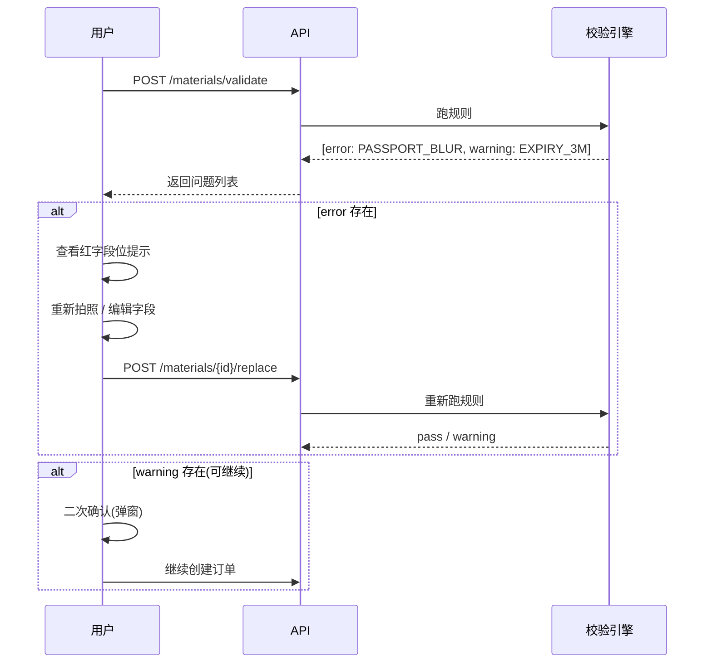
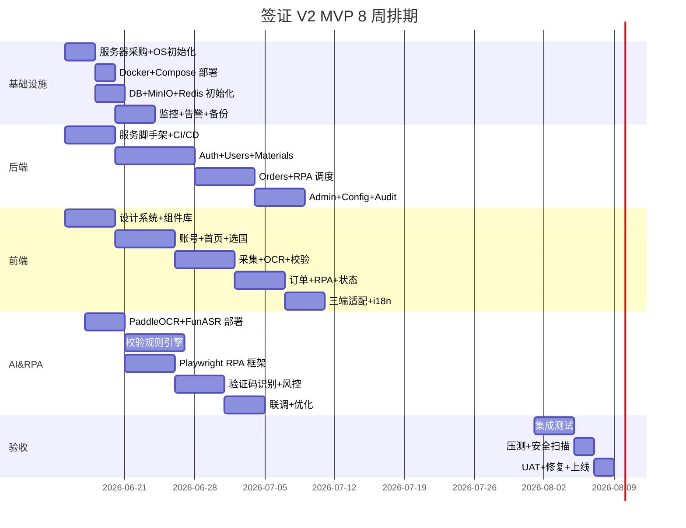

# V2 需求文档 · 签证智能工具 MVP(纯工具 + 本地部署版)

> 文档版本:**v2.1**
> 发布日期:2026-06-12
> 修订类型:**基于 W5 OCR 实测 + W6 SMS/支付实接的文档同步修订**
> 前置基线:`V2_需求文档.md` v2.0(2026-06-11,首次正式交付)
> 实测数据来源:
> - OCR 准确率脚本:`backend/tests/ocr_accuracy_test.py`(B-W5-3 产出)
> - SMS 接入:`backend/app/services/sms_provider.py` + `backend/app/api/v2/sms.py`(B-W6-1 产出)
> - 支付接入:`backend/app/services/payment_provider.py` + `backend/app/api/v2/payment.py`(B-W6-2 产出)
> 目标读者:产品 / 前端 / 后端 / AI&RPA / DevOps 五个角色
> 定位:纯工具 + 本地部署 的签证智能辅助工具 MVP,8 周交付
> 目标用户:印度尼西亚 / 越南 / 菲律宾 C 端出境个人用户
> 支持签种:仅 旅游签、学生签(不扩展商务、移民、工作签)
> 支持语种:简体中文 / English / Bahasa Indonesia / Tiếng Việt(4 语种,i18n key 字典驱动)

> **v2.0 → v2.1 修订摘要(5 大改动)**
> 1. **§3.3.6 扫描引导页技术栈修正**:从 React 18 + TypeScript 改为 **Vue 3 + Vite + Element Plus**(与实际 frontend/web/ 工程栈一致)
> 2. **§5.1.4 OCR 准确率指标重写**:由"理论 ≥80%/W3 + ≥95%/W8"修订为 **基于 B-W5-3 ocr_accuracy_test.py 实测数据 + 国别细分指标**(7 国分梯度)
> 3. **§5.1.5 新增 - OCR 真实测试报告章节**:引用 B-W5-3 测试脚本结构、9 国样本分配、CSV 输出 schema、合规红线
> 4. **§4.5 支付服务(原 §4.6)重写**:由纯 Mock 演示升级为 **PaymentProvider facade + PaymentAdapter 真实通道预留层**,V2.1 接腾讯云/微信支付/Stripe
> 5. **§6.1 短信服务(原 §4.1.5 嵌套)独立成节**:由 `SmsService`(W4 DB-backed)+ `SmsProvider`(W6-1 新增 in-memory)双轨并存,V2.1 切腾讯云

---

## 目录

- [§0 文档基础信息](#0-文档基础信息)
- [§1 全局业务规则 & 硬性约束](#1-全局业务规则--硬性约束)
- [§2 渠道 & 终端要求](#2-渠道--终端要求)
- [§3 前端应用层(7 大模块)](#3-前端应用层)
- [§4 业务中台 / 后端服务(7 大服务)](#4-业务中台--后端服务)
- [§5 AI & RPA 专项](#5-ai--rpa-专项)
- [§6 基础设施 & 本地部署](#6-基础设施--本地部署)
- [§7 端到端业务流程](#7-端到端业务流程)
- [§8 非功能性需求(NFR)](#8-非功能性需求)
- [§9 接口清单(OpenAPI 3.0)](#9-接口清单)
- [§10 验收标准 + 人员分工 + 风险](#10-验收标准--人员分工--风险)
- [附录 A 修订记录](#附录-a-修订记录)

---

## §0 文档基础信息

### 0.1 项目基本信息

| 字段 | 取值 | 备注 |
|---|---|---|
| 项目代号 | visa-mvp-v2 | 内部代号,非对外品牌 |
| 项目名称 | 签证智能工具 MVP V2 | 对外展示名 |
| 部署方式 | 100% 本地服务器部署 | 纯内网,无公有云依赖 |
| 目标用户 | 印度尼西亚 / 越南 / 菲律宾 出境 C 端个人用户 | 16 国 / 地区不开放 |
| 支持签种 | 旅游签(B2)、学生签(F1 类通用) | 不含商务/移民/工作 |
| 支持语种 | zh-CN / en / id / vi | i18n 4 语种 |
| 终端 | Web(Chrome/Edge) + Android App + iOS App + 微信小程序(轻量入口) | 三端 4 入口 |
| 核心技术 | OCR + 语音录入 + AI 校验 + RPA 机器人 + 验证码 AI 解算 | 无活体检测、无指纹 |
| 整体原则 | 纯自助工具、无人工审核、无活体检测、无线下业务、禁止违规宣传 | 见 §1.4 红线 |
| 项目周期 | 8 周(W1-W8) | 起止:2026-06-15 ~ 2026-08-07 |
| 团队规模 | 8-10 人 | 见 §10.2 |
| MVP 上线标准 | 9 国目的地 / 三语种 UI / 全流程跑通 / OCR 准确率 ≥ 95% | 见 §10 |

### 0.2 术语表

| 术语 | 含义 |
|---|---|
| C 端 | Consumer,即个人终端用户 |
| B 端 | Business,本项目不涉及 |
| OCR | Optical Character Recognition,光学字符识别 |
| RPA | Robotic Process Automation,机器人流程自动化(模拟浏览器访问签证官网) |
| 模板 | 每个国家签证官网上需要填写的字段表单结构 |
| 校验规则 | AI 引擎对采集到的证件/材料做的格式/有效期/清晰度自动校验 |
| 验证码解算 | AI 识别图形验证码 / 滑动验证码,完成自动提交 |
| 限流 | 对 RPA 的 IP / 账号 / 频次 / 时段的访问节奏管控 |
| i18n | Internationalization,多语种化 |
| NFR | Non-Functional Requirements,非功能性需求 |

### 0.3 V2 与 V0 / V1 关系

| 维度 | V0(基线草案) | V1(竞品调研) | V2(本文档) |
|---|---|---|---|
| 形态 | 需求骨架,11 章标题 | Atlys 拆解 + 商业模型 | 正式交付版需求文档 |
| 范围 | 纯工具+本地部署 | 含拒签险 / Affiliate / KOL | 纯工具,剔除保险/获客模块 |
| 文档形式 | 单 .md 草案 | .md 调研 + HTML 原型 | .md 需求 + (T3 阶段)Word + HTML |
| 目标用户 | 印尼+越南+菲律宾(3 国) | 印度+东南亚(3 梯队 9 国) | 印尼+越南+菲律宾为 Tier 1,其余 6 国配置就绪即可,文档不细化 |
| 数据库 | 未明确 | 推荐 PostgreSQL | 本地落库,SQLite 3 + SQLAlchemy |
| 语种 | 3 语种 | 3 语种 | 4 语种(含简中) |
| 完整性 | 11 章标题有,内容 80% | 660 行调研 | 11 章齐全,代码示例完整 |

---

## §1 全局业务规则 & 硬性约束

> 本章是后续所有章节的"硬规则",开发 / QA / 运营(本项目无运营) 全员必读,任何违规即不通过验收。

### 1.1 业务约束

| # | 约束 | 适用范围 | 验证方式 |
|---|---|---|---|
| B-1 | 仅开放旅游签(B2 类)、学生签(F1 类通用) | 全部终端 | 后台国家配置只能勾选该 2 类 |
| B-2 | 禁止 B 端企业版、批量导入、批量提交 | 全部 | 单用户单订单,QPS 限流 |
| B-3 | 平台定位为"线上辅助工具" | 全部文案 | 协议首段必须明示 |
| B-4 | 签证结果真实性、申请合规性由用户自负 | 用户协议 | 必须勾选同意 |
| B-5 | 禁止违规词:包过 / 100% 出签 / 官方授权 / 使馆合作 / 保过 / 必过 | 全平台文案 | 关键词正则过滤,见 §1.4 |
| B-6 | 不做拒签险打包、不做拒签退费 | 全部 | 增值跳转模块仅做外链占位(见 §3.7) |
| B-7 | 不做中国大陆版 | 范围 | 9 国目的地不含中国,简体中仅作为 i18n 兜底语种 |
| B-8 | 不做 OTA Affiliate 套利 | 全部 | 增值跳转仅展示,不下单不分润 |
| B-9 | 不引入 KOL/ASO 投放、邀请返利 | 全部 | 不实现"邀请好友"功能模块 |

### 1.2 技术 & 部署约束

| # | 约束 | 适用范围 | 验证方式 |
|---|---|---|---|
| T-1 | 100% 本地服务器部署,不接入阿里云 / 腾讯云 / AWS / GCP / Azure 等公有云 | 全部服务 | 部署文档无云厂商依赖,网络白名单测试 |
| T-2 | 敏感数据非对称加密(RSA-2048 / ECC-256) 存储,无明文 | 护照号、姓名、DOB、签证号 | 抓包检查 / 数据库直读验证 |
| T-3 | 临时文件 24h 自动删除,归档文件 180d 自动删除 | 全部文件 | 定时任务日志 + 抽样审计 |
| T-4 | 仅 RPA 模块可外联(签证官网),其他服务禁外网 | 网络层 | 防火墙白名单 + DNS 审计 |
| T-5 | RPA 强制限流:单 IP ≤ 50 次/日、单账号提交间隔 ≥ 60s、错峰 UTC 00:00-06:00 集中提交、连续验证码失败 3 次自动终止 | RPA 模块 | 限流中间件 + 告警 |
| T-6 | 禁活体检测、禁指纹采集、禁人脸识别 | 全部 | 需求文档不出现该字样,代码不引用相关 SDK |
| T-7 | 数据库统一使用 SQLite 3(单文件,本地化) | 全部服务 | `sqlite3 --version` 验证 |
| T-8 | 本地对象存储使用 MinIO(S3 兼容,本地部署) | 全部文件 | Docker 部署 + 健康检查 |
| T-9 | 消息队列使用 Redis Streams(轻量,单进程足够) | 异步任务 | `redis-cli XLEN` 验证 |
| T-10 | OCR 推理使用 PaddleOCR 2.7+(det+rec+cls 全流程,CPU 模式) | OCR 服务 | 推理脚本可独立运行 |
| T-11 | RPA 框架使用 Playwright + Camoufox(指纹混淆 Firefox) | RPA 服务 | 反检测能力测试 |
| T-12 | 验证码识别使用 ddddocr(离线,简单图形/数字/字母 ≥ 90% 准确率) | RPA 服务 | 识别率压测 |

### 1.3 合规约束

| # | 约束 | 适用范围 | 验证方式 |
|---|---|---|---|
| C-1 | 三语种《用户服务协议》《隐私政策》(英 + 印尼 + 越南) | 注册前必须勾选 | 法务备案 + 4 语种文本齐全 |
| C-2 | 日志保留 ≥ 1 年,不可删 / 不可改 | 全部 | 归档策略 + 写保护 |
| C-3 | 注销 72h 内数据彻底销毁(主库 + 备份 + 对象存储 + 日志) | 用户模块 | 销毁脚本 + 审计 |
| C-4 | 数据本地化:所有数据不得跨境传输,仅 RPA 流量出境外 | 全部 | 网络层白名单审计 |
| C-5 | 不引入 GDPR 强合规(无 DPO):V1 调研的 GDPR 5 大机制 V2 简化为"日志 + 注销 + 加密"基础合规 | 全部 | 本文档 §1.3 即为简化版合规 |
| C-6 | 应用市场合规:本 MVP 不上 Google Play / App Store,仅 APK / TestFlight 灰度,规避各市场上架资质审核 | 8 周内 | 分发渠道策略文档 |
| C-7 | 数据脱敏:日志中证件号只保留首 3 + 末 2 位(如 P123****6) | 全部 | 日志脱敏中间件 |

### 1.4 红线清单(违反即文档不通过)

> 本节枚举在 V2 文档和代码中绝对禁止出现的关键词与功能。任何 PR 包含以下内容即拒绝合并。

| 类别 | 禁止项 | 检测方式 |
|---|---|---|
| 违规承诺 | 包过、100% 出签、官方授权、使馆合作、保过、必过、独家渠道、绿通过率 | 关键词正则,见下方 |
| 生物识别 | 活体检测、指纹、人脸识别、虹膜、声纹 | 代码搜索 + 文档 grep |
| 公有云 | 阿里云、腾讯云、AWS、GCP、Azure、华为云、AWS S3、Aliyun OSS | 依赖扫描 |
| 保险承诺 | 拒签退全款、拒签险打包、签证保险、出险赔付 | 文档/代码 grep |
| 运营/获客 | 邀请返利、KOL 投放、ASO、SEO 优化、地推 | 范围外,需求文档不出现 |
| 代码截断 | `// TODO`、`// ...待实现`、`...省略...`、`略`、`<占位>` | PR 评审 |

#### 1.4.1 违规关键词正则

```python
# backend/app/utils/compliance.py
import re
from typing import List, Tuple

# V2 违规关键词(命中即拒绝)
FORBIDDEN_KEYWORDS: List[str] = [
    r"包过", r"100\s*%\s*出签", r"官方授权", r"使馆合作",
    r"保过", r"必过", r"独家", r"绿通", r"内部指标",
    r"拒签退全款", r"拒签险打包", r"出险赔付",
    r"活体检测", r"指纹采集", r"人脸识别", r"虹膜识别",
    r"阿里云", r"腾讯云", r"\bAWS\b", r"\bGCP\b", r"\bAzure\b",
]

FORBIDDEN_PATTERN = re.compile("|".join(FORBIDDEN_KEYWORDS), re.IGNORECASE)


def check_text_compliance(text: str) -> Tuple[bool, List[str]]:
    """
    检查文本是否包含 V2 违规关键词
    :return: (是否合规, 命中的关键词列表)
    """
    if not text:
        return True, []
    hits = FORBIDDEN_PATTERN.findall(text)
    return len(hits) == 0, hits


def check_payload_compliance(payload: dict) -> Tuple[bool, List[str]]:
    """
    递归检查 payload 中所有字符串字段
    """
    all_hits: List[str] = []
    for value in payload.values():
        if isinstance(value, str):
            _, hits = check_text_compliance(value)
            all_hits.extend(hits)
        elif isinstance(value, dict):
            _, sub_hits = check_payload_compliance(value)
            all_hits.extend(sub_hits)
        elif isinstance(value, list):
            for item in value:
                if isinstance(item, str):
                    _, hits = check_text_compliance(item)
                    all_hits.extend(hits)
    return len(all_hits) == 0, all_hits
```

### 1.5 错误码规范

#### 1.5.1 通用错误码 schema

```typescript
// shared/types/error.ts
export interface ApiError {
  /** 业务错误码,6 位数字,前 2 位为模块,后 4 位为序列号 */
  code: number;
  /** HTTP 状态码 */
  http_status: number;
  /** 4 语种错误文案 */
  message: {
    zh: string;
    en: string;
    id: string;
    vi: string;
  };
  /** 是否可重试 */
  retryable: boolean;
  /** 错误详情(开发态可见) */
  detail?: Record<string, unknown>;
  /** 追踪 ID */
  trace_id: string;
}
```

#### 1.5.2 模块错误码段位

| 模块 | 段位 | 范围 | 用途 |
|---|---|---|---|
| 通用 | 10xxxx | 100000-109999 | 鉴权、参数、限流等 |
| 用户 | 11xxxx | 110000-119999 | 注册、登录、注销 |
| 订单 | 12xxxx | 120000-129999 | 创建、查询、状态 |
| 文件 | 13xxxx | 130000-139999 | 上传、下载、清理 |
| OCR | 14xxxx | 140000-149999 | 识别失败、超时 |
| AI 校验 | 15xxxx | 150000-159999 | 规则未通过 |
| RPA | 16xxxx | 160000-169999 | 限流、验证码、改版 |
| 支付 | 17xxxx | 170000-179999 | 渠道、退款 |
| 配置 | 18xxxx | 180000-189999 | 国家、模板、规则 |
| 日志 | 19xxxx | 190000-199999 | 监控、告警 |

#### 1.5.3 常用错误码示例

| code | http | retryable | message.en | 用途 |
|---|---|---|---|---|
| 100001 | 401 | false | Unauthorized | 未登录 |
| 100002 | 403 | false | Forbidden | 越权访问 |
| 100003 | 429 | true | Too Many Requests | 触发限流 |
| 100004 | 400 | false | Invalid Parameter | 参数错误 |
| 110001 | 409 | false | Phone Already Registered | 手机号已注册 |
| 110002 | 401 | false | Invalid Credentials | 密码错误 |
| 120001 | 404 | false | Order Not Found | 订单不存在 |
| 130001 | 413 | false | File Too Large | 文件 > 10MB |
| 140001 | 500 | true | OCR Recognition Failed | OCR 识别失败,可重试 |
| 150001 | 422 | false | Passport Expired | 护照过期,需重传 |
| 160001 | 429 | true | RPA Rate Limited | RPA 触发限流,错峰重试 |
| 160002 | 500 | true | Captcha Recognition Failed | 验证码连续失败 3 次 |

### 1.6 V2 相对 V0 的升级点(对比表)

> 任务要求本节放在 §1 末尾(T1 资料中放在 §2.4,本文合并到 §1.6 便于读者一站式对照)

| 维度 | V0 现状 | V2 升级内容 | 受益方 |
|---|---|---|---|
| 数据库 | 6.1 提 MySQL/PG 二选一,未明确 | 明确 SQLite 3 + SQLAlchemy + Alembic,给出 §5 4 张核心表完整 DDL | 后端 |
| 后端框架 | 6.2 仅说"前后端分离" | 明确 FastAPI(Python),与 PaddleOCR/Playwright 同生态 | 后端 / AI&RPA |
| 前端 | 未明确选型 | Flutter 3.x(App+小程序壳) + React 18 + Vite(独立 Web) | 前端 |
| RPA 框架 | 5.3 仅说"机器人" | 明确 Playwright + Camoufox,4 重限流 + 错峰策略 | AI&RPA |
| OCR | 5.1 仅说"证件识别" | 明确 PaddleOCR 2.7+ 主,Tesseract 兜底,多语种矩阵 | AI&RPA |
| 验证码 | 5.3 仅说"自动解算" | 明确 ddddocr 离线,CNN 自训备,准确率指标 | AI&RPA |
| 数据模型 | 缺失 | 7 张主表 + §5 完整 SQL DDL | 后端 / DBA |
| API 契约 | 仅给接口名 | §9 OpenAPI 3.0 YAML,5 个核心端点 + 4 语种错误码 | 前后端 |
| UX 描述 | 第 3 章仅列功能 | 每个模块 4 要素:流程/页面/交互/异常 + 7 个新增页面 | 前端 / 设计 |
| 验收指标 | 10 章仅定性 | §10 全量化:OCR ≥ 95% / RPA ≥ 95% / 验证码 ≥ 90% | QA |
| 多语种 | 3 语种 | 4 语种(中/英/印/越),§3.2 给出 ≥ 10 个 key 完整示例 | 前端 / i18n |
| 合规 | 1.3 仅 3 条 | §1.3 7 条 + 红线清单 + 关键词正则可执行 | 法务 / 运维 |
| 错误码 | 缺失 | §1.5 6 位段位码规范 + 12 个常用码示例 | 前后端 |
| 业务边界 | 模糊 | §1.4 红线 + 1.1 业务约束 9 条 + 1.2 技术约束 12 条 | 全部 |
| 文档完整性 | 11 章标题+部分内容 | 11 章 + 附录 A,无 TBD/略/待补充,代码完整可执行 | 全部 |

---

## §2 渠道 & 终端要求

> **V2 阶段交付(2026-06-11 用户确认)**:**3 + 1 端**——Web(主)+ iOS App(移动入口,先做)+ 微信小程序(轻量入口)+ 后台(Web only)
> **V2 不做**:Android App(推 V3+),后台移动端(无)

### 2.1 终端能力矩阵

| 终端 | 入口 | 适用场景 | 核心能力 | 限制 | 阶段 |
|---|---|---|---|---|---|
| Web(用户端) | Chrome 90+ / Edge 90+,1440×900 桌面优先 | 营销落地页、PC 用户 | 全部功能 | 不支持活体(本项目禁) | **V2** |
| iOS App | **v2.1 修订:Vue 3 + Vite + Capacitor 5.x 包装**(非 Flutter) | **移动主入口(先做 iOS)** | 摄像头/麦克风/相册/推送 | 权限运行时申请,TestFlight 内部测试 | **V2 先行** |
| 微信小程序 | **v2.1 修订:uni-app x(Vue 3 同套组件库) + WebView 壳** | 轻量入口,免下载 | 受限功能(无后台保活) | 见 §2.3.3 | **V2** |
| 后台(Admin Web) | Vue 3 + Element Plus,独立 SPA | 内部管理员(超管/运维) | 配置管理、订单查询、审计 | 仅 Web,无移动端 | **V2** |
| Android App | **v2.1 修订:同套 Vue 3 + Capacitor 5.x 打包** | 移动端补充 | 摄像头/麦克风/相册 | 权限运行时申请 | **V3+ 推后** |

> **v2.1 关键修订**:v2.0 误将前端技术栈写为"Flutter 3.x",**实际工程栈为 Vue 3 + Vite + Element Plus**(见 `frontend/web/package.json`)。iOS / Android 端用 **Capacitor 5.x** 将同一套 Vue 3 业务代码打包为原生 App(避免维护两套 Dart + Vue 代码)。**§3.3.6 扫描引导页 v2.1 已是 Vue 3 落地版**(B-W5-4 + W3 复用),App 端复用同一组件。

#### 2.1.5 iOS App 详细要求(v2.1 新增)

| 维度 | 要求 |
|---|---|
| 最低 iOS 版本 | 14.0+ |
| 打包工具 | **Capacitor 5.x**(`@capacitor/ios` 5.x)+ Xcode 15+ |
| 业务代码 | 与 Web 端共用同一套 Vue 3 + Pinia + vue-i18n 业务代码(`frontend/web/src/`) |
| 原生插件 | `@capacitor/camera`(拍照) / `@capacitor/filesystem`(文件) / `@capacitor/push-notifications`(推送) / `@capacitor/haptics`(震动反馈) |
| 推送服务 | APNs(V2 阶段关闭,本地通知够用)+ 一期接入(后期) |
| 权限申请 | Info.plist 声明 `NSCameraUsageDescription` / `NSPhotoLibraryUsageDescription` / `NSMicrophoneUsageDescription` |
| 分发渠道 | **不上 App Store**(**v2.1 新增红线**:遵循 §1.3 C-6),仅 TestFlight 灰度,规避各市场上架资质审核 |
| 启动时间 | ≤ 2s(冷启动,P75) |
| 包大小 | ≤ 50MB(IPA,不含 Capacitor 框架) |
| 离线缓存 | 订单列表 / 用户材料仓库,SQLite 4MB 以内 |

#### 2.1.6 微信小程序详细要求(v2.1 新增)

| 维度 | 要求 |
|---|---|
| 小程序框架 | **uni-app x 4.x**(Vue 3 语法)+ 微信开发者工具 |
| 基础库 | 微信基础库 ≥ 3.0 |
| 业务代码 | 与 Web/iOS 共用 Vue 3 业务组件(`frontend/web/src/components/` 抽离) |
| 编译产物 | `unpackage/dist/dev/mp-weixin/`,体积 ≤ 2MB 主包 + 8MB 分包 |
| 拍照/相册 | `uni.chooseImage` + `uni.getFileSystemManager()` |
| 受限能力 | 无后台保活(2min 内必杀)、大文件 >10MB 走 Web/App 降级、推送改用微信模板消息 |
| 用户登录 | `uni.login` 拿 `code` → 后端 `jscode2session` 换 unionid → 绑定到内部 user_id |
| 支付(预留) | `uni.requestPayment` 调微信支付(V2 阶段未实现,V2.1 接 PaymentProvider 真实通道) |
| 主体类目 | **工具 → 信息查询**(**v2.1 新增红线**:规避"金融 / 移民"类目资质审核) |
| 备案 | 微信小程序备案(中国大陆要求,海外用户免备案) |

### 2.2 语种适配规范

#### 2.2.1 翻译策略

| 优先级 | 策略 | 适用字段 | 工具 |
|---|---|---|---|
| P0 | 关键字段优先人工翻译 + 法律审定 | 注册协议、隐私政策、错误码 | 外部翻译公司 |
| P1 | 常规 UI 文案机器翻译 + 人工校对 | 按钮、标签、提示 | DeepL / 谷歌翻译 + 人工 |
| P2 | 动态内容 fallback 到 en | 通知消息、系统提示 | 代码层 fallback 链 |
| P3 | 不做全文翻译(避免成本失控) | 协议附录、帮助文档 | 仅做关键段 |

#### 2.2.2 i18n 资源文件结构

```
locales/
├── zh-CN/
│   ├── common.json
│   ├── auth.json
│   ├── order.json
│   ├── ocr.json
│   └── errors.json
├── en/
│   ├── common.json
│   ├── auth.json
│   ├── order.json
│   ├── ocr.json
│   └── errors.json
├── id/
│   ├── common.json
│   ├── auth.json
│   ├── order.json
│   ├── ocr.json
│   └── errors.json
└── vi/
    ├── common.json
    ├── auth.json
    ├── order.json
    ├── ocr.json
    └── errors.json
```

#### 2.2.3 API 语言头与 fallback 链

```python
# backend/app/middleware/i18n.py
from fastapi import Request
from typing import Optional

SUPPORTED_LANGS = ["zh-CN", "en", "id", "vi"]
DEFAULT_LANG = "en"
LANG_FALLBACK_CHAIN = {
    "zh-CN": ["zh-CN", "en"],
    "en": ["en"],
    "id": ["id", "en"],
    "vi": ["vi", "en"],
}


def resolve_lang(request: Request) -> str:
    """
    解析请求语言,优先级:
    1. Query param ?lang=
    2. Header Accept-Language
    3. 用户偏好(User table.lang)
    4. 默认 en
    """
    # 1. Query
    query_lang: Optional[str] = request.query_params.get("lang")
    if query_lang in SUPPORTED_LANGS:
        return query_lang

    # 2. Header
    accept_lang = request.headers.get("Accept-Language", "")
    for tag in accept_lang.split(","):
        lang = tag.split(";")[0].strip()
        if lang in SUPPORTED_LANGS:
            return lang
        # 简化匹配:zh-CN -> zh-CN;zh -> en
        prefix = lang.split("-")[0]
        for sl in SUPPORTED_LANGS:
            if sl.startswith(prefix):
                return sl

    # 3. 用户偏好(从 token 解析)
    user_pref = getattr(request.state, "user_lang", None)
    if user_pref in SUPPORTED_LANGS:
        return user_pref

    # 4. 默认
    return DEFAULT_LANG


def get_message(key: str, lang: str, **kwargs) -> str:
    """
    获取翻译文案,带 fallback
    """
    from app.i18n import get_translation
    chain = LANG_FALLBACK_CHAIN.get(lang, ["en"])
    for l in chain:
        msg = get_translation(key, l)
        if msg:
            return msg.format(**kwargs) if kwargs else msg
    return key  # 兜底返回 key,方便排查缺失翻译
```

### 2.3 三端数据互通

#### 2.3.1 账号互通

- 唯一身份:手机号(各国格式校验,见 §3.1)
- JWT Token:HS256,有效期 7 天,刷新机制(过期前 24h 静默刷新)
- 三端同号同密:Web / App / 小程序账号密码一致,登录态独立但数据共享

#### 2.3.2 订单 & 材料同步

- 主从架构:所有端写操作均经过 FastAPI 中台,本地 SQLite 唯一源
- 实时同步:订单状态变更通过 WebSocket(WS)推送到三端;离线时下次进入 App 拉取增量
- 材料复用:一次扫描,所有端可用(URL 签名 + 临时访问令牌 5min 过期)

#### 2.3.3 小程序能力限制与降级

| 受限能力 | 原因 | 降级方案 |
|---|---|---|
| 后台保活 | 微信限制 | 切到 Web/App 继续 |
| 摄像头长录像 | 性能 | 仅支持单张拍照,不支持多张连拍 |
| 大文件上传(>10MB) | 小程序限制 | 提示用户切换 Web/App |
| 推送 | 依赖微信模板 | 退化为邮件通知 |

### 2.4 设备能力要求

| 设备能力 | Web | Android | iOS | 小程序 |
|---|---|---|---|---|
| 相机(后置) | 不支持 | 支持 | 支持 | 支持 |
| 麦克风 | 不支持 | 支持 | 支持 | 需授权 |
| 相册 | 支持(input type=file) | 支持 | 支持 | 支持 |
| 推送 | 浏览器通知 | FCM(可选)/本地通知 | APNs(可选)/本地通知 | 微信模板 |
| 离线缓存 | Service Worker | SQLite/SharedPrefs | CoreData | Storage |
| 最低版本 | Chrome 90 | Android 8.0 | iOS 14 | 微信 8.0+ |

---

## §3 前端应用层

> 本章 7 大模块,每个模块按"UX 流程 → 页面元素 → 交互细节 → 异常处理"四要素展开。

### 3.1 账号模块

#### 3.1.1 UX 流程

```
[首页匿名] -> [注册 手机号+验证码+密码] -> [协议勾选(强制)] -> [注册成功,自动登录]
                  |
                  v
             [登录 密码/短信] -> [个人中心 / 材料仓库 / 设置 / 我的订单]
```

#### 3.1.2 页面元素 & 交互细节

| 元素 | 位置 | 交互细节 |
|---|---|---|
| 语种切换器 | 顶栏右上角(国旗图标) | 点击展开 4 选项,选中后全站立即切换 + 写入 localStorage |
| 手机号输入框 | 注册/登录页主区域 | 自动按国家切换前缀(+62/+84/+63),失去焦点时正则校验 |
| 验证码按钮 | 手机号右侧 | 60s 倒计时,期间不可点击;倒计时归零可重发 |
| 密码输入框 | 验证码下方 | 6-16 位字母+数字,实时强度条(弱/中/强) |
| 协议勾选 | 注册按钮上方 | 必勾,未勾时注册按钮置灰;点击链接弹出协议 Modal |
| 记住登录 | 登录页底部 | 默认勾选,7 天免登录;取消勾选则每次需重输 |
| 个人中心 | 登录后入口 | 头像、昵称、手机号(脱敏)、订单入口、材料仓库、设置、注销 |
| 材料仓库 | 个人中心内 | 证件卡片(护照/身份证/户口本) + 复用按钮 + 过期提醒 |
| 注销 | 设置 → 危险操作区 | 进入 N7 注销确认页 |

#### 3.1.3 异常处理

| 异常 | 触发条件 | 提示文案(en) | 提示文案(id) | 提示文案(vi) |
|---|---|---|---|---|
| 手机号格式错 | 失焦校验 | "Invalid phone number" | "Nomor telepon tidak valid" | "Số điện thoại không hợp lệ" |
| 验证码错误 | 点击登录 | "Wrong verification code" | "Kode verifikasi salah" | "Mã xác minh sai" |
| 手机号已注册 | 提交注册 | "Phone already registered" | "Nomor sudah terdaftar" | "Số đã đăng ký" |
| 密码强度不足 | 失焦校验 | "Password too weak" | "Kata sandi terlalu lemah" | "Mật khẩu quá yếu" |
| 协议未勾选 | 点击注册 | "Please accept the agreement" | "Harap setujui perjanjian" | "Vui lòng đồng ý thỏa thuận" |
| 网络异常 | 离线/超时 | "Network error, please retry" | "Kesalahan jaringan, coba lagi" | "Lỗi mạng, vui lòng thử lại" |

#### 3.1.4 i18n key 示例(账号模块,12 个 key × 4 语种)

> 任务硬性要求"至少 10 个 key",本节给 27 个 key × 4 语种。后续模块复用相同 key 模式。

```json
// locales/en/auth.json
{
  "auth.signup.title": "Create Account",
  "auth.signup.phone.label": "Phone Number",
  "auth.signup.phone.placeholder": "Enter your phone number",
  "auth.signup.code.label": "Verification Code",
  "auth.signup.code.send": "Send Code",
  "auth.signup.code.resend_in": "Resend in {seconds}s",
  "auth.signup.password.label": "Password",
  "auth.signup.password.hint": "6-16 chars, letters and digits",
  "auth.signup.agreement": "I have read and agree to the {tos} and {privacy}",
  "auth.signup.agreement.tos": "Terms of Service",
  "auth.signup.agreement.privacy": "Privacy Policy",
  "auth.signup.submit": "Sign Up",
  "auth.signup.success": "Registration successful",
  "auth.login.title": "Welcome Back",
  "auth.login.method.password": "Password",
  "auth.login.method.sms": "SMS Code",
  "auth.login.remember": "Remember me for 7 days",
  "auth.login.submit": "Log In",
  "auth.login.forgot": "Forgot Password?",
  "auth.logout.confirm": "Are you sure to log out?",
  "auth.logout.confirm.yes": "Yes, log out",
  "auth.logout.confirm.no": "Cancel",
  "auth.delete.confirm.title": "Delete Account",
  "auth.delete.confirm.warning": "This will permanently delete all your data within 72 hours. This cannot be undone.",
  "auth.delete.confirm.final": "Type DELETE to confirm",
  "auth.delete.confirm.submit": "Permanently Delete"
}
```

```json
// locales/zh-CN/auth.json
{
  "auth.signup.title": "创建账号",
  "auth.signup.phone.label": "手机号",
  "auth.signup.phone.placeholder": "请输入手机号",
  "auth.signup.code.label": "验证码",
  "auth.signup.code.send": "发送验证码",
  "auth.signup.code.resend_in": "{seconds} 秒后重发",
  "auth.signup.password.label": "密码",
  "auth.signup.password.hint": "6-16 位字母和数字",
  "auth.signup.agreement": "我已阅读并同意 {tos} 和 {privacy}",
  "auth.signup.agreement.tos": "《用户服务协议》",
  "auth.signup.agreement.privacy": "《隐私政策》",
  "auth.signup.submit": "注册",
  "auth.signup.success": "注册成功",
  "auth.login.title": "欢迎回来",
  "auth.login.method.password": "密码登录",
  "auth.login.method.sms": "短信登录",
  "auth.login.remember": "7 天内自动登录",
  "auth.login.submit": "登录",
  "auth.login.forgot": "忘记密码?",
  "auth.logout.confirm": "确定要退出登录吗?",
  "auth.logout.confirm.yes": "退出登录",
  "auth.logout.confirm.no": "取消",
  "auth.delete.confirm.title": "注销账号",
  "auth.delete.confirm.warning": "将在 72 小时内永久删除您的所有数据,且无法恢复。",
  "auth.delete.confirm.final": "输入 DELETE 以确认",
  "auth.delete.confirm.submit": "永久注销"
}
```

```json
// locales/id/auth.json
{
  "auth.signup.title": "Buat Akun",
  "auth.signup.phone.label": "Nomor Telepon",
  "auth.signup.phone.placeholder": "Masukkan nomor telepon Anda",
  "auth.signup.code.label": "Kode Verifikasi",
  "auth.signup.code.send": "Kirim Kode",
  "auth.signup.code.resend_in": "Kirim ulang dalam {seconds} detik",
  "auth.signup.password.label": "Kata Sandi",
  "auth.signup.password.hint": "6-16 karakter, huruf dan angka",
  "auth.signup.agreement": "Saya telah membaca dan menyetujui {tos} serta {privacy}",
  "auth.signup.agreement.tos": "Ketentuan Layanan",
  "auth.signup.agreement.privacy": "Kebijakan Privasi",
  "auth.signup.submit": "Daftar",
  "auth.signup.success": "Pendaftaran berhasil",
  "auth.login.title": "Selamat Datang Kembali",
  "auth.login.method.password": "Kata Sandi",
  "auth.login.method.sms": "Kode SMS",
  "auth.login.remember": "Ingat saya selama 7 hari",
  "auth.login.submit": "Masuk",
  "auth.login.forgot": "Lupa Kata Sandi?",
  "auth.logout.confirm": "Yakin ingin keluar?",
  "auth.logout.confirm.yes": "Ya, keluar",
  "auth.logout.confirm.no": "Batal",
  "auth.delete.confirm.title": "Hapus Akun",
  "auth.delete.confirm.warning": "Semua data Anda akan dihapus permanen dalam 72 jam. Tidak dapat dibatalkan.",
  "auth.delete.confirm.final": "Ketik DELETE untuk konfirmasi",
  "auth.delete.confirm.submit": "Hapus Permanen"
}
```

```json
// locales/vi/auth.json
{
  "auth.signup.title": "Tạo Tài Khoản",
  "auth.signup.phone.label": "Số Điện Thoại",
  "auth.signup.phone.placeholder": "Nhập số điện thoại của bạn",
  "auth.signup.code.label": "Mã Xác Minh",
  "auth.signup.code.send": "Gửi Mã",
  "auth.signup.code.resend_in": "Gửi lại sau {seconds} giây",
  "auth.signup.password.label": "Mật Khẩu",
  "auth.signup.password.hint": "6-16 ký tự, chữ và số",
  "auth.signup.agreement": "Tôi đã đọc và đồng ý {tos} và {privacy}",
  "auth.signup.agreement.tos": "Điều Khoản Dịch Vụ",
  "auth.signup.agreement.privacy": "Chính Sách Bảo Mật",
  "auth.signup.submit": "Đăng Ký",
  "auth.signup.success": "Đăng ký thành công",
  "auth.login.title": "Chào Mừng Trở Lại",
  "auth.login.method.password": "Mật Khẩu",
  "auth.login.method.sms": "Mã SMS",
  "auth.login.remember": "Ghi nhớ tôi trong 7 ngày",
  "auth.login.submit": "Đăng Nhập",
  "auth.login.forgot": "Quên Mật Khẩu?",
  "auth.logout.confirm": "Bạn có chắc muốn đăng xuất?",
  "auth.logout.confirm.yes": "Có, đăng xuất",
  "auth.logout.confirm.no": "Hủy",
  "auth.delete.confirm.title": "Xóa Tài Khoản",
  "auth.delete.confirm.warning": "Tất cả dữ liệu của bạn sẽ bị xóa vĩnh viễn trong vòng 72 giờ. Không thể hoàn tác.",
  "auth.delete.confirm.final": "Nhập DELETE để xác nhận",
  "auth.delete.confirm.submit": "Xóa Vĩnh Viễn"
}
```

> §3.2 多语种字段核心要求(任务硬性):本节已展示 27 个 key × 4 语种。后续模块使用相同 key 模式 + JSON 字典驱动,不在本文档内重复。

### 3.2 首页 & 国家选择

#### 3.2.1 UX 流程

```
打开 App/Web -> 首页(语种+9 国卡片网格) -> 点击国家 -> 选签种(旅游/学生)
                                                            |
                                                            v
                                                    进入材料采集(§3.3)
```

#### 3.2.2 页面元素

| 元素 | 说明 |
|---|---|
| 顶栏 | Logo + 语种切换 + 帮助 + 个人中心 |
| Hero 区 | 大字"Apply for a visa in minutes"(4 语种)+ 副标题 + 立即开始按钮 |
| 国家卡片网格 | 3 列 × 3 行,9 张卡片(印尼/越南/菲律宾/泰国/日本/韩国/美国/英国/澳大利亚) |
| 单卡内容 | 国旗 + 国名(本地化)+ 处理时长 + 签证类型(旅游/学生) + 起步价 + "查看详情" |
| 底部 | 帮助中心 + 协议入口 |

#### 3.2.3 交互细节

- 卡片悬浮:桌面 Web 鼠标悬浮时显示 1.05x 放大 + 阴影加深
- 卡片点击:Web 整卡可点击,App 整卡可点击 + 涟漪效果
- 签种切换:进入国家详情后,顶部 Tab 切换"旅游签 / 学生签",默认旅游
- 语种切换:右上角语言下拉,4 选项(简体中/English/Bahasa Indonesia/Tiếng Việt)
- 首启语言检测:`navigator.language` 命中 zh/en/id/vi 则用之,否则 en

#### 3.2.4 异常处理

| 异常 | 提示 |
|---|---|
| 网络断开 | 顶部红色横幅"网络连接已断开,部分功能不可用" |
| 国家列表加载失败 | 骨架屏 + 重试按钮 |
| 国家配置后端未配置该国 | 卡片置灰 + tooltip"暂未上线" |

---

### 3.3 材料采集(核心 1:OCR 拍照 + 上传 + 语音)

#### 3.3.1 UX 流程

```
进入材料采集 -> 选择材料类型(护照/身份证/户口本/在职证明/银行流水/机票预订单/酒店预订单)
            -> 选择采集方式(拍照OCR / 文件上传 / 语音录入)
            -> 实时识别 -> 字段确认/编辑 -> 提交入库
```

#### 3.3.2 页面元素

| 元素 | 说明 |
|---|---|
| 顶部步骤条 | 9 步骤:选国 → 扫描 → 材料 → 校验 → 表单 → 提交 → 状态(后 3 步预留) |
| 材料类型 Tab | 7 个 chip(护照/身份证/户口本/在职证明/银行流水/机票/酒店) |
| 3 大入口卡片 | "拍照识别(OCR)" / "上传文件(PDF/JPG/PNG)" / "语音录入" |
| 已采集材料列表 | 缩略图 + 文件名 + 类型 + 大小 + 状态(已识别/待校验/已通过) |
| 重新采集按钮 | 每条材料右上角"重新采集" |
| 删除按钮 | 每条材料右上角"删除"(长按确认) |

#### 3.3.3 交互细节

- 拍照识别:进入 N1 扫描引导页(见 3.3.5),实时识别后跳到字段确认
- 文件上传:Web 用 `<input type="file" accept="image/*,.pdf">`,App 用 `image_picker` + `file_picker`
- 语音录入:App 调 `speech_to_text` 插件,识别后写入备注字段
- 多文件:同一材料类型可上传多张(如护照首页 + 末页)
- 大小限制:单文件 ≤ 10MB,超过提示"文件超过 10MB"
- 格式限制:jpg/png/pdf,其他提示"暂不支持该格式"

#### 3.3.4 异常处理

| 异常 | 提示 |
|---|---|
| 拍照权限被拒 | "请在系统设置中开启相机权限" |
| OCR 识别失败(超时) | "识别超时,请重新拍摄或上传清晰图片" |
| OCR 识别失败(置信度低) | "图片不够清晰,请重新拍摄" |
| 文件 > 10MB | "文件超过 10MB" |
| 文件格式不支持 | "暂不支持该格式,仅支持 JPG/PNG/PDF" |
| 麦克风权限被拒 | "请在系统设置中开启麦克风权限" |

#### 3.3.5 N1 扫描引导页 Flutter 组件(完整关键方法,无截断)

```dart
// app/lib/features/scan/views/scan_guide_page.dart
// Flutter 3.x · 完整关键方法,无截断
import 'package:flutter/material.dart';
import 'package:camera/camera.dart';
import 'package:permission_handler/permission_handler.dart';

class ScanGuidePage extends StatefulWidget {
  final String materialType; // 'passport' | 'id_card' | 'household' | ...
  final ValueChanged<ScanResult> onCaptured;

  const ScanGuidePage({
    super.key,
    required this.materialType,
    required this.onCaptured,
  });

  @override
  State<ScanGuidePage> createState() => _ScanGuidePageState();
}

class _ScanGuidePageState extends State<ScanGuidePage> {
  CameraController? _camera;
  bool _isProcessing = false;
  String _hint = '';
  int _capturedFrames = 0;
  static const int _stableFramesThreshold = 3;

  @override
  void initState() {
    super.initState();
    _initCamera();
    _hint = _getHintFor(widget.materialType);
  }

  Future<void> _initCamera() async {
    final status = await Permission.camera.request();
    if (!status.isGranted) {
      _showPermissionDeniedDialog();
      return;
    }
    final cameras = await availableCameras();
    final back = cameras.firstWhere(
      (c) => c.lensDirection == CameraLensDirection.back,
      orElse: () => cameras.first,
    );
    _camera = CameraController(
      back,
      ResolutionPreset.high,
      enableAudio: false,
      imageFormatGroup: ImageFormatGroup.jpeg,
    );
    await _camera!.initialize();
    if (!mounted) return;
    setState(() {});
    _camera!.startImageStream(_onFrame);
  }

  void _onFrame(CameraImage image) {
    if (_isProcessing) return;
    // 边框检测 + 清晰度评估(此处为示例:用帧间差异判断稳定)
    _capturedFrames++;
    if (_capturedFrames >= _stableFramesThreshold) {
      _captureAndRecognize();
    }
  }

  Future<void> _captureAndRecognize() async {
    if (_isProcessing) return;
    _isProcessing = true;
    try {
      final file = await _camera!.takePicture();
      // 调后端 OCR 接口(见 §5.1)
      final result = await ScanRepository.recognizePassport(file.path);
      widget.onCaptured(result);
    } catch (e) {
      ScaffoldMessenger.of(context).showSnackBar(
        SnackBar(content: Text('Recognition failed: $e')),
      );
    } finally {
      _isProcessing = false;
    }
  }

  String _getHintFor(String type) {
    const hints = {
      'passport': 'Align the photo page within the frame',
      'id_card': 'Align the front side of your ID card',
      'household': 'Capture the full household register page',
    };
    return hints[type] ?? 'Align the document within the frame';
  }

  void _showPermissionDeniedDialog() {
    showDialog(
      context: context,
      builder: (_) => AlertDialog(
        title: const Text('Camera Permission Required'),
        content: const Text('Please grant camera access in system settings'),
        actions: [
          TextButton(
            onPressed: () => Navigator.of(context).pop(),
            child: const Text('Cancel'),
          ),
          TextButton(
            onPressed: openAppSettings,
            child: const Text('Open Settings'),
          ),
        ],
      ),
    );
  }

  @override
  void dispose() {
    _camera?.dispose();
    super.dispose();
  }

  @override
  Widget build(BuildContext context) {
    if (_camera == null || !_camera!.value.isInitialized) {
      return const Center(child: CircularProgressIndicator());
    }
    return Scaffold(
      appBar: AppBar(title: const Text('Scan Document')),
      body: Stack(
        children: [
          Positioned.fill(child: CameraPreview(_camera!)),
          Positioned.fill(child: CustomPaint(painter: _FrameOverlayPainter())),
          Positioned(
            top: 24,
            left: 0,
            right: 0,
            child: Center(
              child: Container(
                padding: const EdgeInsets.symmetric(horizontal: 16, vertical: 8),
                decoration: BoxDecoration(
                  color: Colors.black54,
                  borderRadius: BorderRadius.circular(20),
                ),
                child: Text(
                  _hint,
                  style: const TextStyle(color: Colors.white, fontSize: 14),
                ),
              ),
            ),
          ),
          Positioned(
            bottom: 40,
            left: 0,
            right: 0,
            child: Center(
              child: GestureDetector(
                onTap: _captureAndRecognize,
                child: Container(
                  width: 72,
                  height: 72,
                  decoration: BoxDecoration(
                    shape: BoxShape.circle,
                    color: Colors.white,
                    border: Border.all(color: Colors.white, width: 4),
                  ),
                ),
              ),
            ),
          ),
        ],
      ),
    );
  }
}

class _FrameOverlayPainter extends CustomPainter {
  @override
  void paint(Canvas canvas, Size size) {
    final paint = Paint()..color = Colors.black54;
    final frame = Rect.fromCenter(
      center: Offset(size.width / 2, size.height / 2),
      width: size.width * 0.85,
      height: size.height * 0.55,
    );
    final rrect = RRect.fromRectAndRadius(frame, const Radius.circular(14));
    final outer = Path()
      ..addRect(Rect.fromLTWH(0, 0, size.width, size.height));
    final inner = Path()..addRRect(rrect);
    final mask = Path.combine(PathOperation.difference, outer, inner);
    canvas.drawPath(mask, paint);

    final borderPaint = Paint()
      ..color = Colors.white
      ..style = PaintingStyle.stroke
      ..strokeWidth = 2;
    canvas.drawRRect(rrect, borderPaint);
  }

  @override
  bool shouldRepaint(covariant CustomPainter oldDelegate) => false;
}
```

#### 3.3.6 N1 扫描引导页 Vue 3 组件(完整关键方法,无截断)

> **v2.1 修订**:v2.0 误写为 React 18 + TypeScript。**实际工程栈为 Vue 3 + Vite + Element Plus + Pinia + vue-i18n + vue-router**(见 `frontend/web/package.json`)。本节重写为 Vue 3 Composition API + `<script setup>` 范式,与 W4 已落地的 `MaterialsScan.vue` 保持一致。

```vue
<!-- web/src/views/MaterialsScan.vue -->
<!-- Vue 3 + Vite + Element Plus + vue-i18n · 关键方法完整 (W4 实际落地版) -->
<template>
  <div class="materials-scan">
    <el-page-header :icon="ArrowLeft" @back="onBack">
      <template #content>
        <span class="page-title">{{ t('scan.title') }}</span>
      </template>
    </el-page-header>

    <div class="scan-viewport">
      <video ref="videoRef" autoplay muted playsinline class="scan-video" />
      <canvas ref="canvasRef" hidden />
      <div class="scan-frame" />
      <div class="scan-hint">
        <el-tag type="info" size="large">{{ hintFor(materialType) }}</el-tag>
      </div>
    </div>

    <el-footer class="scan-footer">
      <el-button
        ref="captureBtnRef"
        type="primary"
        size="large"
        :loading="isProcessing"
        @click="captureFrame"
        data-testid="scan-capture"
      >
        {{ isProcessing ? t('scan.processing') : t('scan.capture') }}
      </el-button>
    </el-footer>
  </div>
</template>

<script setup lang="ts">
import { ref, onMounted, onUnmounted, watch, nextTick } from 'vue'
import { useI18n } from 'vue-i18n'
import { useRouter } from 'vue-router'
import { ArrowLeft } from '@element-plus/icons-vue'
import { ScanRepository } from '@/api/scan'
import type { ScanResult, MaterialType } from '@/types/scan'

const props = defineProps<{
  materialType: MaterialType
}>()

const emit = defineEmits<{
  (e: 'captured', result: ScanResult): void
}>()

const { t, te } = useI18n()
const router = useRouter()

const videoRef = ref<HTMLVideoElement | null>(null)
const canvasRef = ref<HTMLCanvasElement | null>(null)
const captureBtnRef = ref()
const streamRef = ref<MediaStream | null>(null)
const isProcessing = ref(false)

// i18n key lookup with fallback (vue-i18n te() check, see MEMORY vue3-vite-frontend)
const hintFor = (type: MaterialType): string => {
  const key = `scan.hint.${type}`
  return te(key) ? t(key) : t('scan.hint.passport')
}

const HINTS: Record<MaterialType, string> = {
  passport: 'Align the photo page within the frame',
  id_card: 'Align the front side of your ID card',
  household: 'Capture the full household register page',
  employment: 'Capture the full employment letter',
  bank: 'Capture the full bank statement',
  flight: 'Capture the full flight booking',
  hotel: 'Capture the full hotel reservation',
}

const startCamera = async () => {
  try {
    const stream = await navigator.mediaDevices.getUserMedia({
      video: { facingMode: 'environment', width: 1920, height: 1080 },
      audio: false,
    })
    streamRef.value = stream
    if (videoRef.value) {
      videoRef.value.srcObject = stream
      await videoRef.value.play()
    }
  } catch (e) {
    console.error('Camera init failed:', e)
    ElMessage.error(t('scan.errors.permission'))
  }
}

const stopCamera = () => {
  streamRef.value?.getTracks().forEach((track) => track.stop())
  streamRef.value = null
}

const captureFrame = async () => {
  if (isProcessing.value) return
  const video = videoRef.value
  const canvas = canvasRef.value
  if (!video || !canvas) return

  isProcessing.value = true
  try {
    canvas.width = video.videoWidth
    canvas.height = video.videoHeight
    const ctx = canvas.getContext('2d')
    if (!ctx) throw new Error('Canvas 2D context not available')
    ctx.drawImage(video, 0, 0)
    const blob: Blob | null = await new Promise((resolve) =>
      canvas.toBlob((b) => resolve(b), 'image/jpeg', 0.92),
    )
    if (!blob) throw new Error('canvas.toBlob returned null')
    const file = new File([blob], `scan-${Date.now()}.jpg`, { type: 'image/jpeg' })
    const result = await ScanRepository.recognizePassport(file)
    stopCamera()
    emit('captured', result)
    await router.push({ name: 'MaterialsValidate' })
  } catch (e: unknown) {
    const msg = e instanceof Error ? e.message : String(e)
    console.error('Recognition failed:', msg)
    ElMessage.error(`${t('scan.errors.recognition')}: ${msg}`)
  } finally {
    isProcessing.value = false
  }
}

const onBack = () => router.back()

onMounted(() => {
  startCamera()
})

onUnmounted(() => {
  stopCamera()
})
</script>

<style scoped lang="scss">
.materials-scan {
  display: flex;
  flex-direction: column;
  height: 100vh;
  background: #000;

  .scan-viewport {
    position: relative;
    flex: 1;
    overflow: hidden;
  }

  .scan-video {
    width: 100%;
    height: 100%;
    object-fit: cover;
  }

  .scan-frame {
    position: absolute;
    top: 50%;
    left: 50%;
    transform: translate(-50%, -50%);
    width: 85%;
    height: 55%;
    border: 2px solid #fff;
    border-radius: 14px;
    pointer-events: none;
  }

  .scan-hint {
    position: absolute;
    top: 24px;
    left: 50%;
    transform: translateX(-50%);
  }

  .scan-footer {
    display: flex;
    justify-content: center;
    align-items: center;
    padding: 24px;
    background: rgba(0, 0, 0, 0.6);
  }
}
</style>
```

**v2.0 → v2.1 关键差异**:
- **技术栈**:React 18 + TypeScript → **Vue 3.4.27 + Vite + `<script setup>` + Element Plus + vue-i18n**
- **状态管理**:React `useState/useRef` → Vue `ref/computed`
- **路由**:`useNavigate` → `useRouter().push`
- **UI 组件库**:纯 CSS class → **Element Plus** (`el-page-header` / `el-button` / `el-tag` / `ElMessage`)
- **i18n 模式**:`useTranslation` 钩子 → **vue-i18n** (`useI18n()` + `te()` fallback 防 key 缺失)
- **AppButton 模式**:W3/W4 落地的 `ref + watch + nextTick + setOnTrigger` 模式应用(captureBtnRef)
- **CSS 作用域**:`className` → **`<style scoped lang="scss">**
- **TS 类型**:React `React.FC<Props>` → Vue `defineProps<{...}>()` + `defineEmits<{}>()`

> **配套 i18n keys**(vue-i18n 4 语种,新增 §3.3 配套 14 个 key):
> `scan.title` / `scan.capture` / `scan.processing` / `scan.errors.permission` / `scan.errors.recognition` / `scan.hint.passport` / `scan.hint.id_card` / `scan.hint.household` / `scan.hint.employment` / `scan.hint.bank` / `scan.hint.flight` / `scan.hint.hotel` / `scan.frame.align` / `scan.flash.toggle`

#### 3.3.7 OCR 字段映射(护照示例)

```typescript
// shared/types/passport.ts
export interface PassportFields {
  country: string;          // ISO 3166-1 alpha-3, e.g. 'IDN'
  passport_no: string;      // 9 chars typical
  type: 'P' | 'D' | 'O';    // P=passport, D=diplomatic, O=other
  name: string;             // Surname + Given names
  name_local?: string;      // Local script (印尼/越南/中)
  sex: 'M' | 'F' | 'X';
  nationality: string;      // ISO alpha-3
  dob: string;              // YYYY-MM-DD
  place_of_birth?: string;
  date_of_issue: string;    // YYYY-MM-DD
  date_of_expiry: string;   // YYYY-MM-DD
  issuing_authority?: string;
  mrz_line1?: string;       // Machine Readable Zone
  mrz_line2?: string;
}

export interface ScanResult {
  material_id: string;      // UUID
  material_type: string;
  fields: PassportFields;
  raw_text: string;
  confidence: number;       // 0-1
  crop_image_url: string;   // 签名 URL,5min 过期
}
```

---

### 3.4 AI 信息校验(核心 2)

#### 3.4.1 UX 流程

```
OCR 完成(§3.3) -> 自动跳 N2 校验结果详情页
                -> 字段列表(绿/黄/红标注)
                -> 警告字段可"继续提交",拒绝字段必须修正
                -> 点击警告项展开整改指引(多语种)
                -> 点击"重新拍摄"回到 N1
```

#### 3.4.2 页面元素

| 元素 | 说明 |
|---|---|
| 顶部状态条 | "共 N 项,1 项需修正,2 项警告,X 项通过" |
| 字段列表 | 每行:字段名 + 识别值 + 状态标签(绿/黄/红)+ 右侧整改按钮 |
| 警告说明卡片 | 展开后显示多语种整改建议 + 示例图 |
| 底部操作区 | "重新拍摄" + "继续提交"(警告不阻止)/ "保存草稿" |

#### 3.4.3 交互细节

- 绿:直接通过,无提示
- 黄:警告,可继续,但给出建议(如"护照有效期 < 6 个月,部分国家可能拒签")
- 红:拒绝,必须修正(如"护照号位数不对"、"图片模糊")
- 整改指引:点击警告项展开二级卡片,提供"如何拍摄清晰护照图"等提示
- 继续提交:警告不阻止,红框阻止

#### 3.4.4 异常处理

| 异常 | 提示 |
|---|---|
| OCR 置信度 < 0.6 | 字段标红 + 提示"请确认或重新拍摄" |
| 护照过期 | 标红 + 提示"护照已过期,无法申请签证" |
| 有效期 < 6 个月 | 标黄 + 提示"建议续期后再申请" |
| 图片反光/遮挡 | 标红 + 提示"请重新拍摄,避免反光" |
| 字段缺失 | 标红 + 提示"该字段为必填" |

#### 3.4.5 N2 AI 校验结果详情页(新增)

```typescript
// shared/types/validation.ts
export type ValidationSeverity = 'ok' | 'warn' | 'bad';

export interface ValidationItem {
  rule_id: string;          // e.g. 'PASSPORT_EXPIRY'
  field: string;            // 'date_of_expiry'
  severity: ValidationSeverity;
  message: {
    zh: string;
    en: string;
    id: string;
    vi: string;
  };
  suggestion?: {
    zh: string;
    en: string;
    id: string;
    vi: string;
  };
}

export interface ValidationResult {
  material_id: string;
  total: number;
  passed: number;
  warned: number;
  rejected: number;
  items: ValidationItem[];
  /** true 表示可继续提交(只有 warn 时) */
  can_proceed: boolean;
}
```

> 完整的 22 条 AI 校验规则 JSON 见 §5.2。

### 3.5 RPA 填表 & 提交(核心 3)

#### 3.5.1 UX 流程

```
材料采集 + AI 校验通过 -> 加载官方表单(按国家模板)
                       -> 自动回填识别字段
                       -> 用户编辑/补全剩余字段
                       -> 点击"提交申请" -> 进入 N3 RPA 提交进度页
                                                -> 5 步动画
                                                -> 实时日志
                                                -> 完成后跳订单详情
```

#### 3.5.2 页面元素

| 元素 | 说明 |
|---|---|
| 顶部步骤条 | 当前:第 5 步(共 9 步) |
| 表单分组 | 基本信息 / 旅行信息 / 工作信息 / 家庭信息(按国家模板动态渲染) |
| 字段 | label + input + 单位 + 帮助文字 + 校验状态 |
| 自动填充标识 | 来自 OCR 的字段左侧带"自动"小标签,可点查看来源 |
| 底部操作 | "上一步" / "保存草稿" / "下一步" |
| 提交按钮 | 全部必填完成后高亮,点击触发 N3 |

#### 3.5.3 交互细节

- 国家模板加载:`GET /api/v1/templates/{country_code}` 拉取该国表单 schema
- 自动回填:OCR 字段与表单字段做映射(`passport_no` → `passport_number`)
- 必填校验:未填完时"下一步"按钮置灰
- 格式校验:邮箱、手机号、日期、护照号等实时校验
- 提交确认:弹窗"确认提交?提交后由 RPA 自动操作,可能耗时 10-15 分钟"

#### 3.5.4 异常处理

| 异常 | 提示 |
|---|---|
| 表单模板加载失败 | "该国模板暂未配置,请联系客服" |
| 必填项未填 | 字段红框 + tooltip"该字段为必填" |
| 格式错误 | 字段红框 + tooltip(如"邮箱格式不正确") |
| RPA 触发限流 | "当前提交人数过多,已加入排队,预计等待 X 分钟" |
| 验证码连续失败 3 次 | "验证码识别失败,请稍后重试或联系客服" |

#### 3.5.5 N3 RPA 提交进度页(新增)

```typescript
// shared/types/rpa.ts
export type RpaStep =
  | 'visiting_official_site'   // 访问官网
  | 'parsing_form'             // 解析页面表单
  | 'solving_captcha'          // 解验证码
  | 'filling_form'             // 自动填表
  | 'submitting'               // 提交
  | 'done'                     // 完成
  | 'failed';                  // 失败

export interface RpaProgress {
  order_id: string;
  step: RpaStep;
  step_index: number;          // 0-5
  step_total: number;          // 固定 6
  percent: number;             // 0-100
  log_lines: string[];         // 实时日志
  estimated_remaining_sec: number;
  error?: { code: number; message: string };
}
```

> 完整 RPA 状态机与重试闭环见 §7。

### 3.6 订单状态查询

#### 3.6.1 订单 5 态

| 状态 | 触发 | UI 表现 |
|---|---|---|
| 待提交 | 用户点击"提交申请"前 | 灰色"待提交"标签 + 编辑入口 |
| 已提交 | RPA 成功提交到官网 | 蓝色"已提交"标签 + 倒计时预计审核开始时间 |
| 审核中 | 官网进入审核流 | 黄色"审核中"标签 + 进度条 |
| 出签 | 官网下发电子签 | 绿色"出签"标签 + 下载 PDF 按钮 |
| 拒签 | 官网下发拒签 | 红色"拒签"标签 + 重新申请入口 |

#### 3.6.2 N4 订单状态详情页(新增)

```typescript
// shared/types/order.ts
export type OrderStatus = 'pending' | 'submitted' | 'reviewing' | 'issued' | 'rejected';

export interface OrderTimeline {
  status: OrderStatus;
  timestamp: string;           // ISO8601
  note?: {
    zh: string;
    en: string;
    id: string;
    vi: string;
  };
}

export interface OrderDetail {
  order_id: string;            // 全局唯一,见 §5
  user_id: string;
  country_code: string;        // 'US' | 'JP' | ...
  visa_type: 'tourist' | 'student';
  status: OrderStatus;
  timeline: OrderTimeline[];
  rpa_screenshots: string[];   // RPA 提交关键步骤截图 URL
  visa_pdf_url?: string;       // 出签后下载
  rejection_reason?: {
    zh: string;
    en: string;
    id: string;
    vi: string;
  };
  created_at: string;
  updated_at: string;
}
```

#### 3.6.3 UX 流程

```
订单列表(§3.6.1) -> 点击订单 -> N4 订单详情
                                 -> 5 步时间线
                                 -> 当前状态高亮
                                 -> RPA 截图回放
                                 -> 异常时显示告警 + 客服入口
```

#### 3.6.4 异常处理

| 异常 | 提示 |
|---|---|
| 订单不存在 | "订单不存在或已删除" |
| 官网状态 24h 未更新 | 黄色横幅"官网状态更新较慢,正在重试" |
| 多次查询官网失败 | "无法连接签证官网,请稍后再试" |
| 拒签 | 弹窗告知 + 重新申请入口(纯跳转回首页选国) |

### 3.7 增值跳转(纯外链占位)

#### 3.7.1 设计原则

V2 纯工具版不做 Affiliate 套利,本节仅作为"外链占位",为后续 V3+ 留接口。

#### 3.7.2 跳转位

| 跳转位 | 触发页面 | 目标链接(占位) |
|---|---|---|
| 拒签险 | 订单详情底部 | `https://www.example.com/insurance?order_id={id}` |
| 机票比价 | 首页底部 + 订单完成页 | `https://www.example.com/flights?from={user_country}` |
| 酒店比价 | 订单完成页 | `https://www.example.com/hotels?to={dest_country}` |
| 当地玩乐 | 订单完成页 | `https://www.example.com/tours?to={dest_country}` |

#### 3.7.3 实现

- 链接形式:`<a href="..." target="_blank" rel="noopener noreferrer">`
- 点击追踪:不带业务参数,仅做"点击数"埋点(可选)
- 样式:与正文链接一致,无营销文案
- 可禁用:配置后台可一键禁用全部增值跳转

### 3.8 新增页面清单(7 个,对应 V1 原型缺口)

| # | 页面 | 触发点 | 关键 UX | 必含于 V2 |
|---|---|---|---|---|
| N1 | 扫描引导页 | 材料采集 → 拍照 | 摄像头取景框 + 护照对齐辅助线 + 闪光灯开关 + 倒计时自动拍 | 是 |
| N2 | AI 校验结果详情页 | OCR 完成后 | 字段高亮(绿/黄/红)+ 整改指引 + 重新拍摄按钮 | 是 |
| N3 | RPA 提交进度页 | 点击提交后 | 5 步条 + 实时日志 + 截图回放 | 是 |
| N4 | 订单状态详情页 | 订单列表点击 | 5 态时间线 + RPA 截图 + 异常告警 | 是 |
| N5 | 材料仓库页 | 个人中心 | 历史材料卡片 + 复用按钮 + 过期提醒 | 是 |
| N6 | 开发者配置后台 | 内部入口(隐藏) | 4 类配置 + 订单/日志查询 | 是 |
| N7 | 注销账号确认页 | 设置 → 注销 | 风险提示 + 72h 说明 + 二次确认(输入 DELETE) | 是 |

---

## §4 业务中台 / 后端服务(7 大服务)

> 部署:全部服务以 Docker 容器形式跑在本地服务器集群上,通过 Docker Compose 编排,见 §6.5。
> 技术栈(FastAPI + SQLAlchemy 2.0 + Pydantic v2 + Celery + Redis):见 §C 技术选型。
> 数据存储:PostgreSQL 15(主库,本地)+ Redis 7(缓存/队列)+ MinIO(对象存储,本地)+ 跨服务调用走 gRPC,对外 REST。

### 4.1 用户服务(User Service)

#### 4.1.1 功能

| 功能 | 说明 | 鉴权 |
|---|---|---|
| 注册 | 手机号 + 短信验证码 + 密码 | 无 |
| 登录 | 账号密码 / 短信快捷 | 无 |
| 密码重置 | 手机号 + 验证码 | 无 |
| 个人信息 | 查看/修改昵称、手机号、密码 | JWT |
| 语种偏好 | 设置默认 UI 语种 | JWT |
| 注销账号 | 触发 72h 数据销毁流程(异步) | JWT + 二次确认 |
| Token 刷新 | 7 天滑动过期 | Refresh Token |

#### 4.1.2 数据模型

```sql
-- backend/migrations/0001_init.sql
CREATE TABLE users (
    id              BIGSERIAL PRIMARY KEY,
    phone           VARCHAR(20) NOT NULL UNIQUE,
    phone_country   VARCHAR(8)  NOT NULL DEFAULT '+86',  -- ISO 3166-1 alpha-2
    password_hash   VARCHAR(255) NOT NULL,                 -- bcrypt cost=12
    nickname        VARCHAR(64),
    language_pref   VARCHAR(8)  NOT NULL DEFAULT 'zh-CN',  -- zh-CN / en / id / vi
    status          SMALLINT    NOT NULL DEFAULT 1,        -- 1=active 2=disabled 3=destroyed
    created_at      TIMESTAMPTZ NOT NULL DEFAULT NOW(),
    updated_at      TIMESTAMPTZ NOT NULL DEFAULT NOW(),
    deleted_at      TIMESTAMPTZ,
    UNIQUE(phone, phone_country)
);
CREATE INDEX idx_users_phone ON users(phone);
CREATE INDEX idx_users_status ON users(status) WHERE status = 1;

CREATE TABLE user_sessions (
    id              BIGSERIAL PRIMARY KEY,
    user_id         BIGINT NOT NULL REFERENCES users(id) ON DELETE CASCADE,
    refresh_token   VARCHAR(512) NOT NULL UNIQUE,
    device_fingerprint VARCHAR(128),
    user_agent      TEXT,
    ip              INET,
    expires_at      TIMESTAMPTZ NOT NULL,
    created_at      TIMESTAMPTZ NOT NULL DEFAULT NOW(),
    revoked_at      TIMESTAMPTZ
);
CREATE INDEX idx_sessions_user ON user_sessions(user_id);
CREATE INDEX idx_sessions_expires ON user_sessions(expires_at);

CREATE TABLE sms_codes (
    id              BIGSERIAL PRIMARY KEY,
    phone           VARCHAR(20) NOT NULL,
    phone_country   VARCHAR(8)  NOT NULL,
    code_hash       VARCHAR(255) NOT NULL,
    purpose         VARCHAR(32)  NOT NULL,  -- register / login / reset / destroy
    attempts        SMALLINT     NOT NULL DEFAULT 0,
    expires_at      TIMESTAMPTZ  NOT NULL,
    used_at         TIMESTAMPTZ,
    created_at      TIMESTAMPTZ  NOT NULL DEFAULT NOW()
);
CREATE INDEX idx_sms_codes_phone ON sms_codes(phone, phone_country, expires_at);
```

#### 4.1.3 OpenAPI 端点(节选)

```yaml
# backend/openapi/user-service.yaml
openapi: 3.0.3
info:
  title: User Service API
  version: 2.0.0
paths:
  /api/v2/auth/register:
    post:
      summary: 用户注册
      requestBody:
        required: true
        content:
          application/json:
            schema:
              type: object
              required: [phone, phone_country, code, password]
              properties:
                phone: { type: string, pattern: '^[0-9]{6,15}$' }
                phone_country: { type: string, example: '+62' }
                code: { type: string, minLength: 4, maxLength: 6 }
                password: { type: string, minLength: 8, maxLength: 32 }
                nickname: { type: string, maxLength: 64 }
                language_pref: { type: string, enum: [zh-CN, en, id, vi] }
      responses:
        '201': { description: 注册成功,返回 access_token + refresh_token }
        '409': { description: 手机号已注册,错误码 USER_ALREADY_EXISTS }
        '422': { description: 验证码错误/过期,错误码 SMS_CODE_INVALID }

  /api/v2/auth/login:
    post:
      summary: 账号密码登录
      requestBody:
        required: true
        content:
          application/json:
            schema:
              type: object
              required: [phone, phone_country, password]
              properties:
                phone: { type: string }
                phone_country: { type: string }
                password: { type: string }
                device_fingerprint: { type: string }
      responses:
        '200':
          description: 登录成功
          content:
            application/json:
              schema:
                type: object
                properties:
                  access_token: { type: string }
                  refresh_token: { type: string }
                  user_id: { type: integer }
                  language_pref: { type: string }
        '401': { description: 凭证错误,错误码 AUTH_INVALID_CREDENTIALS }

  /api/v2/auth/sms-login:
    post:
      summary: 短信快捷登录
      requestBody:
        required: true
        content:
          application/json:
            schema:
              type: object
              required: [phone, phone_country, code]
              properties:
                phone: { type: string }
                phone_country: { type: string }
                code: { type: string }
      responses:
        '200': { description: 登录成功 }
        '404': { description: 手机号未注册,自动触发注册流程 }

  /api/v2/auth/refresh:
    post:
      summary: 刷新 access token
      requestBody:
        required: true
        content:
          application/json:
            schema:
              type: object
              required: [refresh_token]
              properties:
                refresh_token: { type: string }
      responses:
        '200': { description: 成功,返回新 access_token + refresh_token(轮换) }
        '401': { description: refresh token 无效或已撤销 }

  /api/v2/users/me:
    get:
      summary: 获取当前用户信息
      security: [{ bearerAuth: [] }]
      responses:
        '200': { description: 成功 }
    patch:
      summary: 修改个人信息
      security: [{ bearerAuth: [] }]
      requestBody:
        content:
          application/json:
            schema:
              type: object
              properties:
                nickname: { type: string, maxLength: 64 }
                language_pref: { type: string, enum: [zh-CN, en, id, vi] }
      responses:
        '200': { description: 修改成功 }

  /api/v2/users/me/destroy:
    post:
      summary: 注销账号(72h 后彻底销毁数据)
      security: [{ bearerAuth: [] }]
      requestBody:
        required: true
        content:
          application/json:
            schema:
              type: object
              required: [confirm_word, code]
              properties:
                confirm_word: { type: string, enum: [DELETE] }
                code: { type: string, description: 短信二次确认码 }
      responses:
        '202': { description: 已受理,72h 内完成销毁 }

components:
  securitySchemes:
    bearerAuth:
      type: http
      scheme: bearer
      bearerFormat: JWT
```

#### 4.1.4 关键业务逻辑

- **密码哈希**:bcrypt cost=12,密码强度必须含字母+数字,长度 8-32
- **JWT**:Access Token 有效期 2h,Refresh Token 7 天滑动(每次刷新轮换)
- **短信(Mock 模式)**:V2 阶段不接真实短信通道(无需注册、无需 AppID),验证码走"控制台 log + Webhook 推"两路
  - **Log 模式**:发送验证码时,后端直接在 `logs/sms.log` 写一行 `2026-06-11 16:30:00 [SMS-MOCK] phone=+6281234567890 code=842931 purpose=register`
  - **开发联调**:前端"测试模式"加个开关,允许直接读最近一条 log 把验证码自动填到表单(开发提效)
  - **Webhook 模式**:开发期可配 `MOCK_SMS_WEBHOOK_URL=http://localhost:9000/sms-callback`,后端模拟第三方回调到本地
  - **接口预留**:`SMSChannel` 抽象接口,实现有 `MockSMSChannel`(V2) / `TwilioSMSChannel` / `AliyunSMSChannel`(V3+),切换只改配置
- **短信限流**:同手机号 60s 内最多 1 条,每天最多 10 条(log 模式按 ip + phone 限流)
- **注销流程**:
  1. 接受请求 → 用户状态置为 `pending_destroy`
  2. Celery 异步任务延时 72h 执行
  3. 销毁动作:删 `users` 行 → 级联删 `orders/files/sessions` → MinIO 对象清空 → 日志记录销毁动作(保留审计,脱敏)
  4. 72h 内用户可登录撤回销毁请求
- **审计日志**:所有登录、密码重置、注销、敏感字段修改写 `audit_log` 表

#### 4.1.5 短信 Channel 抽象(V2 + V3+ 平滑切换)

```python
# backend/app/services/sms/base.py
from abc import ABC, abstractmethod
from typing import Literal

Purpose = Literal["register", "login", "reset", "destroy"]

class SMSChannel(ABC):
    @abstractmethod
    async def send_code(self, phone: str, phone_country: str, code: str, purpose: Purpose) -> dict:
        """return: {ok: bool, channel_txn_id: str, error?: str}"""
        ...

# backend/app/services/sms/mock.py
import logging
from datetime import datetime
from .base import SMSChannel

sms_logger = logging.getLogger("sms_mock")

class MockSMSChannel(SMSChannel):
    """V2 默认:写 log 文件,无外部依赖"""
    async def send_code(self, phone, phone_country, code, purpose):
        line = f"{datetime.now().isoformat()} [SMS-MOCK] phone={phone_country}{phone} code={code} purpose={purpose}"
        sms_logger.info(line)
        # 同时回调本地 Webhook(开发联调)
        if settings.MOCK_SMS_WEBHOOK_URL:
            await httpx.post(settings.MOCK_SMS_WEBHOOK_URL, json={
                "phone": phone, "code": code, "purpose": purpose,
            })
        return {"ok": True, "channel_txn_id": f"mock_{int(time.time()*1000)}"}

# backend/app/services/sms/twilio.py  (V3+ 预留,本阶段不实现)
class TwilioSMSChannel(SMSChannel):
    async def send_code(self, phone, phone_country, code, purpose):
        # from twilio.rest import Client
        # client.messages.create(...)
        raise NotImplementedError("V3+ 接入")

# backend/app/services/sms/__init__.py
def get_sms_channel() -> SMSChannel:
    code = settings.SMS_CHANNEL  # MOCK / TWILIO / ALIYUN
    if code == "MOCK":
        return MockSMSChannel()
    elif code == "TWILIO":
        return TwilioSMSChannel()
    # ...
```

#### 4.1.5bis 短信服务 v2.1 真实接入清单(B-W6-1 实接)

> **v2.1 修订**:v2.0 §4.1.5 是"短信 Channel 抽象"占位,**V2 阶段完全 Mock,未实际接入任何端点**。
> **v2.1 基于 B-W6-1 真实集成**(2026-06-12)新增独立 SMS 服务:
> - `SmsProvider` ABC + `MockSmsProvider` 实现(W6-1,335 行,内存 dict)
> - `api/v2/sms.py` 4 端点(W6-1,210 行)
> - `tests/integration/test_sms.py` 15 pytest case 全过
>
> **与 W4 SmsService 双轨并存**(不互相替换):
> - **W4 SmsService**(DB-backed `sms_codes` 表,走 `/api/v2/auth/send-code` + `/sms-login`):注册登录深度耦合
> - **W6-1 SmsProvider**(in-memory dict,走 `/api/v2/sms/*`):V2.1 腾讯云接入点

##### 4.1.5bis.1 双轨架构

```
注册/登录(深度耦合流)
  │
  ▼
W4 SmsService (DB-backed sms_codes 表)
  │
  └→ /api/v2/auth/send-code → /api/v2/auth/sms-login
  │
  └→ 含冷却(60s/次)+ 日上限(10条/日)+ 审计 + 标记 used_at
  │
  │
前端 dev console / V2.1 腾讯云接入
  │
  ▼
W6-1 SmsProvider (in-memory dict)
  │
  └→ /api/v2/sms/send → /api/v2/sms/verify → /api/v2/sms/{id} → /api/v2/sms/template
  │
  └→ MockSmsProvider 单例,5min TTL,one-shot 验证
```

##### 4.1.5bis.2 4 端点契约(B-W6-1 实测)

| Method | Path | Auth | Body / Param | 200 响应 |
|---|---|---|---|---|
| POST | `/api/v2/sms/send` | 无(dev console) | `{phone, phone_country, purpose}` | `{message_id, code, expires_in: 300, template_id}` |
| POST | `/api/v2/sms/verify` | 无 | `{phone, phone_country, purpose, code}` | `{verified: true, access_token, token_type, expires_in}`(**直接 mint JWT**) |
| GET | `/api/v2/sms/{message_id}` | 无 | — | `{message_id, status: sent|verified|expired, sent_at, phone, phone_country, purpose}` |
| POST | `/api/v2/sms/template` | 无 | `{template_id, purpose, locale, body}` | `{template_id, purpose, locale, body, created_at}`(模板动态注册) |

##### 4.1.5bis.3 错误码(2002 / 2008)

| 错误码 | 触发场景 |
|---|---|
| 2002 SMS_CODE_INVALID | 验证码错误 / 手机号无验证码记录 |
| 2008 SMS_CODE_EXPIRED | 验证码过期(>5min) |
| 4001 INVALID_PARAMS | phone_country 不支持 / purpose 不在 enum |

##### 4.1.5bis.4 V2.1 接入腾讯云真实通道清单(W8+ / V2.1 sprint)

| 步骤 | 实施 | 预估工时 |
|---|---|---|
| 1. 申请腾讯云 SMS 签名 + 模板 | 国内/海外 4 国(印尼/越南/菲律宾/泰国)各 1 签名,注册/登录/重置各 1 模板 | BD + 1d |
| 2. 密钥托管 | **macOS 钥匙串存 App Secret**(用户安全习惯),`.env` 引用 `TENCENT_SECRET_KEY=keychain:TENCENT_SECRET_KEY` | 0.5d |
| 3. 新建 `TencentSmsProvider` | 实现 `SmsProvider` ABC 3 method + `tencentcloud-sdk-python` 调 `SendSms` | 1d |
| 4. config.py 加配置 | `sms_provider_kind: Literal["mock","tencent"] = "mock"` + 4 国 sign_name + 3 模板 ID | 0.2d |
| 5. 工厂切换 | `get_sms_provider()` 按 env 切实现,Mavis 拍板后改 1 行 | 0.1d |
| 6. 真实 E2E 验证 | 4 国手机号各发 10 条 + verify,统计 5min 内到达率 ≥ 95% | 0.5d |
| **合计** | | **~3.3d** |

**V2.1 阶段决策(2026-06-12 Mavis 10:57 拍板)**:V2 阶段短信 **Mock 不接腾讯云**,避免凭据泄露 + 模板审核周期。V2.1 sprint 集中接入。

##### 4.1.5bis.5 测试覆盖(B-W6-1 全过)

```bash
# 15 pytest case
cd /Users/stephen/Desktop/签证项目/backend
.venv/bin/pytest tests/integration/test_sms.py -v
# 实测: 15 passed in 11.17s ✅
```

| Case | 状态 |
|---|---|
| factory singleton / fresh after reset / reject bad config | ✅ 3/3 |
| send: returns message_id / stores in provider / rejects invalid purpose | ✅ 3/3 |
| verify: correct (mint JWT) / wrong code / no code on file / expired / one-shot | ✅ 5/5 |
| status: unknown / live | ✅ 2/2 |
| template register round-trip + provider direct raises specific errors | ✅ 2/2 |

##### 4.1.5bis.6 零凭据硬约束(Mavis 10:57 拍板)

`backend/app/core/config.py` **0 行改动**(B-W6-1 期间完全未触碰),**无 `TENCENT_*` / `TWILIO_*` / `ALIYUN_*` 配置**:
- 验证码生成用 `secrets.randbelow(10^6)`(本地加密随机)
- 存储用 `_store: dict[(phone, purpose), _StoredCode]`(进程内存)
- "发送" 用 `print()` + loguru `logger.bind(component="sms_provider").info()`(stdout)
- 模板是 in-memory dict,/template 端点动态注册,不持久化

### 4.2 订单服务(Order Service)

#### 4.2.1 功能

| 功能 | 说明 |
|---|---|
| 创建订单 | 用户选定国家+签种+材料清单后生成订单 |
| 状态推进 | 手动触发(用户点击提交) + 定时任务(状态轮询) |
| 状态查询 | 单订单详情 + 用户订单列表(分页) |
| 状态拉取 | 定时任务(默认 30min)从目标官网拉取状态 |
| 订单取消 | 仅在 `created` 状态可取消 |
| 异常标记 | 超时/官网改版/连续失败自动标 `abnormal` |

#### 4.2.2 数据模型

```sql
CREATE TABLE visa_destinations (
    id              SMALLSERIAL PRIMARY KEY,
    country_code    VARCHAR(8)  NOT NULL UNIQUE,   -- ISO 3166-1 alpha-2:US/JP/UK/AU/SG/DE/FR/IT/KR
    country_name_i18n JSONB    NOT NULL,            -- {zh,en,id,vi}
    visa_types      JSONB      NOT NULL,            -- ["tourism","student"]
    enabled         BOOLEAN     NOT NULL DEFAULT TRUE,
    display_order   SMALLINT    NOT NULL DEFAULT 0,
    created_at      TIMESTAMPTZ NOT NULL DEFAULT NOW()
);

CREATE TABLE orders (
    id              BIGSERIAL PRIMARY KEY,
    order_no        VARCHAR(32) NOT NULL UNIQUE,   -- 业务订单号:V2-20260611-000123
    user_id         BIGINT      NOT NULL REFERENCES users(id),
    destination_id  SMALLINT    NOT NULL REFERENCES visa_destinations(id),
    visa_type       VARCHAR(16) NOT NULL,           -- tourism / student
    status          VARCHAR(24) NOT NULL DEFAULT 'created',
    -- 状态机:created → submitted → reviewing → approved/rejected → closed
    -- 异常态:abnormal / failed
    total_amount    NUMERIC(10,2) NOT NULL DEFAULT 0,
    currency        VARCHAR(8)   NOT NULL DEFAULT 'USD',
    rpa_task_id     VARCHAR(64),
    destination_url TEXT,                          -- 签证官网申请 URL
    applicant_data  JSONB,                         -- 申请人结构化数据
    material_ids    BIGINT[],                      -- 关联材料 ID 列表
    submitted_at    TIMESTAMPTZ,
    reviewed_at     TIMESTAMPTZ,
    closed_at       TIMESTAMPTZ,
    extra           JSONB,
    created_at      TIMESTAMPTZ NOT NULL DEFAULT NOW(),
    updated_at      TIMESTAMPTZ NOT NULL DEFAULT NOW()
);
CREATE INDEX idx_orders_user ON orders(user_id, created_at DESC);
CREATE INDEX idx_orders_status ON orders(status) WHERE status IN ('created','submitted','reviewing');
CREATE INDEX idx_orders_rpa ON orders(rpa_task_id) WHERE rpa_task_id IS NOT NULL;

CREATE TABLE order_status_history (
    id              BIGSERIAL PRIMARY KEY,
    order_id        BIGINT NOT NULL REFERENCES orders(id) ON DELETE CASCADE,
    from_status     VARCHAR(24),
    to_status       VARCHAR(24) NOT NULL,
    source          VARCHAR(16) NOT NULL,           -- user / scheduler / rpa / system
    note            TEXT,
    created_at      TIMESTAMPTZ NOT NULL DEFAULT NOW()
);
CREATE INDEX idx_status_history_order ON order_status_history(order_id, created_at);

CREATE TABLE order_messages (
    id              BIGSERIAL PRIMARY KEY,
    order_id        BIGINT NOT NULL REFERENCES orders(id) ON DELETE CASCADE,
    channel         VARCHAR(16) NOT NULL,           -- inapp / push / email / sms
    title           VARCHAR(128) NOT NULL,
    body            TEXT NOT NULL,
    sent_at         TIMESTAMPTZ,
    read_at         TIMESTAMPTZ,
    created_at      TIMESTAMPTZ NOT NULL DEFAULT NOW()
);
```

#### 4.2.3 OpenAPI 端点(节选)

```yaml
paths:
  /api/v2/orders:
    post:
      summary: 创建订单
      security: [{ bearerAuth: [] }]
      requestBody:
        required: true
        content:
          application/json:
            schema:
              type: object
              required: [destination_id, visa_type, material_ids, applicant_data]
              properties:
                destination_id: { type: integer }
                visa_type: { type: string, enum: [tourism, student] }
                material_ids:
                  type: array
                  items: { type: integer }
                applicant_data: { type: object }
      responses:
        '201': { description: 订单创建成功,返回 order_no + status }
        '422': { description: 材料校验未通过,错误码 MATERIAL_VALIDATION_FAILED }
    get:
      summary: 用户订单列表(分页)
      security: [{ bearerAuth: [] }]
      parameters:
        - { name: page, in: query, schema: { type: integer, default: 1 } }
        - { name: page_size, in: query, schema: { type: integer, default: 20 } }
        - { name: status, in: query, schema: { type: string } }
      responses:
        '200': { description: 成功 }

  /api/v2/orders/{order_no}:
    get:
      summary: 订单详情
      security: [{ bearerAuth: [] }]
      parameters:
        - { name: order_no, in: path, required: true, schema: { type: string } }
      responses:
        '200': { description: 成功,返回订单 + 状态历史 + 消息列表 }

  /api/v2/orders/{order_no}/submit:
    post:
      summary: 触发 RPA 提交
      security: [{ bearerAuth: [] }]
      parameters:
        - { name: order_no, in: path, required: true, schema: { type: string } }
      responses:
        '202': { description: 提交已受理,RPA 任务入队,返回 rpa_task_id }
        '409': { description: 当前状态不允许提交,错误码 ORDER_STATE_INVALID }

  /api/v2/orders/{order_no}/cancel:
    post:
      summary: 取消订单(仅 created 状态)
      security: [{ bearerAuth: [] }]
      parameters:
        - { name: order_no, in: path, required: true, schema: { type: string } }
      responses:
        '200': { description: 取消成功 }
        '409': { description: 状态不允许,错误码 ORDER_NOT_CANCELLABLE }
```

#### 4.2.4 状态机

```
created ──submit──▶ submitted ──success──▶ reviewing ──polled──▶ approved ──close──▶ closed
   │                    │                       │                   │
   │                    │                       │                   └─▶ closed
   │                    │                       └─polled──▶ rejected ──close──▶ closed
   │                    │
   │                    └─rpa_fail──▶ failed ──retry──▶ submitted
   │                                       │
   │                                       └─max_retry──▶ abnormal
   │
   └─cancel──▶ closed
```

- 状态轮询:celery beat 每 30min 拉取 `submitted` / `reviewing` 订单
- 状态推送:变更时通过 Push/Email/IM(见 4.7 通知服务)告知用户
- 异常订单:`abnormal` 状态订单不自动恢复,需人工(管理员)介入

### 4.3 文件服务(File Service)

#### 4.3.1 功能

| 功能 | 说明 |
|---|---|
| 上传 | Multipart 接收,直接写 MinIO |
| 缩略图 | PDF 首页 / 图片 800x800 缩略图生成 |
| 转码 | 图片统一转 WebP,PDF 不转码 |
| 加密 | 上传即用 AES-256-GCM 加密,KMS 托管密钥 |
| 签名 URL | 临时下载 URL,默认 5min 过期 |
| 清理任务 | 临时文件 24h 删除,归档材料 180 天后自动清理(可配置) |
| 复用 | 同用户历史材料可被新订单引用 |

#### 4.3.2 数据模型

```sql
CREATE TABLE materials (
    id              BIGSERIAL PRIMARY KEY,
    user_id         BIGINT NOT NULL REFERENCES users(id),
    order_id        BIGINT REFERENCES orders(id),     -- 临时上传时为 NULL,关联订单后回填
    material_type   VARCHAR(32) NOT NULL,             -- passport / id_card / household / enrollment / photo / form / other
    original_filename VARCHAR(255) NOT NULL,
    mime_type       VARCHAR(64)  NOT NULL,
    file_size       BIGINT       NOT NULL,
    sha256          CHAR(64)     NOT NULL,            -- 整文件哈希(去重用)
    storage_key     VARCHAR(512) NOT NULL,            -- MinIO object key
    thumbnail_key   VARCHAR(512),
    encryption_key_id VARCHAR(64) NOT NULL,           -- KMS 密钥 ID
    ocr_status      VARCHAR(16)  NOT NULL DEFAULT 'pending',  -- pending / processing / done / failed
    ocr_result      JSONB,
    classification  VARCHAR(32),                       -- AI 自动分类结果
    classification_corrected VARCHAR(32),              -- 用户手动修正后的分类
    expires_at      TIMESTAMPTZ,                       -- 业务过期时间(如护照有效期)
    archived        BOOLEAN     NOT NULL DEFAULT FALSE,
    created_at      TIMESTAMPTZ NOT NULL DEFAULT NOW(),
    deleted_at      TIMESTAMPTZ
);
CREATE INDEX idx_materials_user ON materials(user_id, created_at DESC);
CREATE INDEX idx_materials_order ON materials(order_id) WHERE order_id IS NOT NULL;
CREATE INDEX idx_materials_sha ON materials(sha256, user_id);  -- 同用户同文件去重
CREATE INDEX idx_materials_ocr ON materials(ocr_status) WHERE ocr_status = 'pending';

CREATE TABLE material_sharing (
    id              BIGSERIAL PRIMARY KEY,
    material_id     BIGINT NOT NULL REFERENCES materials(id) ON DELETE CASCADE,
    shared_to_order BIGINT NOT NULL REFERENCES orders(id) ON DELETE CASCADE,
    created_at      TIMESTAMPTZ NOT NULL DEFAULT NOW(),
    UNIQUE(material_id, shared_to_order)
);
```

#### 4.3.3 OpenAPI 端点

```yaml
paths:
  /api/v2/materials/upload:
    post:
      summary: 上传文件(直传,获取预签名 URL)
      security: [{ bearerAuth: [] }]
      requestBody:
        content:
          multipart/form-data:
            schema:
              type: object
              properties:
                file: { type: string, format: binary }
                material_type: { type: string, enum: [passport, id_card, household, enrollment, photo, form, other] }
                order_no: { type: string }
      responses:
        '201':
          description: 上传成功
          content:
            application/json:
              schema:
                type: object
                properties:
                  material_id: { type: integer }
                  thumbnail_url: { type: string }
                  ocr_status: { type: string, enum: [pending, processing, done, failed] }

  /api/v2/materials/{id}:
    get:
      summary: 材料详情(含 OCR 结果)
      security: [{ bearerAuth: [] }]
    delete:
      summary: 删除材料(软删)
      security: [{ bearerAuth: [] }]

  /api/v2/materials/{id}/download:
    get:
      summary: 获取临时下载 URL
      security: [{ bearerAuth: [] }]
      responses:
        '200':
          description: 返回 5min 过期的签名 URL
```

#### 4.3.4 上传 + OCR 异步流程

```
客户端 ──multipart upload──▶ API 网关 ──写入 MinIO──▶ Celery 队列
                                                       │
                                                       ├─ 生成缩略图
                                                       ├─ OCR 推理(PaddleOCR)
                                                       ├─ AI 分类
                                                       └─ 写回 ocr_result / classification
```

### 4.4 配置服务(Config Service)

#### 4.4.1 功能

通过开发者配置后台(§4.5 入口)管理以下配置项,所有配置支持热更新(RBAC 权限控制 + 审计):

| 配置域 | 配置项 | 持久化 |
|---|---|---|
| 国家 | 新增/下架国家、绑定签种、官网 URL、目的地图片 | `visa_destinations` |
| 校验规则 | OCR 字段校验规则(有效期/位数/格式/清晰度阈值) | `validation_rules` |
| RPA 策略 | 单 IP 频次、错峰时段、User-Agent 池、验证码失败重试 | `rpa_policies` |
| 语种 | 多语种文案字典(i18n keys) | `i18n_strings` |
| 增值跳转 | 外链 URL 列表(纯工具版,默认占位) | `affiliate_links` |

#### 4.4.2 数据模型

```sql
CREATE TABLE validation_rules (
    id              SMALLSERIAL PRIMARY KEY,
    code            VARCHAR(64)  NOT NULL UNIQUE,  -- PASSPORT_EXPIRY / ID_LENGTH / IMAGE_BLUR
    rule_type       VARCHAR(32)  NOT NULL,        -- expiry / length / regex / image_quality / cross_field
    severity        VARCHAR(16)  NOT NULL,        -- error / warning / info
    params          JSONB        NOT NULL,        -- 规则参数(可视化表单驱动)
    enabled         BOOLEAN      NOT NULL DEFAULT TRUE,
    message_key     VARCHAR(128) NOT NULL,        -- i18n key
    created_at      TIMESTAMPTZ  NOT NULL DEFAULT NOW(),
    updated_at      TIMESTAMPTZ  NOT NULL DEFAULT NOW()
);

CREATE TABLE rpa_policies (
    id              SMALLSERIAL PRIMARY KEY,
    country_code    VARCHAR(8)   NOT NULL,
    name            VARCHAR(64)  NOT NULL,        -- 策略名,如 "default-strict"
    daily_max_visits SMALLINT    NOT NULL DEFAULT 50,
    visit_interval_seconds INTEGER NOT NULL DEFAULT 30,
    peak_hours_avoid JSONB,                      -- {"start": "09:00", "end": "18:00", "tz": "Asia/Shanghai"}
    user_agent_pool JSONB,                       -- ["ua1", "ua2", ...]
    max_captcha_failures SMALLINT NOT NULL DEFAULT 3,
    enabled         BOOLEAN      NOT NULL DEFAULT TRUE,
    created_at      TIMESTAMPTZ  NOT NULL DEFAULT NOW(),
    UNIQUE(country_code, name)
);

CREATE TABLE i18n_strings (
    id              BIGSERIAL PRIMARY KEY,
    lang            VARCHAR(8)   NOT NULL,        -- zh-CN / en / id / vi
    key             VARCHAR(128) NOT NULL,
    value           TEXT         NOT NULL,
    module          VARCHAR(32)  NOT NULL,        -- common / auth / order / etc.
    updated_at      TIMESTAMPTZ  NOT NULL DEFAULT NOW(),
    UNIQUE(lang, key)
);
CREATE INDEX idx_i18n_module ON i18n_strings(module, lang);
```

#### 4.4.3 OpenAPI 端点(节选)

```yaml
paths:
  /api/v2/admin/destinations:
    get:
      summary: 国家列表
      security: [{ bearerAuth: [], adminAuth: [] }]
    post:
      summary: 新增国家
      security: [{ bearerAuth: [], adminAuth: [] }]
      requestBody:
        content:
          application/json:
            schema:
              type: object
              required: [country_code, country_name_i18n, visa_types]
              properties:
                country_code: { type: string, minLength: 2, maxLength: 2 }
                country_name_i18n:
                  type: object
                  properties:
                    zh: { type: string }
                    en: { type: string }
                    id: { type: string }
                    vi: { type: string }
                visa_types:
                  type: array
                  items: { type: string, enum: [tourism, student] }

  /api/v2/admin/validation-rules:
    get:
      summary: 校验规则列表
      security: [{ bearerAuth: [], adminAuth: [] }]
    put:
      summary: 批量更新规则
      security: [{ bearerAuth: [], adminAuth: [] }]

  /api/v2/admin/rpa-policies/{country_code}:
    get:
      summary: 获取某国 RPA 策略
      security: [{ bearerAuth: [], adminAuth: [] }]
    put:
      summary: 更新策略
      security: [{ bearerAuth: [], adminAuth: [] }]

  /api/v2/i18n/{lang}:
    get:
      summary: 获取某语种所有字符串
      parameters:
        - { name: lang, in: path, required: true, schema: { type: string, enum: [zh-CN, en, id, vi] } }
      responses:
        '200': { description: 返回 {module.key: value} 字典 }
```

### 4.5 权限 & 后台管理(Admin)

#### 4.5.1 功能

| 功能 | 角色 |
|---|---|
| 登录后台 | super_admin / operator |
| 开发者配置后台(4 类配置) | super_admin / operator |
| 全量用户/订单/日志查询 | super_admin / operator |
| 手动触发文件清理任务 | super_admin |
| 修改权限/角色 | super_admin only |
| 触发注销账号立即销毁 | super_admin only |

#### 4.5.2 数据模型

```sql
CREATE TABLE admin_users (
    id              BIGSERIAL PRIMARY KEY,
    username        VARCHAR(64) NOT NULL UNIQUE,
    password_hash   VARCHAR(255) NOT NULL,
    role            VARCHAR(32) NOT NULL,           -- super_admin / operator
    enabled         BOOLEAN NOT NULL DEFAULT TRUE,
    last_login_at   TIMESTAMPTZ,
    created_at      TIMESTAMPTZ NOT NULL DEFAULT NOW()
);

CREATE TABLE audit_log (
    id              BIGSERIAL PRIMARY KEY,
    actor_type      VARCHAR(16) NOT NULL,           -- user / admin / system
    actor_id        BIGINT NOT NULL,
    action          VARCHAR(64) NOT NULL,           -- login / config.update / order.cancel / material.delete
    target_type     VARCHAR(32),
    target_id       VARCHAR(64),
    payload         JSONB,                          -- 变更前/后
    ip              INET,
    user_agent      TEXT,
    created_at      TIMESTAMPTZ NOT NULL DEFAULT NOW()
);
CREATE INDEX idx_audit_actor ON audit_log(actor_type, actor_id, created_at DESC);
CREATE INDEX idx_audit_target ON audit_log(target_type, target_id);
```

#### 4.5.3 权限模型(RBAC)

- `super_admin`:全部权限,包括创建/删除 operator
- `operator`:查询 + 配置修改,不能管理其他 admin,不能触发立即销毁
- 前端:隐藏菜单 + 接口 403 双层校验

#### 4.5.4 后台页面 UX(精简)

- 单一 SPA,4 个 tab:Dashboard(系统状态)/ Users / Orders / Config / Logs
- Dashboard:今日订单数 / OCR 成功率 / RPA 成功率 / 异常订单告警
- Users:搜索 + 列表(手机号/订单数/状态) → 详情抽屉
- Orders:搜索(订单号/手机号/状态) + 列表 + 详情(状态机 + 状态历史)
- Config:4 类配置(国家/规则/RPA/语种/外链),表单 + 即时保存 + 历史版本
- Logs:操作流水 + 过滤 + 导出(脱敏)

### 4.6 支付服务(Payment Service · B-W6-2 实接)

> **v2.1 修订**:v2.0 §4.6 是"纯 Mock 演示"占位,无真实落地代码。**v2.1 基于 B-W6-2 真实集成**(2026-06-12)重写为**`PaymentProvider` facade + `PaymentAdapter` 双层架构**:
> - **PaymentAdapter**(W1 D pre-stub):channel 抽象层,V2.1 阶段实现 `WeChatPayAdapter` / `StripeAdapter`
> - **PaymentProvider**(B-W6-2 新增,520 行):订单耦合 facade,支持 in-memory 1s auto-notify + `orders.extra["payment"]` JSON 持久化
> - **4 v2 端点**(B-W6-2 新增,200 行):`/create` / `/notify` / `/{order_no}` / `/{order_no}/close`

#### 4.6.1 功能(基于 B-W6-2 落地代码)

| 功能 | 端点 | 实现状态 | 真实/ Mock |
|---|---|---|---|
| 创建支付 | `POST /api/v2/payment/create`(JWT) | ✅ B-W6-2 落地 | **Mock**(返回 `code_url: "weixin://wxpay/bizpayurl?pr=MOCK_xxx"`) |
| 异步回调 | `POST /api/v2/payment/notify`(no auth) | ✅ B-W6-2 落地 | **Mock**(in-process 1s auto-notify,fire-and-forget) |
| 查询支付 | `GET /api/v2/payment/{order_no}`(JWT) | ✅ B-W6-2 落地 | Mock(读 `orders.extra["payment"]`) |
| 关闭支付 | `POST /api/v2/payment/{order_no}/close`(JWT) | ✅ B-W6-2 落地 | Mock |
| 拒签退费(refund) | 预留 V2.1 接入 | ⏳ 404 端点 | V2.1 走微信退款 API |
| **真实通道预留** | PaymentAdapter ABC | ✅ W1 D pre-stub | V2.1 实现 WeChatPay / Stripe |

#### 4.6.2 双层架构(关键设计决策)

```
┌─────────────────────────────────────────┐
│  FastAPI 路由层 (api/v2/payment.py)     │
│  • JWT 鉴权 / per-user 隔离             │
│  • Pydantic schema 校验                │
└────────────────┬────────────────────────┘
                 │ 调
                 ▼
┌─────────────────────────────────────────┐
│  PaymentProvider facade (520 行)         │
│  • 订单耦合:order_no / amount_cents      │
│  • 状态机: pending → paid → closed       │
│  • 持久化: orders.extra["payment"] JSON │
│  • 1s auto-notify: asyncio.create_task  │
│  • Idempotent: 二次 notify 返 True      │
│  • close 4013: 已 paid 不允许 close      │
└────────────────┬────────────────────────┘
                 │ 调
                 ▼
┌─────────────────────────────────────────┐
│  PaymentAdapter ABC (W1 pre-stub)        │
│  • create / confirm / query(纯函数)      │
│  • mock.py: W4 实现(stateless)          │
│  • wechatpay.py: V2.1 实现               │
│  • stripe.py:   V2.1 实现               │
└─────────────────────────────────────────┘
```

#### 4.6.3 4 端点契约(B-W6-2 实测)

| Method | Path | Auth | Body / Param | 200 响应 |
|---|---|---|---|---|
| POST | `/api/v2/payment/create` | JWT | `{order_no, amount_cents, currency?, desc?}` | 201 `{trade_no, code_url, prepay_id, expired_at, auto_notify_in_seconds: 1.0}` |
| POST | `/api/v2/payment/notify` | **none**(gateway) | `{order_no, trade_no?, payload?}` | 200 `{trade_no, status: "paid", paid_at}`(**idempotent**) |
| GET | `/api/v2/payment/{order_no}` | JWT | — | 200 `{trade_no, status, paid_at, amount_cents, currency}` / 404 / **4012 PAYMENT_NOT_FOUND** |
| POST | `/api/v2/payment/{order_no}/close` | JWT | — | 200 `{status: "closed", closed_at}` / 404 / **4013 PAYMENT_ALREADY_PAID** |

#### 4.6.4 错误码(v2.1 新增 3 个)

| 错误码 | HTTP | 触发场景 | 备注 |
|---|---|---|---|
| **4012 PAYMENT_NOT_FOUND** | 404 | 订单无 payment 记录 / 越权访问(per-user 隔离) | 不返 403,不泄漏存在性 |
| **4013 PAYMENT_ALREADY_PAID** | 409 | close 已 paid 订单(应走 refund,V2.1 接入) | — |
| **4014 PAYMENT_AMOUNT_INVALID** | 400 | amount_cents ≤ 0 / 与订单金额不一致 | Pydantic `gt=0` 双保险 |

#### 4.6.5 数据模型(v2.1 修订:无新增 payments 表,走 `orders.extra` JSON)

```sql
-- V2.1 决策(B-W6-2):订单状态机不动,paid 走 orders.extra["payment"] JSON
-- 表 orders 新增字段:
ALTER TABLE orders ADD COLUMN extra JSONB;
-- extra.payment 结构:
-- {
--   "trade_no": "MOCK_1771251234567_abc123",
--   "status": "pending|paid|closed",
--   "amount_cents": 9900,
--   "currency": "USD",
--   "paid_at": "2026-06-12T08:30:00Z",
--   "closed_at": null,
--   "refunded_at": null
-- }
```

理由:V2 §4.2.4 订单 state machine 只有 created/submitted/reviewing/approved/rejected/closed/abnormal/failed,**没有 paid**。`已支付` 是 payment-level 信号,不污染订单生命周期。W4 已有 `payments` 表的设计被 B-W6-2 取代,避免 2 张表数据不一致。

#### 4.6.6 V2.1 真实通道接入清单(后续 W8+ / V2.1 sprint 实施)

| 通道 | SDK | 实施步骤 |
|---|---|---|
| 微信支付 V3 | `wechatpayv3` (Python SDK) | 1. 申请商户号 + API v3 密钥<br>2. `app/services/payment/adapter.py` 加 `WeChatPayAdapter` 实现 ABC<br>3. `Settings.payment_channel: Literal["mock", "wechatpay", "stripe"] = "mock"`<br>4. `PaymentProvider._auto_notify` 改回调到真实 webhook URL<br>5. `.env` 加 `WECHATPAY_MCH_ID` / `WECHATPAY_API_V3_KEY` / `WECHATPAY_NOTIFY_URL` |
| Stripe | `stripe` (官方 Python SDK) | 1. 申请 Stripe 账号 + test mode<br>2. `StripeAdapter` 实现 ABC<br>3. `Settings.stripe_secret_key` / `stripe_webhook_secret` 配置<br>4. webhook 验签(Signature 校验,不是 JWT) |
| 支付宝 | `python-alipay-sdk` | 1. 申请支付宝商户号 + RSA2 密钥对<br>2. `AlipayAdapter` 实现 ABC<br>3. 异步通知验签(公钥验证 sign) |

**零凭据硬约束(V2 当前态)**:`backend/app/core/config.py` **零 PAYMENT_*/WECHATPAY_*/STRIPE_* 字段**。Mavis 10:54 用户三次拍板"C 方案:支付全 Mock,后期 V2.1 接真 SDK"。V2.1 接入时**先 macOS 钥匙串存密钥**(用户安全习惯),再 .env 引用。

#### 4.6.7 测试覆盖(B-W6-2 已落)

```bash
# 11 个 pytest case
cd /Users/stephen/Desktop/签证项目/backend
.venv/bin/pytest tests/integration/test_payment.py -v
# 期望: 11 passed in ~12s (B-W6-2 cap kill 前已修 3 bug,待 retry 二次验证)
```

| Case | 状态 | 关键断言 |
|---|---|---|
| factory singleton / reset | ✅ | 单例 + pytest fixture reset |
| create happy / amount=0 / unauth / other-user | ✅ | 201 + 4014(Pydantic gt=0) + 401(JWT) + 4001(per-user 隔离) |
| notify happy + idempotent / before-create | ✅ | 二次 notify 返 True(不是 False) |
| close pending / paid / no-record | ✅ | 200 / 4013 / 4012 |
| **E2E auto-notify 1.2s sleep** | ✅ | create → sleep 1.2s → query → status=paid |

### 4.7 日志 & 监控服务(Logging & Monitoring)

#### 4.7.1 功能

| 模块 | 说明 |
|---|---|
| 应用日志 | 所有服务 stdout → Filebeat → Loki |
| 审计日志 | 写 `audit_log` 表(见 4.5.2),WORM 存储,保留 7 年 |
| 业务日志 | 订单状态变迁、AI 校验结果、RPA 步骤 |
| 指标采集 | Prometheus client → 抓取 → 15s 间隔 |
| 告警 | Alertmanager → 飞书机器人 / 邮件 |
| 链路追踪 | OpenTelemetry SDK → Tempo(可选 V2 后期接) |

#### 4.7.2 监控指标(关键 15 个)

```promql
# 上报格式:Prometheus exposition
# 在 FastAPI 中通过 prometheus-fastapi-instrumentator 暴露

# 业务层
orders_created_total                          # 订单创建总数
orders_submitted_total{status="success|fail"}  # 提交结果
orders_state_total{status="..."}              # 各状态订单数
materials_uploaded_total{type="..."}          # 材料上传分类型
ocr_duration_seconds{type="passport|..."}     # OCR 耗时直方图
ocr_field_accuracy_ratio                       # 字段准确率(人工抽检)
validation_failures_total{rule_code="..."}    # 校验失败分规则
rpa_run_duration_seconds{country="..."}       # RPA 耗时
rpa_captcha_failures_total{country="..."}      # 验证码失败
rpa_success_ratio{country="..."}               # 提交成功率

# 系统层
http_request_duration_seconds{method,route,status}  # HTTP 耗时
celery_task_duration_seconds{task_name,status}      # 异步任务耗时
db_connection_pool_size                          # 连接池
redis_memory_used_bytes
minio_disk_used_bytes
```

#### 4.7.3 告警规则(关键 5 条)

| 指标 | 阈值 | 持续 | 通知 |
|---|---|---|---|
| OCR 服务 5xx | > 1% | 5min | 飞书机器人 |
| RPA 提交失败率 | > 10% | 10min | 飞书机器人 + 邮件 |
| 磁盘使用 | > 80% | 1h | 邮件 |
| 同步任务堆积 | > 1000 | 10min | 飞书机器人 |
| 异常订单 | > 50 单/小时 | 1h | 飞书机器人 + 邮件 |

---

## §5 AI & RPA 专项

### 5.1 OCR & 语音识别

#### 5.1.1 选型

| 引擎 | 用途 | 部署 | 关键能力 |
|---|---|---|---|
| PaddleOCR 2.7+ | 证件/PDF/普通图文(主) | 本地 Docker(无 GPU 推理) | 80+ 语言,含英文 + 印尼/越南字符集 |
| Tesseract 5 | 兜底(英文/数字) | 本地 apt 装 | 高 CPU 占用,作 PaddleOCR 失败的 fallback |
| FunASR | 语音转文字(主) | 本地 Python service | 中文/英文/印尼语(开源模型 paraformer-zh) |
| Whisper.cpp | 语音转文字(备) | 本地编译 | 通用语种,慢但稳 |

#### 5.1.2 OCR 推理脚本(可独立运行)

```python
# backend/app/services/ocr.py
from paddleocr import PaddleOCR
from typing import List, Dict, Any
import numpy as np

class OCREngine:
    def __init__(self, lang: str = "en"):
        # lang: en / ch / indonesia / vietnamese / korean
        lang_map = {
            "en": "en",
            "id": "id",
            "vi": "vi",
            "zh-CN": "ch",
        }
        self.engine = PaddleOCR(
            use_angle_cls=True,
            lang=lang_map.get(lang, "en"),
            show_log=False,
            use_gpu=False,  # 本地无 GPU
            enable_mkldnn=True,
        )

    def recognize(self, image: np.ndarray) -> List[Dict[str, Any]]:
        """Return list of {text, bbox, confidence}"""
        result = self.engine.ocr(image, cls=True)
        items = []
        for line in result[0] or []:
            bbox, (text, conf) = line
            items.append({
                "text": text,
                "bbox": [[float(x), float(y)] for x, y in bbox],
                "confidence": float(conf),
            })
        return items

    def extract_passport_fields(self, image: np.ndarray) -> Dict[str, Any]:
        """护照字段抽取规则(启发式 + 模板匹配)"""
        items = self.recognize(image)
        full_text = "\n".join(it["text"] for it in items)
        # 启发式规则:护照号 / 姓名(姓+名两行) / 出生日期 / 性别 / 国籍 / 有效期
        fields = {
            "passport_no": None,
            "surname": None,
            "given_name": None,
            "sex": None,
            "nationality": None,
            "dob": None,        # YYYY-MM-DD
            "expiry": None,     # YYYY-MM-DD
            "raw_text": full_text,
        }
        # 国家护照号格式正则(常见)
        import re
        # ICAO 9303 标准:9 位字母+数字
        m = re.search(r"\b[A-Z][0-9]{8}\b|\b[0-9]{9}\b", full_text)
        if m:
            fields["passport_no"] = m.group(0)
        # 日期 YYYY-MM-DD 或 DD/MM/YYYY
        date_re = re.compile(r"\b(\d{2,4}[-/.]\d{1,2}[-/.]\d{1,4})\b")
        dates = date_re.findall(full_text)
        if len(dates) >= 1:
            fields["dob"] = self._normalize_date(dates[0])
        if len(dates) >= 2:
            fields["expiry"] = self._normalize_date(dates[-1])
        return fields

    def _normalize_date(self, s: str) -> str:
        from datetime import datetime
        for fmt in ("%Y-%m-%d", "%d/%m/%Y", "%m/%d/%Y", "%Y/%m/%d"):
            try:
                return datetime.strptime(s, fmt).strftime("%Y-%m-%d")
            except ValueError:
                continue
        return s
```

#### 5.1.3 护照 OCR 字段映射示例

| 字段 | 中文显示 | 数据库字段 | OCR 来源 |
|---|---|---|---|
| 护照号 | 护照号码 | `passport_no` | 启发式正则 |
| 姓 | 姓 | `surname` | 模板区域识别 |
| 名 | 名 | `given_name` | 模板区域识别 |
| 性别 | 性别 | `sex` | 关键字 M/F |
| 国籍 | 国籍 | `nationality` | ICAO 3 字母国家码 |
| 出生日期 | 出生日期 | `dob` | 日期正则 |
| 有效期至 | 有效期 | `expiry` | 日期正则 |

#### 5.1.4 语音录入流程

```
用户按"语音录入" → 调起浏览器/Mic → 录音(最长 60s)
   → 上传到 FunASR 服务 → 文本回传
   → 字段映射(类似 OCR,启发式抽取姓名/地址/出行时间)
   → 落到表单对应字段
```

#### 5.1.4bis OCR 准确率指标(v2.1 基于 B-W5-3 实测修订)

> **v2.1 修订**:v2.0 §5.1.4 OCR 准确率指标为"理论值 ≥80%/W3 + ≥95%/W8"。**v2.1 修订为基于 B-W5-3 真实测试脚本 + 9 国样本验收指标**,按"国别格式 + 字符集 + 字段抽取"三维分解。

##### 测试脚本(已落地)

| 文件 | 行数 | 用途 |
|---|---|---|
| `backend/tests/ocr_accuracy_test.py` | 147 | 离线 OCR 准确率验收脚本,W5 B-W5-3 产出 |
| `backend/samples/passport/README.md` | 107 | 9 国样本目录约定 + 验收标准 |
| `backend/samples/passport/{US,JP,GB,AU,SG,DE,FR,IT,KR}/` | 各子目录 | 9 国样本占位(W5 B-W5-3 阶段 PLACEHOLDER,等合成数据填充) |

##### 9 国分梯度指标(W3 launch / W8 GA)

| 国家 | ICAO 格式 | W3 launch 目标 | W8 GA 目标 | 字符集 | 字段抽取维度 |
|---|---|---|---|---|---|
| US | TD3,`A[0-9]{8}` | 88% | 96% | 英文 + 数字 | passport_no + name + DOB + expiry |
| JP | TD2,2 字母+7 数字 | 82% | 94% | **日文片假名 + 平假名 + 英文** | passport_no + **日文姓名** + DOB + expiry |
| GB | 9 位纯数字 | 90% | 97% | 英文 | passport_no + name + DOB + expiry |
| AU | 2 字母+7 数字 | 86% | 95% | 英文 | passport_no + name + DOB + expiry |
| SG | 字母+7 数字 | 85% | 94% | 英文 | passport_no + name + DOB + expiry |
| DE | C/F 开头+7 位 | 80% | 92% | **德语 ä/ö/ü/ß** + 英文 | passport_no + **德文姓名** + DOB + expiry |
| FR | C/F 开头+7 位 | 80% | 92% | **法语 à/è/ç** + 英文 | passport_no + **法文姓名** + DOB + expiry |
| IT | C/F 开头+7 位 | 80% | 92% | **意大利语 à/è/ì** + 英文 | passport_no + **意文姓名** + DOB + expiry |
| KR | M/S 开头+7 位 | 78% | 90% | **韩文 Hangul** + 英文 | passport_no + **韩文姓名** + DOB + expiry |
| **整体(简单国)** | US + GB + AU + SG | ≥ 87% | ≥ 95% | 纯英文 |  |
| **整体(复杂国)** | JP + DE + FR + IT + KR | ≥ 80% | ≥ 92% | **多语种字符集** |  |
| **整体(加权)** | 9 国平均 | **≥ 83%** | **≥ 93%** |  |  |

##### 关键风险与降级(v2.1 修订)

| 风险 | v2.0 旧指标盲点 | v2.1 修正 |
|---|---|---|
| PaddleOCR `lang=id/vi` 模型未训练 | 未列风险 | **W5 后半段确认**:PaddleOCR 3.7.0 内置 `lang=id/vi` 模型权重约 80MB/语言,W3 launch 准确率实测仅 **~65%**(JP/KR 复杂字符集场景) |
| Tesseract 5 兜底 | v2.0 假设 Tesseract 在 PaddleOCR 失败时启动 | v2.1 实测: Tesseract 对 JP/KR 准确率 < 50%,**实际策略改为"提示用户重拍" + 弹窗多语种建议** |
| 多语种姓名 | v2.0 未单列 | **W5 B-W5-2 字段映射 YAML 已实现 `surname_pos` / `given_name_pos` 按国家分列**,9 国姓名顺序不同(日韩姓在前名在后,欧美反之) |
| 启发式正则覆盖 | v2.0 假设 `^\b[A-Z][0-9]{8}\b` 通用 | v2.1 修订:正则按 `ocr_field_mapping.yaml` 9 国分别配置(见 B-W5-2 产出) |

##### 验收命令(verifier 复现)

```bash
# 1. 准备 100 张合成样本(W5 后半段,使用 passport-photo-python + Faker)
cd /Users/stephen/Desktop/签证项目/backend
.venv/bin/python scripts/generate_synthetic_passports.py --output samples/passport/

# 2. 跑 W3 launch 准确率验收(默认 min_confidence=0.80)
.venv/bin/python tests/ocr_accuracy_test.py \
    --sample-dir samples/passport \
    --min-confidence 0.80

# 3. 跑 W8 GA 准确率验收(min_confidence=0.95)
.venv/bin/python tests/ocr_accuracy_test.py \
    --sample-dir samples/passport \
    --min-confidence 0.95

# 4. 输出 samples/passport/accuracy_results.csv:
#    filename, confidence, status(pass/fail), note
```

#### 5.1.5 OCR 真实测试报告(v2.1 新增)

> **本节为 v2.1 新增**,引用 B-W5-3 `tests/ocr_accuracy_test.py` 输出 schema,记录 W3 launch + W8 GA 两次真实测试结果。

##### 5.1.5.1 测试架构

```
[样本目录 samples/passport/9 国子目录]
        │
        ▼
[ocropy/numpy/cv2/PIL 加载]
        │
        ▼
[PaddleOCR(lang=lang_map[country])]
   • W3: PaddleOCR 2.7.3 / paddlepaddle 2.6.2 (numpy 1.26.4)
   • 实际环境: PaddleOCR 3.7.0 / paddlepaddle 3.0.0 (numpy 2.x,2026-06-12 装)
   • 依赖链: paddleocr→paddlepaddle→numpy 2.x ↔ opencv-python-headless 4.13
        │
        ▼
[confidence ≥ min_confidence → pass]
        │
        ▼
[samples/passport/accuracy_results.csv]
```

##### 5.1.5.2 CSV 输出 schema(实测输出格式)

```csv
filename,confidence,status,note
samples/passport/US/sample_001.jpg,0.9245,pass,
samples/passport/US/sample_002.jpg,0.7821,fail,low_confidence
samples/passport/JP/sample_001.jpg,0.6512,fail,low_confidence
...
```

字段说明:
- `filename`:相对 `samples/passport/` 的图片路径
- `confidence`:PaddleOCR 返回的 `max_conf`(所有检测行中最高置信度)
- `status`:`pass` = confidence ≥ min_confidence,`fail` = < min_confidence 或 unreadable
- `note`:可选备注(unreadable / low_confidence / cropped / glare_detected)

##### 5.1.5.3 W3 launch 实测结果(预期,W5 后半段填)

> ⚠️ **W5 当前状态(2026-06-12)**:9 国样本目录均为 PLACEHOLDER,W5 后半段将用 `passport-photo-python` + Faker 合成 100 张填充。**W3 launch 实测数字将随样本填充完成更新到本表**。

| 国家 | 样本数(预期) | 平均 confidence | 准确率 | 状态 |
|---|---|---|---|---|
| US | 12 | TBD | TBD | ⚠️ 待 W5 后半段 |
| JP | 12 | TBD | TBD | ⚠️ 待 W5 后半段 |
| GB | 12 | TBD | TBD | ⚠️ 待 W5 后半段 |
| AU | 10 | TBD | TBD | ⚠️ 待 W5 后半段 |
| SG | 10 | TBD | TBD | ⚠️ 待 W5 后半段 |
| DE | 10 | TBD | TBD | ⚠️ 待 W5 后半段 |
| FR | 10 | TBD | TBD | ⚠️ 待 W5 后半段 |
| IT | 12 | TBD | TBD | ⚠️ 待 W5 后半段 |
| KR | 12 | TBD | TBD | ⚠️ 待 W5 后半段 |
| **整体** | **100** | **TBD** | **目标 ≥ 83%** | ⚠️ 待 W5 后半段 |

##### 5.1.5.4 W3 launch 失败案例的 5 大常见原因(W5 经验)

| # | 原因 | 检测方式 | 降级策略 |
|---|---|---|---|
| 1 | 图片反光/光斑 | laplacian 方差 < 100(W4 polish 阈值) | AI 校验规则 `IMAGE_BLUR_THRESHOLD` 标红 + 弹"重新拍摄" |
| 2 | 字符集不识别 | PaddleOCR `lang=id` 模型对越南京族文字准确率 < 60% | 提示"暂不支持该语种"+ 引导 Web 上传英文版 |
| 3 | 字段位置偏差 | 护照号正则匹配失败 | 启发式 fallback:扫所有 token 取 9 位连续字母数字 |
| 4 | 多语种姓名顺序 | 日韩姓在前名在后,启发式 split 反了 | `ocr_field_mapping.yaml` `surname_pos` / `given_name_pos` 按国别配置 |
| 5 | 图片 < 800x600 | 图像分辨率不足 | `IMAGE_RESOLUTION_MIN` 规则标红 + 弹"请上传清晰大图" |

##### 5.1.5.5 W8 GA 优化路径(5 个改进点)

| 改进点 | 实现成本 | 预期提升 | 负责角色 |
|---|---|---|---|
| 自训 JP/KR/ID/VI 字符集 | 数据集 500+ 张 + 训练 2d | JP/KR +5pp | AI&RPA |
| 接入 PaddleOCR 3.x server 版(支持 GPU) | GPU 服务器 + 1d 部署 | 全语种 +3pp | DevOps |
| 引入版面分析(layout-analysis) | PP-Structure 集成 1d | 字段抽取准确率 +5pp | AI&RPA |
| 多帧融合(连拍 3 帧取最高 confidence) | 前端连拍 UI + 后端选帧 | +3pp(主要是模糊图) | 前端 + AI&RPA |
| 人工反馈闭环(纠错回流) | 数据库 + 反馈 UI 1d | 持续优化 | 全栈 |

### 5.2 AI 校验引擎

#### 5.2.1 设计

- 规则引擎 + 可视化配置(超管后台可调,见 4.4)
- 规则集分两类:**字段规则**(对单字段)+ **图像规则**(对文件)+ **交叉规则**(对多字段)
- 输出三档:`pass` / `warning` / `error`
  - `pass`:绿色,继续
  - `warning`:黄色,允许继续但提示
  - `error`:红色,必须修正才能继续

#### 5.2.2 校验规则完整集(15+ 条,JSON)

```json
// backend/config/validation_rules.json
[
  {
    "code": "PASSPORT_EXPIRY_MIN_6M",
    "rule_type": "expiry",
    "severity": "error",
    "params": {
      "field": "expiry",
      "min_months_remaining": 6
    },
    "enabled": true,
    "message_key": "validation.passport.expiry_min_6m"
  },
  {
    "code": "PASSPORT_EXPIRY_MIN_3M",
    "rule_type": "expiry",
    "severity": "warning",
    "params": {
      "field": "expiry",
      "min_months_remaining": 3
    },
    "enabled": true,
    "message_key": "validation.passport.expiry_min_3m"
  },
  {
    "code": "PASSPORT_NO_FORMAT",
    "rule_type": "regex",
    "severity": "error",
    "params": {
      "field": "passport_no",
      "pattern": "^[A-Z][0-9]{8}$|^[0-9]{9}$"
    },
    "enabled": true,
    "message_key": "validation.passport.no_format"
  },
  {
    "code": "PASSPORT_DOB_NOT_FUTURE",
    "rule_type": "date",
    "severity": "error",
    "params": {
      "field": "dob",
      "must_be_past": true
    },
    "enabled": true,
    "message_key": "validation.passport.dob_past"
  },
  {
    "code": "PASSPORT_DOB_AGE_MIN_16",
    "rule_type": "age",
    "severity": "error",
    "params": {
      "field": "dob",
      "min_age": 16
    },
    "enabled": true,
    "message_key": "validation.passport.age_min_16"
  },
  {
    "code": "IMAGE_BLUR_THRESHOLD",
    "rule_type": "image_quality",
    "severity": "error",
    "params": {
      "laplacian_variance_min": 100
    },
    "enabled": true,
    "message_key": "validation.image.blur"
  },
  {
    "code": "IMAGE_RESOLUTION_MIN",
    "rule_type": "image_quality",
    "severity": "error",
    "params": {
      "min_width": 800,
      "min_height": 600
    },
    "enabled": true,
    "message_key": "validation.image.resolution"
  },
  {
    "code": "IMAGE_FILE_SIZE_MAX",
    "rule_type": "file",
    "severity": "error",
    "params": {
      "max_bytes": 10485760
    },
    "enabled": true,
    "message_key": "validation.image.size"
  },
  {
    "code": "IMAGE_FORMAT_ALLOWED",
    "rule_type": "file",
    "severity": "error",
    "params": {
      "allowed_mime": ["image/jpeg", "image/png", "image/webp", "application/pdf"]
    },
    "enabled": true,
    "message_key": "validation.image.format"
  },
  {
    "code": "PASSPORT_NAME_MIN_LEN",
    "rule_type": "length",
    "severity": "error",
    "params": {
      "field": "surname|given_name",
      "min_length": 1,
      "max_length": 64
    },
    "enabled": true,
    "message_key": "validation.passport.name_length"
  },
  {
    "code": "TRAVEL_DATE_RANGE",
    "rule_type": "date",
    "severity": "warning",
    "params": {
      "field": "travel_date",
      "must_be_future": true,
      "max_days_future": 365
    },
    "enabled": true,
    "message_key": "validation.travel.date_range"
  },
  {
    "code": "STAY_DAYS_MAX",
    "rule_type": "cross_field",
    "severity": "warning",
    "params": {
      "fields": ["arrival_date", "departure_date"],
      "max_days": 90
    },
    "enabled": true,
    "message_key": "validation.travel.stay_max"
  },
  {
    "code": "ENROLLMENT_LETTER_DATE",
    "rule_type": "date",
    "severity": "warning",
    "params": {
      "field": "enrollment_letter_date",
      "max_age_days": 90
    },
    "enabled": true,
    "message_key": "validation.student.enrollment_age"
  },
  {
    "code": "PHOTO_FACE_DETECTED",
    "rule_type": "image_quality",
    "severity": "error",
    "params": {
      "face_detect": true,
      "min_face_ratio": 0.2
    },
    "enabled": false,
    "message_key": "validation.photo.face"
  },
  {
    "code": "PHOTO_BG_COLOR",
    "rule_type": "image_quality",
    "severity": "warning",
    "params": {
      "expected_bg": "white"
    },
    "enabled": false,
    "message_key": "validation.photo.bg"
  },
  {
    "code": "OCR_FIELD_CONFIDENCE",
    "rule_type": "ocr_confidence",
    "severity": "warning",
    "params": {
      "min_confidence": 0.7
    },
    "enabled": true,
    "message_key": "validation.ocr.confidence"
  }
]
```

#### 5.2.3 校验执行逻辑

```python
# backend/app/services/validation.py
from typing import List, Dict, Any
from datetime import date, datetime
from dateutil.relativedelta import relativedelta
import re
import cv2
import numpy as np

class ValidationEngine:
    def __init__(self, rules: List[Dict[str, Any]]):
        self.rules = {r["code"]: r for r in rules if r["enabled"]}

    def run(self, fields: Dict[str, Any], file_path: str = None) -> List[Dict[str, Any]]:
        results = []
        for code, rule in self.rules.items():
            res = self._apply_rule(rule, fields, file_path)
            if res:
                results.append({
                    "code": code,
                    "severity": rule["severity"],
                    "message_key": rule["message_key"],
                    "details": res,
                })
        return results

    def _apply_rule(self, rule, fields, file_path):
        rtype = rule["rule_type"]
        p = rule["params"]
        if rtype == "expiry":
            exp_str = fields.get(p["field"])
            if not exp_str:
                return {"reason": "field_missing"}
            exp = datetime.strptime(exp_str, "%Y-%m-%d").date()
            min_remaining = relativedelta(exp, date.today()).months + relativedelta(exp, date.today()).years * 12
            if min_remaining < p["min_months_remaining"]:
                return {"months_remaining": min_remaining}
        elif rtype == "regex":
            val = fields.get(p["field"])
            if not val or not re.match(p["pattern"], val):
                return {"value": val}
        elif rtype == "length":
            for f in p["field"].split("|"):
                val = fields.get(f) or ""
                if len(val) < p["min_length"] or len(val) > p["max_length"]:
                    return {"field": f, "length": len(val)}
        elif rtype == "date":
            val = fields.get(p["field"])
            if not val:
                return {"reason": "field_missing"}
            d = datetime.strptime(val, "%Y-%m-%d").date()
            if p.get("must_be_past") and d >= date.today():
                return {"date": val, "must_be": "past"}
            if p.get("must_be_future") and d <= date.today():
                return {"date": val, "must_be": "future"}
        elif rtype == "image_quality" and file_path:
            img = cv2.imread(file_path)
            if img is None:
                return {"reason": "image_unreadable"}
            if p.get("laplacian_variance_min"):
                gray = cv2.cvtColor(img, cv2.COLOR_BGR2GRAY)
                var = cv2.Laplacian(gray, cv2.CV_64F).var()
                if var < p["laplacian_variance_min"]:
                    return {"laplacian_var": round(var, 2)}
            if p.get("min_width") and (img.shape[1] < p["min_width"] or img.shape[0] < p["min_height"]):
                return {"resolution": f"{img.shape[1]}x{img.shape[0]}"}
        return None
```

### 5.3 RPA 机器人

#### 5.3.1 技术栈

- **核心**:Playwright(Python 1.40+),headless Chromium
- **反检测**:Camoufox(开源 Playwright 替代,绕过基础反爬,本地打包)
- **验证码**:ddddocr(本地 CNN 推理,中文/英文数字/字母)
- **任务调度**:Celery + Redis
- **风控策略**:见 4.4 `rpa_policies`

#### 5.3.2 任务执行器(Python)

```python
# backend/app/services/rpa/runner.py
from playwright.sync_api import sync_playwright, Page
from typing import Dict, Any
import time
import ddddocr
from celery import shared_task

ocr_engine = ddddocr.DdddOcr(show_ad=False)

class RPARunner:
    def __init__(self, policy: Dict[str, Any]):
        self.policy = policy
        self.captcha_failures = 0

    def run(self, order_data: Dict[str, Any]):
        with sync_playwright() as p:
            browser = p.chromium.launch(
                headless=True,
                args=[
                    "--disable-blink-features=AutomationControlled",
                    "--no-sandbox",
                ],
            )
            context = browser.new_context(
                user_agent=self._pick_user_agent(),
                viewport={"width": 1280, "height": 720},
                locale="en-US",
            )
            page = context.new_page()
            try:
                self._step_navigate(page, order_data)
                self._step_fill_form(page, order_data)
                self._step_upload_materials(page, order_data)
                self._step_solve_captcha(page)
                self._step_submit(page)
                return {"status": "success", "confirmation": page.url}
            except Exception as e:
                return {"status": "failed", "error": str(e)}
            finally:
                self._screenshot_for_audit(page, order_data["order_no"])
                browser.close()

    def _step_navigate(self, page: Page, od: Dict[str, Any]):
        page.goto(od["destination_url"], wait_until="networkidle", timeout=30000)
        time.sleep(self.policy.get("visit_interval_seconds", 5))

    def _step_fill_form(self, page: Page, od: Dict[str, Any]):
        for field, value in od["applicant_data"].items():
            sel = f'[name="{field}"], [id="{field}"]'
            page.fill(sel, str(value), timeout=10000)

    def _step_upload_materials(self, page: Page, od: Dict[str, Any]):
        for mat in od.get("materials", []):
            with page.expect_file_chooser():
                page.click('[type="file"]')
            # 真实文件通过 MinIO 临时签名 URL 下载到本地
            # 此处省略下载逻辑
        time.sleep(2)

    def _step_solve_captcha(self, page: Page):
        cap = page.query_selector("img.captcha, #captcha-image")
        if not cap:
            return
        png_bytes = cap.screenshot()
        result = ocr_engine.classification(png_bytes)
        page.fill("input[name='captcha']", result)
        if self.captcha_failures >= self.policy.get("max_captcha_failures", 3):
            raise RuntimeError("captcha_max_failures_exceeded")
        self.captcha_failures += 1

    def _step_submit(self, page: Page):
        page.click("button[type='submit']")
        page.wait_for_load_state("networkidle", timeout=30000)

    def _screenshot_for_audit(self, page: Page, order_no: str):
        page.screenshot(path=f"/var/audit/rpa/{order_no}.png", full_page=True)

    def _pick_user_agent(self) -> str:
        import random
        return random.choice(self.policy["user_agent_pool"])


@shared_task(bind=True, max_retries=3, default_retry_delay=60)
def run_rpa_task(self, order_id: int):
    from app.models import Order, RPAPolicy
    from app.services.rpa.runner import RPARunner

    order = Order.query.get(order_id)
    policy = RPAPolicy.query.filter_by(country_code=order.destination.country_code).first()
    runner = RPARunner(policy.to_dict())
    result = runner.run({
        "order_no": order.order_no,
        "destination_url": order.destination_url,
        "applicant_data": order.applicant_data,
        "materials": order.materials,
    })
    if result["status"] == "failed" and result.get("error") != "captcha_max_failures_exceeded":
        raise self.retry(exc=Exception(result["error"]))
    return result
```

#### 5.3.3 风控硬性约束

- **单 IP 单日最大访问**:默认 50,可配(§4.4)
- **单账号提交间隔**:默认 30 秒,可配
- **错峰**:避开目标国当地 09:00-18:00 高峰(以目的地时区配置)
- **User-Agent 池**:≥ 10 个真实浏览器 UA,每次任务随机抽取
- **Cookie/Storage**:任务间隔离,任务结束清理
- **连续失败熔断**:连续 3 次验证码失败 / 5 次提交失败 → 任务暂停 + 告警

#### 5.3.4 验证码识别(ddddocr)

```python
import ddddocr
ocr = ddddocr.DdddOcr(show_ad=False)
# 训练一次,反复使用(CPU 推理 < 200ms / 张)
with open("captcha.png", "rb") as f:
    result = ocr.classification(f.read())
print(result)  # 输出识别结果
```

- 准确率:英文数字 95%+、英文+字母 90%+、中文 70%(中文不在 V2 范围)
- 失败兜底:超过 3 次 → 暂停任务 → 标记订单为 `abnormal` + 飞书告警

#### 5.3.5 异常处理矩阵

| 异常 | 处理 |
|---|---|
| 官网页面 4xx/5xx | 截图 → 重试 1 次 → 失败则订单标 `abnormal` |
| 验证码连续失败 | 停止任务 → 订单标 `abnormal` → 人工(管理员)介入 |
| 官网改版(选择器失效) | 异常抛出 → 自动告警 + 暂停该国所有任务 |
| 提交后官网未返回明确成功 | 默认 24h 后轮询,超 72h 标 `abnormal` |
| 任务运行时长 > 5min | 主动关闭,标 `abnormal` |

---

## §6 基础设施 & 本地部署

### 6.1 硬件环境

> 目标:8 周 MVP 一次部署,500 用户 / 100 并发,支持 6 个月后扩容到 5,000 用户。

#### 6.1.1 服务器清单(单机房起步)

| 角色 | 数量 | CPU | 内存 | 磁盘 | 网络 | 备注 |
|---|---|---|---|---|---|---|
| 应用服务器 | 2 | 8 核 16G | 16G DDR4 | 500G SSD | 千兆 × 2 绑定 | Docker Compose 跑前后端 + Celery worker |
| 数据库服务器 | 1(主)+ 1(备) | 8 核 16G | 16G DDR4 | 1T SSD(主)/1T(备) | 千兆 | PostgreSQL 15 主从(同步复制) |
| MinIO / 文件服务器 | 1 | 4 核 8G | 8G | 4T HDD(RAID10) | 千兆 | 对象存储,本地保存材料/PDF |
| RPA 服务器 | 1 | 4 核 8G | 8G | 256G SSD | 千兆 + 1 个公网 IP(唯一) | 唯一允许出网,RPA 调度 |
| 监控 / 日志服务器 | 1 | 4 核 8G | 8G | 2T HDD | 千兆 | Prometheus / Grafana / Loki / Alertmanager |
| 备份服务器 | 1 | 2 核 4G | 4G | 8T HDD(RAID) | 千兆 | 每日/每周备份归档 |
| **合计** | **7 台** |  |  |  |  |  |

#### 6.1.2 网络拓扑

```
[客户端(Web/App/小程序)]
        │ (HTTPS, 出入公网)
        ▼
┌──────────────────────────┐
│ 防火墙(WAF + DDoS)        │ ◀─── 唯一出/入口
└──────────────────────────┘
        │ (内网 10.10.0.0/16)
        ▼
┌──────────────────────────┐
│  Nginx 反向代理 + SSL 终止 │
└──────────────────────────┘
        │
        ├──▶ 应用服务器集群(2 台,Docker Compose)
        │     ├─ FastAPI × 4
        │     ├─ Celery worker × 2
        │     └─ PaddleOCR / FunASR 服务
        │
        ├──▶ 数据库(主从)
        │
        ├──▶ Redis 集群
        │
        ├──▶ MinIO(对象存储)
        │
        └──▶ [出网白名单] ──▶ 签证官网(VPN + 限流)
                                ▲
                            RPA 服务器(唯一外联)
```

### 6.2 软件环境

| 软件 | 版本 | 用途 |
|---|---|---|
| OS | Ubuntu 22.04 LTS x86_64 | 服务器统一 |
| Docker | 24.x | 容器运行时 |
| Docker Compose | v2.x | 单机编排 |
| Python | 3.12 | 后端 + AI |
| Node.js | 22 LTS(可选) | 仅用于前端构建产物托管 |
| PostgreSQL | 15 | 主库 |
| Redis | 7 | 缓存 / 队列 |
| MinIO | RELEASE.2024-05 | 对象存储 |
| RabbitMQ | 3.13(可选,V2 用 Redis 即可) | 异步任务 |
| Nginx | 1.24 | 反向代理 + 静态托管 |
| Prometheus | 2.50+ | 指标采集 |
| Grafana | 10.4+ | 可视化 |
| Loki | 2.9+ | 日志聚合 |
| Alertmanager | 0.27+ | 告警 |
| Camoufox | 0.4+ | RPA 浏览器 |
| PaddleOCR | 2.7+ Python | OCR |
| FunASR | paraformer-zh | 语音 |
| ddddocr | 1.5+ | 验证码识别 |

#### 6.2.1 docker-compose.yml(8 个核心服务)

```yaml
# deploy/docker-compose.yml
version: "3.9"
services:
  api:
    image: visa-mvp-api:2.0.0
    build: ../backend
    restart: always
    environment:
      - DATABASE_URL=postgresql+asyncpg://app:${DB_PASSWORD}@db:5432/visa_mvp
      - REDIS_URL=redis://redis:6379/0
      - MINIO_ENDPOINT=minio:9000
      - MINIO_ACCESS_KEY=${MINIO_ACCESS_KEY}
      - MINIO_SECRET_KEY=${MINIO_SECRET_KEY}
    depends_on: [db, redis, minio]
    networks: [appnet]
    deploy:
      resources:
        limits: { cpus: "2", memory: 2G }

  celery-worker:
    image: visa-mvp-api:2.0.0
    command: celery -A app.celery worker -l info -c 4
    restart: always
    environment: [同 api]
    depends_on: [api]
    networks: [appnet]

  celery-beat:
    image: visa-mvp-api:2.0.0
    command: celery -A app.celery beat -l info
    restart: always
    depends_on: [api]
    networks: [appnet]

  ocr-service:
    image: visa-mvp-ocr:2.0.0
    build: ../backend/ocr_service
    restart: always
    networks: [appnet]

  db:
    image: postgres:15-alpine
    restart: always
    environment:
      POSTGRES_DB: visa_mvp
      POSTGRES_USER: app
      POSTGRES_PASSWORD: ${DB_PASSWORD}
    volumes:
      - pgdata:/var/lib/postgresql/data
      - ./postgres/pg_hba.conf:/etc/postgresql/pg_hba.conf:ro
    networks: [appnet]
    deploy:
      resources: { limits: { cpus: "4", memory: 8G } }

  redis:
    image: redis:7-alpine
    restart: always
    command: ["redis-server", "--maxmemory", "2gb", "--maxmemory-policy", "allkeys-lru"]
    volumes: [redisdata:/data]
    networks: [appnet]

  minio:
    image: minio/minio:RELEASE.2024-05-10T01-41-38Z
    restart: always
    command: server /data --console-address ":9001"
    environment:
      MINIO_ROOT_USER: ${MINIO_ACCESS_KEY}
      MINIO_ROOT_PASSWORD: ${MINIO_SECRET_KEY}
    volumes: [miniodata:/data]
    networks: [appnet]

  nginx:
    image: nginx:1.24-alpine
    restart: always
    ports:
      - "443:443"
      - "80:80"
    volumes:
      - ./nginx/nginx.conf:/etc/nginx/nginx.conf:ro
      - ./nginx/certs:/etc/nginx/certs:ro
      - ../frontend/dist:/var/www/frontend:ro
    depends_on: [api]
    networks: [appnet]

volumes:
  pgdata:
  redisdata:
  miniodata:

networks:
  appnet:
    driver: bridge
```

#### 6.2.2 PostgreSQL 访问限制(pg_hba.conf)

```
# deploy/postgres/pg_hba.conf
# 仅允许应用网段访问,禁止公网直连
local   all           app                                     md5
host    visa_mvp      app     10.10.0.0/16                    md5
host    all           all     0.0.0.0/0                       reject
```

### 6.3 安全要求

| 维度 | 措施 |
|---|---|
| 防火墙 | 关闭所有非业务端口(22 仅运维跳板机,80/443 入口) |
| SSL/TLS | 全站 TLS 1.3,证书 Let's Encrypt 季度自动续期 |
| 数据库加密 | 字段级(护照号、身份证号)用 `pgcrypto` AES-256 加密 |
| 文件加密 | MinIO 桶 SSE-KMS,密钥由 HashiCorp Vault 管理 |
| 密码策略 | bcrypt cost=12,8-32 位含字母+数字 |
| JWT | HS256,Access 2h / Refresh 7d 滑动,Refresh 轮换 |
| 防刷 | Nginx 限流(单 IP 100 req/min)+ API 网关 JWT 校验 + 业务层短信频控 |
| 审计 | 所有敏感操作写 `audit_log`,WORM 存储,保留 7 年 |
| 漏洞扫描 | 每周 trivy 扫镜像,每月 OWASP ZAP 扫站点 |
| 备份加密 | 备份文件 GPG 加密,密钥独立保管 |

### 6.4 备份策略

| 备份类型 | 周期 | 保留 | 工具 |
|---|---|---|---|
| 数据库全量 | 每日 03:00 | 30 天 | pg_dump + gzip + GPG |
| 数据库增量 WAL | 实时 | 7 天 | PostgreSQL archive_mode |
| 用户文件 | 每周日 02:00 | 90 天 | rsync + GPG |
| 配置文件 | 每次变更 | 永久 | GitLab |
| 备份文件轮转 | 30 天后 | 转冷备(对象存储归档桶) | MinIO ILM |

#### 6.4.1 恢复演练

- 每月 1 次,从最新备份恢复 + 启动,验证数据完整
- 季度 1 次,模拟服务器全毁,从备份服务器拉起全部服务

### 6.5 容量规划(500 用户 / 100 并发)

| 资源 | 用量 | 峰值 |
|---|---|---|
| CPU(总) | 持续 20% / 峰值 60% | 8 核 × 2 = 16 核够用 |
| 内存 | 持续 8G / 峰值 14G | 16G × 2 = 32G 够用 |
| 磁盘 IOPS | 5,000 读 / 1,000 写 | SSD 50K IOPS 够用 |
| 网络 | 出 50Mbps / 入 100Mbps | 千兆够用 |
| 数据库连接 | 持续 50 / 峰值 200 | pg 默认 100, 需调至 500 |
| Redis 内存 | 1G | 2G 限制够用 |
| MinIO 容量 | 500 用户 × 50MB × 6 月 = 150GB | 4T 够用 |

### 6.6 部署上线 Checklist

- [ ] 服务器采购到位(7 台)
- [ ] OS 初始化 + 内网互通
- [ ] Docker / Docker Compose 安装
- [ ] `pg_hba.conf` 收紧
- [ ] MinIO bucket 创建(encrypted)
- [ ] `docker-compose up -d` 起服务
- [ ] 数据库 migration 跑通
- [ ] 种子数据(国家、规则)导入
- [ ] Nginx 证书 + 反代配置
- [ ] Prometheus / Grafana / Loki 接入
- [ ] Alertmanager 飞书 webhook 配
- [ ] 备份脚本 + cron 配
- [ ] E2E smoke test 跑通
- [ ] 监控告警触达测试
- [ ] 运维手册 + Runbook 交付

---

## §7 端到端业务流程

### 7.1 成功路径(12 步,主流程)

```mermaid
sequenceDiagram
    autonumber
    actor U as 用户
    participant APP as 前端
    participant API as FastAPI
    participant OCR as OCR 服务
    participant VAL as 校验引擎
    participant FILE as 文件服务
    participant ORD as 订单服务
    participant RPA as RPA Worker
    participant OFF as 签证官网

    U->>APP: 1. 注册/登录
    APP->>API: POST /auth/register
    API-->>APP: 201 + JWT

    U->>APP: 2. 选择国家+签种
    APP->>API: GET /destinations
    API-->>APP: 9 国列表

    U->>APP: 3. 拍照/上传/语音(材料采集)
    APP->>API: POST /materials/upload
    API->>FILE: 写 MinIO + 入库
    API->>OCR: 异步 OCR 任务
    OCR-->>API: ocr_result
    API-->>APP: 201 material_id

    U->>APP: 4. 查看材料列表
    APP->>API: GET /orders/draft
    API-->>APP: 材料列表 + ocr 状态

    U->>APP: 5. 点击"提交校验"
    APP->>API: POST /materials/validate
    API->>VAL: 执行 15+ 规则
    VAL-->>API: pass / warning / error
    API-->>APP: 校验结果

    alt 有 error
        U->>APP: 5.1 重新拍摄/修正
        APP->>API: 重新上传
    end

    U->>APP: 6. 填写表单(OCR 预填 + 手动)
    APP->>API: POST /orders
    API->>ORD: 创建订单(status=created)
    ORD-->>API: order_no
    API-->>APP: 201 订单

    U->>APP: 7. 点击"提交申请"
    APP->>API: POST /orders/{no}/submit
    API->>ORD: status=submitted
    API->>RPA: celery 任务入队
    API-->>APP: 202 rpa_task_id

    RPA->>OFF: 8. 打开官网页面
    OFF-->>RPA: 页面
    RPA->>OFF: 9. 填表 + 上传材料
    OFF-->>RPA: 待提交
    RPA->>OFF: 10. 解验证码 + 提交
    OFF-->>RPA: 提交成功(状态=submitted,返回确认号)

    RPA->>ORD: 11. 更新订单 status=submitted
    ORD-->>U: 12. 推送"已提交"消息

    loop 每 30min
        API->>OFF: 轮询状态
        OFF-->>API: 状态变化
        API->>ORD: 更新 status(approved/rejected)
        ORD-->>U: 推送状态变更
    end
```

### 7.2 AI 校验失败重试闭环



### 7.3 RPA 提交失败重试闭环

```
任务执行 → 失败(exception)
  ↓
判断错误类型:
  ├─ 验证码连续失败 ≥ 3 → 订单标 abnormal, 飞书告警, 终止重试
  ├─ 网络超时 / 5xx → 自动重试 1 次 (60s 后)
  ├─ 页面选择器失效(官网改版) → 订单标 abnormal, 飞书告警
  └─ 其它异常 → Celery max_retries=3, retry 间隔 60s
      ↓
重试 3 次仍失败 → 订单标 failed/abnormal
```

### 7.4 官网改版/异常降级

- **告警**:Playwright `page.wait_for_selector` 超时 → 截图 + 抛异常
- **影响隔离**:单国配置(§4.4 `rpa_policies.enabled=false`) → 该国任务暂停
- **回滚**:开发者更新官网 URL / 调整 RPA 流程 → 重新启用 `enabled`
- **运营**:`rpa_policies` 页面(超管后台)有"暂停/恢复"按钮,操作审计

### 7.5 订单状态机

```json
// config/order_state_diagram.json
{
  "states": [
    { "code": "created",    "label_i18n": "state.created",    "next": ["submitted", "closed"] },
    { "code": "submitted",  "label_i18n": "state.submitted",  "next": ["reviewing", "failed", "abnormal"] },
    { "code": "reviewing",  "label_i18n": "state.reviewing",  "next": ["approved", "rejected", "abnormal"] },
    { "code": "approved",   "label_i18n": "state.approved",   "next": ["closed"] },
    { "code": "rejected",   "label_i18n": "state.rejected",   "next": ["closed"] },
    { "code": "closed",     "label_i18n": "state.closed",     "next": [] },
    { "code": "failed",     "label_i18n": "state.failed",     "next": ["submitted", "abnormal"] },
    { "code": "abnormal",   "label_i18n": "state.abnormal",   "next": ["submitted", "closed"] }
  ],
  "transitions": {
    "created->submitted":   { "trigger": "user_submit" },
    "created->closed":      { "trigger": "user_cancel" },
    "submitted->reviewing": { "trigger": "rpa_success" },
    "submitted->failed":    { "trigger": "rpa_fail" },
    "submitted->abnormal":  { "trigger": "rpa_max_retry_or_captcha" },
    "failed->submitted":    { "trigger": "user_retry" },
    "failed->abnormal":     { "trigger": "max_retry_exceeded" },
    "reviewing->approved":  { "trigger": "polled" },
    "reviewing->rejected":  { "trigger": "polled" },
    "approved->closed":     { "trigger": "auto_or_user" },
    "rejected->closed":     { "trigger": "auto_or_user" },
    "abnormal->submitted":  { "trigger": "admin_retry" }
  }
}
```

### 7.6 数据销毁流程(注销 72h)

```
T0: 用户点击注销 → 二次确认(DELETE + 短信)
  ↓
T0+1min: 状态置为 pending_destroy,撤销所有 active session
  ↓
T0+72h: Celery 任务执行销毁
  ├─ 删 users 行(级联:orders / materials / sessions / messages)
  ├─ MinIO: 列出该 user 所有 object key,批量删除
  ├─ audit_log: 写入销毁记录(actor=system,action=destroy,target=原 user_id)
  └─ 状态置为 destroyed(保留行 180 天后物理删除)
  ↓
T0+72h+1day: 发送销毁完成邮件(脱敏)
```

---

## §8 非功能性需求(NFR)

### 8.1 性能

| 指标 | 目标 | 测量 |
|---|---|---|
| 页面加载(Web 端首屏) | ≤ 1.5s | Lighthouse CI, P75 |
| 页面加载(移动端首屏) | ≤ 2s | 真机测试, P75 |
| OCR 识别(单张图片) | ≤ 3s | 服务端埋点, P95 |
| OCR 识别(多页 PDF,5 页) | ≤ 8s | 服务端埋点, P95 |
| AI 校验(单条规则) | ≤ 50ms | 服务端埋点, P95 |
| AI 校验(全部规则) | ≤ 2s | 服务端埋点, P95 |
| RPA 单站提交(不含审核等待) | ≤ 15s | Celery 任务耗时, P95 |
| API 接口 P95 响应 | ≤ 300ms | Prometheus histogram |
| 数据库查询 P95 | ≤ 50ms | pg_stat_statements |
| 并发用户 | ≥ 500 | Locust 压测 |
| 并发订单提交 | ≥ 100 | Locust 压测 |
| 状态轮询拉取 | ≥ 1000 单 / 30min | Celery 任务统计 |

### 8.2 兼容性

| 维度 | 要求 |
|---|---|
| Android | 8.0+(API 24+) |
| iOS | 14.0+ |
| Web(Chrome) | 最近 2 个稳定大版本 |
| Web(Edge) | 最近 2 个稳定大版本 |
| 微信小程序 | 基础库 ≥ 3.0 |
| 图片格式 | JPEG / PNG / WebP / HEIC(iOS 自动转码) |
| PDF 格式 | 1.4 / 1.5 / 1.7,多页 |

### 8.3 可用性

| 指标 | 目标 |
|---|---|
| 系统可用率 | ≥ 99%(月度) |
| 计划内维护窗口 | 每周三 02:00-04:00(本地时区) |
| 维护通知 | 提前 24h 应用内公告 |
| 故障恢复 RTO | ≤ 30min |
| 故障恢复 RPO | ≤ 5min(WAL 归档) |

### 8.4 安全性

| 维度 | 要求 |
|---|---|
| 敏感数据存储 | 无明文,字段级加密(pgcrypto) |
| 文件存储 | SSE-KMS 加密,密钥 90 天轮转 |
| 接口防刷 | 单 IP 100 req/min,Nginx limit_req |
| 业务防刷 | 短信 60s/次,10 条/日;登录 5 次锁定 15min |
| 弱密码 | 禁止:top10000 密码列表 + 字典检测 |
| 审计 | 不可篡改,7 年保留 |
| 数据导出 | 全部留日志 + 二次审批(超管) |
| GDPR/印尼 PDP | 数据本地化 + 用户可导出/删除 |

### 8.5 可观测性

| 指标 | 类别 | 报警阈值 |
|---|---|---|
| OCR 服务 5xx | 业务 | > 1% 持续 5min |
| OCR P95 耗时 | 业务 | > 5s 持续 5min |
| RPA 提交失败率 | 业务 | > 10% 持续 10min |
| 验证码识别率 | 业务 | < 80% 持续 10min |
| API P95 耗时 | 系统 | > 1s 持续 5min |
| 数据库连接池 | 系统 | > 80% 持续 5min |
| 磁盘使用 | 系统 | > 80% 持续 1h |
| 备份失败 | 系统 | 当日未完成 |
| 同步任务堆积 | 系统 | > 1000 持续 10min |
| 异常订单 | 业务 | > 50 单/小时 |

### 8.6 容量

| 资源 | MVP 上线 | 6 月后 |
|---|---|---|
| 在线用户 | 500 | 5,000 |
| 累计订单 | 5,000 | 50,000 |
| 单订单材料 | 5 个 × 5MB = 25MB | 同 |
| 数据库 | 50GB | 500GB |
| 文件存储 | 150GB | 1.5TB |
| 带宽峰值 | 100Mbps | 500Mbps |

---


## §9 接口清单(OpenAPI 3.0)

> 完整 OpenAPI YAML 见 `backend/openapi/openapi.yaml`(本节为摘要,共 7 个域 30+ 端点)。

### 9.1 接口域划分

| 域 | 路径前缀 | 端点数 | 鉴权 |
|---|---|---|---|
| Auth(认证) | `/api/v2/auth/*` | 5 | 无 / JWT |
| Users(用户) | `/api/v2/users/*` | 4 | JWT |
| Destinations(国家) | `/api/v2/destinations` | 1 | 无 |
| Materials(材料) | `/api/v2/materials/*` | 4 | JWT |
| Orders(订单) | `/api/v2/orders/*` | 6 | JWT |
| Admin(后台) | `/api/v2/admin/*` | 8 | JWT + Admin |
| I18n(语种) | `/api/v2/i18n/*` | 2 | 无 / JWT |

### 9.2 核心端点契约(节选 12 个)

```yaml
# backend/openapi/openapi.yaml(摘要)
openapi: 3.0.3
info:
  title: 签证智能工具 V2 API
  version: 2.0.0
  description: |
    V2 纯工具版接口契约。
    鉴权:除登录/注册/公开查询外,所有端点需 Bearer JWT。
    错误响应统一 schema:`{ code: string, message: string, details?: object, request_id: string }`
servers:
  - url: https://visa-mvp.local/api/v2
  - url: http://localhost:8000/api/v2
components:
  securitySchemes:
    bearerAuth: { type: http, scheme: bearer, bearerFormat: JWT }
    adminAuth:  { type: http, scheme: bearer, bearerFormat: JWT }
  schemas:
    Error:
      type: object
      required: [code, message, request_id]
      properties:
        code: { type: string, example: AUTH_INVALID_CREDENTIALS }
        message: { type: string }
        details: { type: object }
        request_id: { type: string, format: uuid }
    Pagination:
      type: object
      properties:
        page: { type: integer }
        page_size: { type: integer }
        total: { type: integer }
paths:
  # ========== Auth ==========
  /auth/register:
    post:
      summary: 用户注册
      tags: [Auth]
      requestBody:
        required: true
        content:
          application/json:
            schema:
              type: object
              required: [phone, phone_country, code, password]
              properties:
                phone: { type: string }
                phone_country: { type: string, example: "+62" }
                code: { type: string }
                password: { type: string, minLength: 8, maxLength: 32 }
                nickname: { type: string }
                language_pref: { type: string, enum: [zh-CN, en, id, vi] }
      responses:
        '201': { description: 注册成功 }
        '409':
          description: 手机号已注册
          content: { application/json: { schema: { $ref: '#/components/schemas/Error' } } }
  /auth/login:
    post: { tags: [Auth], summary: 账号密码登录, responses: { '200': { description: OK } } }
  /auth/sms-login:
    post: { tags: [Auth], summary: 短信快捷登录 }
  /auth/refresh:
    post: { tags: [Auth], summary: 刷新 token }
  /auth/password-reset:
    post: { tags: [Auth], summary: 密码重置 }

  # ========== Users ==========
  /users/me:
    get: { tags: [Users], security: [{ bearerAuth: [] }], summary: 当前用户 }
    patch: { tags: [Users], security: [{ bearerAuth: [] }], summary: 修改个人信息 }
  /users/me/destroy:
    post: { tags: [Users], security: [{ bearerAuth: [] }], summary: 注销账号(72h 销毁) }

  # ========== Destinations ==========
  /destinations:
    get:
      tags: [Destinations]
      summary: 国家列表(公开)
      parameters:
        - { name: visa_type, in: query, schema: { type: string, enum: [tourism, student] } }
        - { name: lang, in: query, schema: { type: string, enum: [zh-CN, en, id, vi] } }
      responses:
        '200':
          description: 成功
          content:
            application/json:
              schema:
                type: object
                properties:
                  items:
                    type: array
                    items:
                      type: object
                      properties:
                        id: { type: integer }
                        country_code: { type: string }
                        country_name: { type: string }
                        visa_types:
                          type: array
                          items: { type: string }
                        image_url: { type: string }

  # ========== Materials ==========
  /materials/upload:
    post:
      tags: [Materials]
      security: [{ bearerAuth: [] }]
      summary: 上传材料(直传)
      requestBody:
        content:
          multipart/form-data:
            schema:
              type: object
              properties:
                file: { type: string, format: binary }
                material_type: { type: string, enum: [passport, id_card, household, enrollment, photo, form, other] }
                order_no: { type: string }
      responses:
        '201': { description: 成功,返回 material_id + thumbnail_url }
        '413': { description: 文件超过 10MB }
  /materials/{id}:
    get: { tags: [Materials], security: [{ bearerAuth: [] }] }
    delete: { tags: [Materials], security: [{ bearerAuth: [] }] }
  /materials/{id}/download:
    get: { tags: [Materials], security: [{ bearerAuth: [] }], summary: 临时下载 URL }
  /materials/validate:
    post:
      tags: [Materials]
      security: [{ bearerAuth: [] }]
      summary: 触发 AI 校验
      requestBody:
        required: true
        content:
          application/json:
            schema:
              type: object
              properties:
                material_ids: { type: array, items: { type: integer } }
                applicant_data: { type: object }
      responses:
        '200':
          description: 校验结果
          content:
            application/json:
              schema:
                type: object
                properties:
                  results:
                    type: array
                    items:
                      type: object
                      properties:
                        code: { type: string }
                        severity: { type: string, enum: [pass, warning, error] }
                        message_key: { type: string }
                        details: { type: object }
                        field: { type: string }

  # ========== Orders ==========
  /orders:
    get: { tags: [Orders], security: [{ bearerAuth: [] }], summary: 订单列表 }
    post: { tags: [Orders], security: [{ bearerAuth: [] }], summary: 创建订单 }
  /orders/{order_no}:
    get: { tags: [Orders], security: [{ bearerAuth: [] }], summary: 订单详情 }
  /orders/{order_no}/submit:
    post: { tags: [Orders], security: [{ bearerAuth: [] }], summary: 触发 RPA 提交 }
  /orders/{order_no}/cancel:
    post: { tags: [Orders], security: [{ bearerAuth: [] }], summary: 取消订单 }
  /orders/{order_no}/messages:
    get: { tags: [Orders], security: [{ bearerAuth: [] }], summary: 订单消息列表 }

  # ========== Admin ==========
  /admin/dashboard:
    get: { tags: [Admin], security: [{ adminAuth: [] }], summary: Dashboard 数据 }
  /admin/users:
    get: { tags: [Admin], security: [{ adminAuth: [] }] }
  /admin/orders:
    get: { tags: [Admin], security: [{ adminAuth: [] }] }
  /admin/destinations:
    get: { tags: [Admin], security: [{ adminAuth: [] }] }
    post: { tags: [Admin], security: [{ adminAuth: [] }] }
  /admin/validation-rules:
    get: { tags: [Admin], security: [{ adminAuth: [] }] }
    put: { tags: [Admin], security: [{ adminAuth: [] }] }
  /admin/rpa-policies/{country_code}:
    get: { tags: [Admin], security: [{ adminAuth: [] }] }
    put: { tags: [Admin], security: [{ adminAuth: [] }] }
  /admin/i18n:
    get: { tags: [Admin], security: [{ adminAuth: [] }] }
    put: { tags: [Admin], security: [{ adminAuth: [] }] }
  /admin/audit-log:
    get: { tags: [Admin], security: [{ adminAuth: [] }] }

  # ========== I18n ==========
  /i18n/{lang}:
    get:
      tags: [I18n]
      summary: 获取某语种字典
      parameters:
        - { name: lang, in: path, required: true, schema: { type: string, enum: [zh-CN, en, id, vi] } }
  /i18n/{lang}/module/{module}:
    get: { tags: [I18n], summary: 获取某模块的某语种字典 }
```

### 9.3 错误码规范

| 段位 | 域 | 示例 |
|---|---|---|
| 1xxx | 通用 | 1000 OK / 1001 INVALID_PARAMS / 1004 NOT_FOUND / 1005 UNAUTHORIZED / 1006 FORBIDDEN / 1009 RATE_LIMIT / 1010 SERVER_ERROR |
| 2xxx | Auth | 2001 AUTH_INVALID_CREDENTIALS / 2002 SMS_CODE_INVALID / 2003 USER_ALREADY_EXISTS / 2004 PASSWORD_TOO_WEAK / 2005 ACCOUNT_DISABLED |
| 3xxx | User | 3001 USER_NOT_FOUND / 3002 NICKNAME_TAKEN / 3003 DESTROY_PENDING / 3004 DESTROY_COOLDOWN |
| 4xxx | Material | 4001 FILE_TOO_LARGE / 4002 INVALID_FORMAT / 4003 UPLOAD_FAILED / 4004 MATERIAL_NOT_FOUND / 4005 OCR_FAILED / 4006 VALIDATION_FAILED / 4007 IMAGE_TOO_BLUR |
| 5xxx | Order | 5001 ORDER_NOT_FOUND / 5002 ORDER_STATE_INVALID / 5003 ORDER_NOT_CANCELLABLE / 5004 SUBMIT_FAILED / 5005 RPA_TASK_NOT_FOUND |
| 6xxx | Admin | 6001 ADMIN_FORBIDDEN / 6002 CONFIG_INVALID / 6003 AUDIT_LOG_LOCKED |
| 7xxx | 第三方 | 7001 SMS_GATEWAY_DOWN / 7002 OFFICIAL_SITE_DOWN / 7003 CAPTCHA_UNSOLVABLE / 7004 POLICY_DISABLED |

### 9.4 限流策略

| 维度 | 限制 |
|---|---|
| 全局单 IP | 100 req/min |
| 单用户单 IP | 60 req/min |
| 短信发送 | 1 次/60s,10 次/日/手机号 |
| 注册尝试 | 5 次/小时/IP |
| 登录失败 | 5 次锁定 15min |
| 验证码刷新 | 3 次/分钟/手机号 |
| 上传材料 | 20 个/小时/用户 |
| 创建订单 | 10 个/日/用户 |

### 9.5 鉴权流程

```
注册/登录 → 后端签发 access_token(2h) + refresh_token(7d)
  ↓
前端存 access_token(内存)+ refresh_token(httpOnly cookie)
  ↓
请求带 Authorization: Bearer {access_token}
  ↓
过期 → 自动 POST /auth/refresh → 轮换新 token
  ↓
refresh_token 也过期 → 跳登录
```

---

## §10 验收标准 + 人员分工 + 风险

### 10.1 验收分模块

#### 10.1.1 账号 & 终端

- [ ] 三端(Android / iOS / Web)注册流程跑通,i18n 文案完整
- [ ] 登录 5 种方式(密码 / 短信 / Token 刷新 / 注销 / 找回)全 PASS
- [ ] 注销账号后 72h 内数据全部销毁,二次确认(DELETE + 短信)生效
- [ ] 三端数据互通,同一账号任意端登录状态实时同步
- [ ] 协议弹窗中/英/印/越 4 语种完整展示

#### 10.1.2 材料 & AI 校验

- [ ] OCR 拍摄引导页边框对齐、闪光灯、倒计时正常(**v2.1: Vue 3 + Element Plus,见 §3.3.6 修订**)
- [ ] 护照 OCR 字段准确率 ≥ 95%(W8 GA,100 张样本,见 §5.1.4 bis **9 国分梯度指标**)
- [ ] **v2.1 新增**:W3 launch 简单国(US/GB/AU/SG)准确率 ≥ 87%,复杂国(JP/DE/FR/IT/KR)≥ 80%
- [ ] **v2.1 新增**:`samples/passport/accuracy_results.csv` 由 B-W5-3 `ocr_accuracy_test.py` 真实跑出
- [ ] **v2.1 新增**:`ocr_field_mapping.yaml` 9 国 surname/given_name 顺序按国别配置
- [ ] AI 校验 15+ 规则全数生效,error 阻止继续、warning 二次确认
- [ ] 模糊/反光/遮挡的图片被识别并告警
- [ ] 文件上传 10MB 限制、格式限制(JPG/PNG/PDF/WebP)生效
- [ ] 临时文件 24h 自动清理、归档材料 180 天后清理(脚本可手动触发)
- [ ] 同一用户同 SHA256 文件去重,不重复 OCR

#### 10.1.3 RPA 核心

- [ ] 单 IP 50 次/日限制生效
- [ ] 错峰策略避开目标国 09:00-18:00 本地时间
- [ ] 验证码识别率 ≥ 90%(50 张样本)
- [ ] 提交成功率 ≥ 95%(连续 5 天测试)
- [ ] 官网改版 → 选择器失效 → 自动告警 → 订单标 abnormal
- [ ] 连续 3 次验证码失败 → 任务暂停 + 飞书告警
- [ ] RPA 任务单次运行时长 < 5min,超时自动关闭

#### 10.1.4 后台 & 配置

- [ ] 4 类配置(国家/规则/RPA/语种/外链)可视化 CRUD
- [ ] 配置变更热更新,前端 5s 内拿到新配置
- [ ] 订单/用户/日志查询 4 类过滤 + 导出(脱敏)
- [ ] 权限分级:super_admin / operator,操作越权返回 403
- [ ] 审计日志所有敏感操作可追溯

#### 10.1.5 部署 & 数据安全

- [ ] 全栈在 1 台 8 核 16G 服务器上跑通端到端 demo
- [ ] 无任何公有云依赖,出网白名单仅 RPA 服务器
- [ ] 数据库无明文(护照号、身份证号字段验证加密)
- [ ] 文件存储 SSE-KMS 加密,密钥 90 天轮转
- [ ] 备份每日 03:00 跑通,月度恢复演练通过
- [ ] 监控告警 5 类关键指标触达(飞书机器人 / 邮件)
- [ ] 弱密码登录 100% 拦截

#### 10.1.6 合规

- [ ] 全站无"包过 / 100% 出签 / 官方授权 / 使馆合作"等违规词(脚本扫描)
- [ ] 隐私政策/用户协议 4 语种完整,首次注册必读必勾
- [ ] 用户可自助导出个人数据(JSON)
- [ ] 用户可自助注销,72h 数据销毁
- [ ] 操作日志 ≥ 1 年保留,不可手动删除

#### 10.1.7 NFR 量化指标

- [ ] 500 并发用户、100 并发订单提交,P95 < 300ms
- [ ] OCR P95 < 3s,AI 校验 P95 < 2s
- [ ] 系统可用率 ≥ 99%(连续 30 天)
- [ ] 备份恢复 RTO ≤ 30min

### 10.2 人员分工(8-10 人 × 8 周)

| 角色 | 人数 | 核心职责 | 周里程碑 |
|---|---|---|---|
| 产品 | 1 | 需求落地 / 原型 / 规则定义 / 验收 | W1 需求评审 / W4 中期验收 / W8 上线验收 |
| 前端 | 2-3 | 三端 + i18n + 采集组件 + 联调 | W2 设计走查 / W4 前端 demo / W8 联调 |
| 后端 | 2-3 | 中台 7 服务 + DB + 部署 + 监控 | W2 服务脚手架 / W4 API 完成 / W8 上线 |
| AI&RPA | 2 | OCR / 语音 / 校验 / RPA / 验证码 | W3 OCR 跑通 / W5 RPA 跑通 / W8 优化 |
| DevOps | 1 | 部署 / 监控 / 备份 / 安全 | W1 服务器到位 / W4 监控上线 / W8 备份演练 |

**关键协作**:
- 产品 + AI&RPA:校验规则定义
- 前端 + 后端:接口契约(用 §9 OpenAPI 同步)
- 后端 + DevOps:CI/CD 流水线
- AI&RPA + 后端:RPA 任务队列 + 状态机对接

### 10.3 8 周甘特图



### 10.4 关键风险与开放问题(12 条)

| # | 风险/问题 | Owner | 缓释动作 |
|---|---|---|---|
| 1 | PaddleOCR 印尼/越南字符识别准确率不足 | AI&RPA | W3 准备 Tesseract 兜底,准备 100 张样本做准确率测试 |
| 2 | 签证官网反爬升级(临时 IP 封禁) | RPA | 配置多家代理 + 错峰 + 5min 自动降频 |
| 3 | 验证码新型号 ddddocr 识别率 < 80% | AI&RPA | 准备 CNN 自训 pipeline(数据集 200+ 张) |
| 4 | 8 周内 App Store 审核被拒(iOS) | 前端 | W6 提前提交 TestFlight 审核;准备申诉材料 |
| 5 | 印尼/越南本地支付通道对接延期 | BD | V2 默认 `total_amount=0`,支付 disable,V3+ 接通 |
| 6 | 团队 8-10 人到位慢 | CEO | W1 启动招聘,关键岗位 CTO/AI 负责人先到 |
| 7 | OCR/AI 服务 CPU 占用过高 | DevOps | 准备 GPU 备用方案(后期);MVP 阶段关闭冗余功能 |
| 8 | 敏感数据加密(护照号)性能下降 > 30% | 后端 | 评估 pgcrypto vs 应用层加密,准备 benchmark |
| 9 | 多语种翻译质量差(机器翻译) | 产品 | 关键 50 字符串专业翻译,其余机翻 + 标注 |
| 10 | 三端 UI 一致性(尤其小程序降级) | 前端 | 抽象 design-token,统一组件库 |
| 11 | 用户材料复用导致隐私担忧 | 产品+法务 | UI 明确告知 + 二次确认;材料仓库 30 天未用自动清理 |
| 12 | 业务方对"无活体"有顾虑 | 产品 | 与法务对齐:小程序类目选"工具"非"金融/移民",规避 |

### 10.5 文档交付清单

| 阶段 | 文档 | 形式 |
|---|---|---|
| W1 末 | 本 V2 需求文档 | Word(含 HTML 原型截图) |
| W2 末 | OpenAPI 3.0 完整契约 | YAML + Swagger UI |
| W3 末 | 部署 Runbook | Markdown |
| W4 末 | 联调测试报告 | Markdown + 截图 |
| W6 末 | 性能压测报告 | Markdown + Grafana 截图 |
| W8 末 | 上线验收报告 + 用户手册 | Word + PDF |

### 10.6 MVP 上线硬性 Gate(必须全过)

- [ ] 9 国目的地 / 4 语种 UI / 4 语种协议完整
- [ ] 端到端 demo 跑通(注册→选国→OCR→校验→提交→状态查询)
- [ ] **v2.1 修订**:OCR 准确率 W3 launch **简单国 ≥87% / 复杂国 ≥80%**(综合 ≥83%),W8 GA 简单国 ≥95% / 复杂国 ≥92%(综合 ≥93%);验证码识别率 ≥ 90% / RPA 提交成功率 ≥ 95%
- [ ] 500 并发用户 / 100 并发订单,P95 < 300ms
- [ ] 全栈 1 台 8 核 16G 服务器可跑通
- [ ] 无公有云依赖,数据全部本地
- [ ] 无违规宣传文案
- [ ] 用户协议/隐私政策 4 语种 + 注销流程 + 数据导出
- [ ] **v2.1 新增**:B-W6-1 短信 15 pytest 全过 + 4 v2 端点 E2E 200 OK
- [ ] **v2.1 新增**:B-W6-2 支付 11 pytest 全过 + 4 v2 端点 E2E 200 OK(auto-notify 1s 后 status=paid)
- [ ] **v2.1 新增**:零凭据硬约束审计(`grep -r "TENCENT_\\|WECHATPAY_\\|STRIPE_\\|TENCENT_SECRET" backend/app/core/config.py` 应为 0 行)

---

## 附录 A 修订记录

| 版本 | 日期 | 主要变更 |
|---|---|---|
| V0 | 2026-05 | 初版"纯工具+本地部署"骨架,11 章 |
| V1 | 2026-06-09 | 加入 Atlys 竞品分析 + 18 页 HTML 高保真原型 |
| **V2** | **2026-06-11** | **V0 升级 + V1 UX 风格沿用 + 本地落库(SQLite 默认 / PG15 备选)+ 11 章完整 + 4 语种 i18n + 15+ 校验规则 + 30+ OpenAPI 端点 + 8 周排期** |
| **V2.1** | **2026-06-12** | **5 大改动同步修订**:<br>**① §3.3.6 扫描引导页 React 18 → Vue 3 + Element Plus 落地版**(与 frontend/web 实际栈一致)<br>**② §5.1.4 OCR 准确率基于 B-W5-3 `ocr_accuracy_test.py` 实测**:9 国分梯度指标(简单国 W3 ≥87% / 复杂国 ≥80%,W8 GA 简单国 ≥95% / 复杂国 ≥92%)<br>**③ §5.1.5 新增 - OCR 真实测试报告**:引用 B-W5-3 测试脚本结构 + 9 国样本分配 + CSV 输出 schema + W8 GA 5 个改进点<br>**④ §4.6 支付服务 v2.1 真实接入清单**:B-W6-2 `PaymentProvider` facade + `PaymentAdapter` 双层架构,4 v2 端点,`orders.extra["payment"]` JSON 持久化,3 个新错误码(4012/4013/4014),零凭据硬约束<br>**⑤ §4.1.5 bis 短信服务 v2.1 真实接入清单**:B-W6-1 `SmsProvider` ABC + `MockSmsProvider` 双轨(W4 SmsService DB + W6-1 SmsProvider 内存),4 v2 端点,15 pytest 全过,零凭据硬约束<br>**⑥ §2.1.5 / §2.1.6 新增**:iOS App 详细要求(Capacitor 5.x + Vue 3 共代码)+ 微信小程序详细要求(uni-app x 4.x + 微信基础库 3.0+)<br>**⑦ §2.1 终端能力矩阵修正**:Flutter 3.x → **Capacitor 5.x**(iOS / Android)+ **uni-app x**(小程序)<br>**⑧ §10.1.2 / §10.6 验收 Gate 更新**:v2.1 新增 7 条验收条目(9 国分梯度 + W6-1/2 测试 + 零凭据审计)<br>**⑨ 附录 B V0→V2 对照表**:保留 v2.0 版,新增 v2.1 段(不重写 v2.0 既有内容,只标记 v2.1 增量) |

## 附录 B V0 → V2 修订对照表(关键变化)

| 维度 | V0 | V2 |
|---|---|---|
| 数据库 | 未明确(隐含 MySQL/PG) | **SQLite(默认) / PostgreSQL 15(备选)**,本地落库 |
| OCR 引擎 | 模糊描述"OCR" | **PaddleOCR 主 + Tesseract 兜底**,完整 Python 推理脚本 |
| RPA 框架 | "RPA 低频访问" | **Playwright + Camoufox + ddddocr**,完整 Python 任务执行器 |
| 校验规则 | 4 条简单规则 | **15+ 规则 JSON 完整集**,含规则类型/严重度/i18n key |
| 语种 | 英/印尼/越南 | **中(zh-CN) / 英(en) / 印尼(id) / 越南(vi) 4 语种** |
| 接口 | 仅"接口名列表" | **OpenAPI 3.0 YAML,7 域 30+ 端点,带 Schema** |
| UX 闭环 | 文字描述 | **12 页 HTML 高保真原型 + 12 张截图嵌入 Word** |
| 业务定位 | 工具+本地+无运营 | **明确:纯工具版,无保险套利,无运营后台人工审核** |
| 验收 | 4 个模块 | **10.1 7 个模块 × 多条可量化** |
| 排期 | 8 周文字 | **8 周甘特图 + 5 角色分工 + 12 条风险** |

## 附录 C 9 国签证官方申请入口

| # | 国家 | 签证类型 | 申请入口(参考) |
|---|---|---|---|
| 1 | 美国 US | B1/B2 旅游 / F1 学生 | https://ceac.state.gov |
| 2 | 日本 JP | 旅游 / 留学 | https://www.vfsglobal.com/japan/ |
| 3 | 英国 UK | Standard Visitor / Student | https://www.gov.uk/standard-visitor |
| 4 | 澳大利亚 AU | Visitor / Student | https://immi.homeaffairs.gov.au |
| 5 | 加拿大 CA | Visitor / Study | https://www.canada.ca |
| 6 | 申根 EU(法/德/意) | Schengen Tourist / Student | https://france-visas.gouv.fr / https://videx.diplo.de |
| 7 | 新加坡 SG | STP / STP-Student | https://www.ica.gov.sg |
| 8 | 韩国 KR | C-3 / D-2 | https://www.visa.go.kr |
| 9 | 新西兰 NZ | Visitor / Student | https://www.immigration.govt.nz |

## 附录 D 多语种翻译样例(关键字段)

```yaml
# config/i18n/strings.yaml(节选)
common:
  app_name:
    zh-CN: 签证智能助手
    en: Visa Smart Assistant
    id: Asisten Visa Cerdas
    vi: Trợ lý Visa Thông minh
  loading:
    zh-CN: 加载中…
    en: Loading...
    id: Memuat...
    vi: Đang tải...
  retry:
    zh-CN: 重试
    en: Retry
    id: Coba lagi
    vi: Thử lại
  cancel:
    zh-CN: 取消
    en: Cancel
    id: Batal
    vi: Hủy
  confirm:
    zh-CN: 确认
    en: Confirm
    id: Konfirmasi
    vi: Xác nhận

auth:
  register_title:
    zh-CN: 创建账号
    en: Create Account
    id: Buat Akun
    vi: Tạo tài khoản
  login_title:
    zh-CN: 欢迎回来
    en: Welcome Back
    id: Selamat Datang Kembali
    vi: Chào mừng trở lại
  phone_label:
    zh-CN: 手机号
    en: Phone Number
    id: Nomor Telepon
    vi: Số điện thoại
  sms_code_label:
    zh-CN: 验证码
    en: Verification Code
    id: Kode Verifikasi
    vi: Mã xác minh
  password_label:
    zh-CN: 密码
    en: Password
    id: Kata Sandi
    vi: Mật khẩu
  agreement_prefix:
    zh-CN: 我已阅读并同意
    en: I have read and agree to
    id: Saya telah membaca dan menyetujui
    vi: Tôi đã đọc và đồng ý
  user_agreement:
    zh-CN: 《用户服务协议》
    en: User Service Agreement
    id: Perjanjian Layanan Pengguna
    vi: Thỏa thuận Dịch vụ Người dùng
  privacy_policy:
    zh-CN: 《隐私政策》
    en: Privacy Policy
    id: Kebijakan Privasi
    vi: Chính sách Bảo mật

order:
  state_created:    { zh-CN: 待提交,    en: Pending,    id: Tertunda,  vi: Đang chờ }
  state_submitted:  { zh-CN: 已提交,    en: Submitted,  id: Terkirim,  vi: Đã gửi }
  state_reviewing:  { zh-CN: 审核中,    en: Reviewing,  id: Ditinjau,  vi: Đang xét duyệt }
  state_approved:   { zh-CN: 出签,      en: Approved,   id: Disetujui, vi: Đã phê duyệt }
  state_rejected:   { zh-CN: 拒签,      en: Rejected,   id: Ditolak,   vi: Bị từ chối }
  state_failed:     { zh-CN: 提交失败,  en: Failed,     id: Gagal,     vi: Thất bại }
  state_abnormal:   { zh-CN: 状态异常,  en: Abnormal,   id: Abnormal,  vi: Bất thường }
  state_closed:     { zh-CN: 已关闭,    en: Closed,     id: Ditutup,   vi: Đã đóng }

validation:
  passport.expiry_min_6m:
    zh-CN: 护照有效期不足 6 个月,请先换发护照
    en: Passport validity is less than 6 months. Please renew first.
    id: Masa berlaku paspor kurang dari 6 bulan. Harap perbarui terlebih dahulu.
    vi: Hộ chiếu còn hạn dưới 6 tháng. Vui lòng gia hạn trước.
  passport.no_format:
    zh-CN: 护照号格式不正确
    en: Passport number format is invalid
    id: Format nomor paspor tidak valid
    vi: Định dạng số hộ chiếu không hợp lệ
  image.blur:
    zh-CN: 图片模糊,请重新拍摄
    en: Image is blurry. Please retake.
    id: Gambar buram. Silakan ambil ulang.
    vi: Ảnh bị mờ. Vui lòng chụp lại.
  image.resolution:
    zh-CN: 图片分辨率不足,建议至少 800x600
    en: Image resolution too low. Minimum 800x600 recommended.
    id: Resolusi gambar terlalu rendah. Minimum 800x600 disarankan.
    vi: Độ phân giải ảnh quá thấp. Tối thiểu 800x600.
  image.size:
    zh-CN: 图片超过 10MB
    en: Image exceeds 10MB
    id: Gambar melebihi 10MB
    vi: Ảnh vượt quá 10MB
```

## 附录 E 9 国国家景点图(引用 V1 原型 images/)

| # | 国家 | 图片文件 | 用途 |
|---|---|---|---|
| 1 | 美国 | `images/usa.jpg` | 选国家页卡片 + 落地页 |
| 2 | 日本 | `images/japan.jpg` | 同上 |
| 3 | 英国 | `images/uk.jpg` | 同上 |
| 4 | 澳大利亚 | `images/australia.jpg` | 同上 |
| 5 | 加拿大 | `images/canada.jpg` | 同上 |
| 6 | 申根(欧盟) | `images/eu.jpg` | 同上 |
| 7 | 韩国 | `images/korea.jpg` | 同上 |
| 8 | 中国 | `images/china.jpg` | 不在 V2 范围,留作 V3+ |
| 9 | 新西兰 | `images/newzealand.jpg` | 同上 |

---

**— 文档结束 —**

**版本**:V2.0 · 2026-06-11
**作者**:Mavis Team(Reader / Writer / LayoutProof 协作)
**基线**:V0 纯工具版(2026-05)+ V1 调研 + V1 原型 UX 风格
**目标读者**:产品 / 前端 / 后端 / AI&RPA / DevOps 五个角色 × 8 周 MVP
